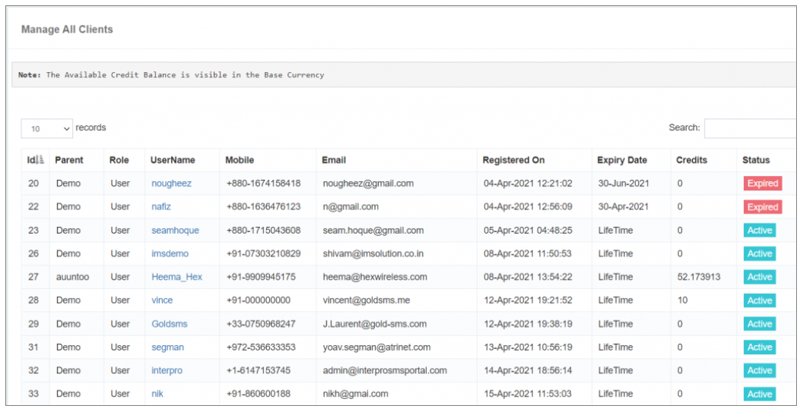

## 📋 Client Detail List

The **Client Detail List** feature offers a **visually rich display of user information**, encompassing details such as **username**, **email ID**, **mobile number**, and more. This information serves as a valuable resource for **engaging with users** and facilitating **effective communication**.

### **Key Elements:**

- **Parent:**  
  Refers to the **direct parent account** associated with the child user.

- **Expiry Date:**  
  iTextPRO provides the **validity or expiry date** of the user account, particularly relevant if a **custom validity period** was selected during the user account creation.

- **Credits:**  
  Displays the **available balance** in the user account, presented in the **base currency** for user convenience. This information is crucial for users to **monitor and manage their account resources** effectively.

- **Status:**  
  The default status for any user or reseller account is **"Active."** Users have the option to **deactivate their accounts** through the status option within the user profile section. This feature provides **flexibility** in managing the status of user accounts based on business requirements or user preferences.

