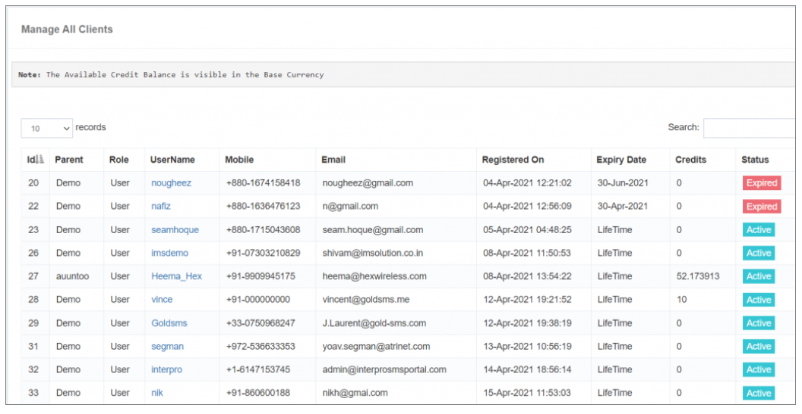

## 客戶端詳細列表

這個 **客戶端詳細列表** 特性提供a **顯示豐富的使用者資訊**,包括諸如: **使用者名稱**, (中文(簡體) ). **電子郵件標識**, (中文(簡體) ). **手機號碼**還有更多 這些資料是: **與使用者接觸** 和提供便利 **有效溝通**。 。 。 。

### **關鍵要素:**

- **家長 :** 
 指 **直接父賬戶** 與兒童使用者相關聯。

- **過期日期 :** 
 iTextPRO 提供 **有效期或終止日期** 使用者賬戶,特別是如果 **自定義有效期** 在使用者賬戶建立期間被選中。

- **功勞:** 
 顯示 **可用餘額** 在使用者賬戶中,在 **基準貨幣** 為使用者方便。 這些資訊對於使用者 **監測和管理其賬戶資源** 有效地。

- **狀態 :** 
 任何使用者或再銷售賬戶的預設狀態為 **"主動".** 使用者可選擇 **關閉他們的賬戶** 透過使用者配置檔案欄內的狀況選項。 此特性提供 **靈活性** 根據業務要求或使用者偏好管理使用者賬戶狀況。

