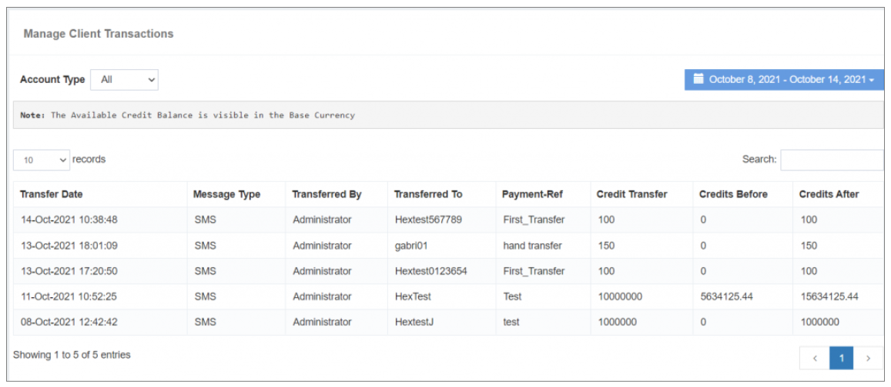

## 💰 Client Transaction

The **Client Transaction** feature presents a **detailed history of transactions**, encompassing both your actions and the user's interactions. This comprehensive view includes information on **balance additions and deductions** made by you in the user account, along with the corresponding **balance before and after** details.

### **Key Features:**

- **Transaction History:**  
  Provides a **chronological record** of transactions, offering insights into the **financial interactions** between you and the user.

- **Balance Added/Deducted:**  
  Clearly outlines instances where **balance was either added or deducted** from the user account, facilitating **transparent financial management**.

- **Balance Before and After:**  
  Displays the **balance in the user account before and after** each transaction, ensuring **clarity** on the impact of specific actions.

- **Custom Date and Account Type Filter:**  
  Enables users to **fetch transaction history** based on **specific dates** and **account types**. This filter functionality enhances the ability to **narrow down and analyze** transaction data according to user preferences.

The **Client Transaction** feature serves as a **valuable tool for monitoring financial interactions**, providing detailed information for **accurate record-keeping** and **analysis**.

