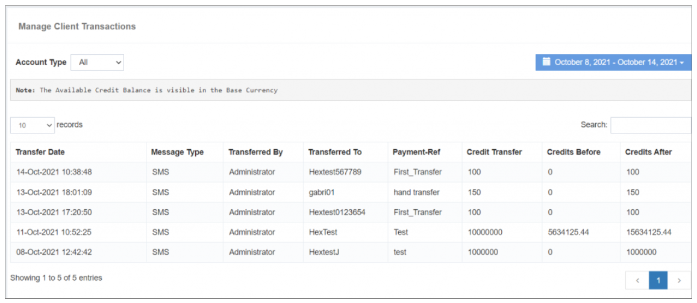

## 客户交易

这个 **客户交易** 特性显示 a **交易的详细历史**,包含您的动作和用户的交互。 这一全面观点包括: **余额增减** 由您在用户账户中制作,以及相应的 **前后结余** 细节。

### **关键特性 :**

- **交易历史 :** 
 规定 a **时间顺序记录** 提供深入了解 **财务互动** 在您和用户之间。

- **增加/减少的余额:** 
 明确概述在哪些情况下 **余额是增加或扣除的** 从用户账户中提取,促进 **透明的财务管理**。 。 。 。

- **前后余额 :** 
 显示 **用户账户前后余额** 每次交易,确保 **清晰** 具体行动的影响。

- **自定义日期和账户类型过滤器 :** 
 允许用户使用 **获取交易历史** 基于 **具体日期** 财务报告和审定财务报表 **账户类型**。此过滤功能可增强 **缩小并分析** 根据用户偏好提供交易数据。

这个 **客户交易** 特性作为 **监测金融互动的可贵工具**,提供详细资料。 **准确保存记录** 财务报告和审定财务报表 **分析**。 。 。 。

