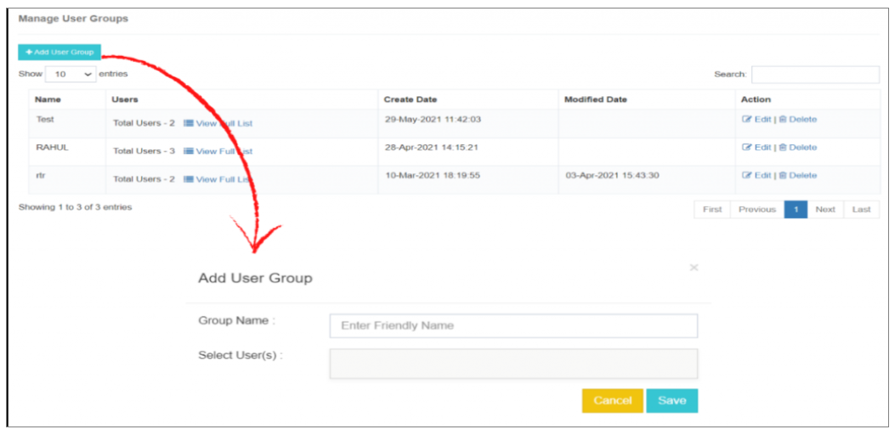
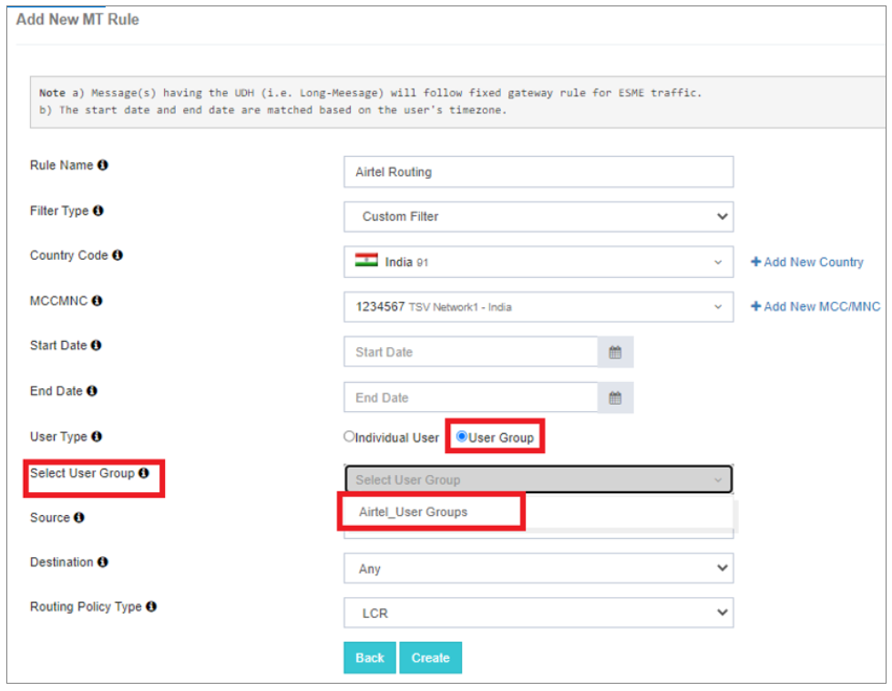

## Gérer les groupes d'utilisateurs

Cette fonctionnalité facilite la **regroupement logique des utilisateurs**, permettant la cartographie de ces groupes **MT règles de routage**.

En cas de **panne** ou **problèmes de performance** avec le fournisseur de passerelle primaire, les utilisateurs peuvent parfaitement **passer à un autre fournisseur de passerelle** en un seul clic.

En mettant à jour **MT routage directement à partir du moteur de routage principal**, les utilisateurs peuvent rapidement **Transférer leur trafic de messagerie à un fournisseur de passerelle secondaire**. Ce processus simplifié assure **réactivité rapide à tous les problèmes**, renforcer **fiabilité du système** et **minimiser les temps d'arrêt**.

