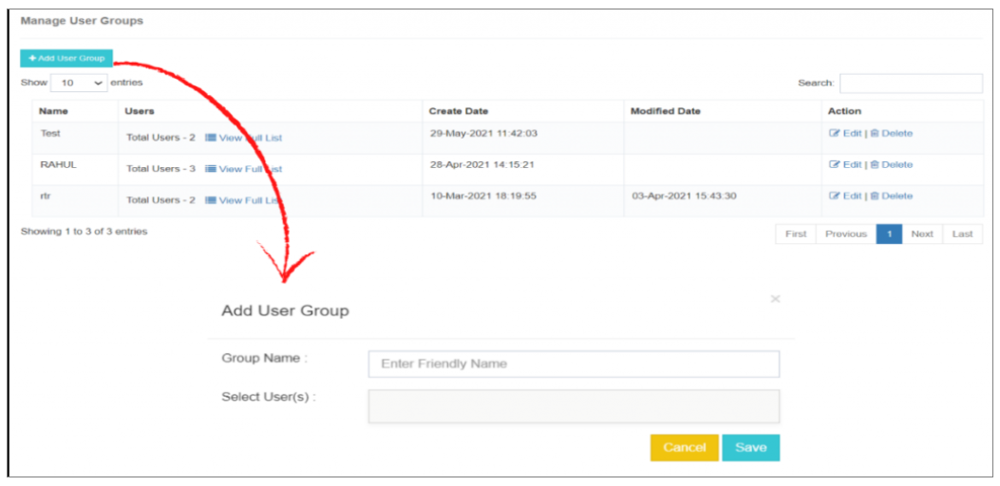
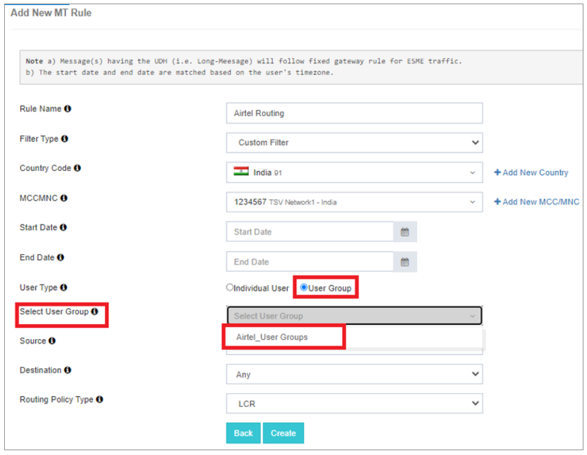

## 👥 Manage User Groups

This feature facilitates the **logical grouping of users**, enabling the mapping of these groups to specific **MT routing rules**.

In the event of an **outage** or **performance issues** with the primary gateway vendor, users can seamlessly **switch to an alternative gateway vendor** with a single click.

By updating the **MT routing directly from the main routing engine**, users can swiftly **transition their messaging traffic to a secondary gateway vendor**. This streamlined process ensures **quick responsiveness to any issues**, enhancing **system reliability** and **minimizing downtime**.

