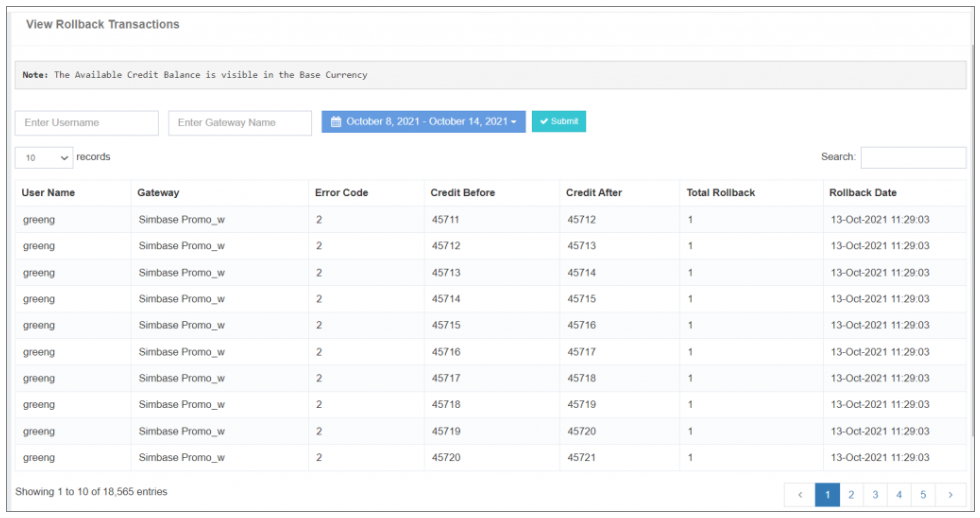

## 🔄 Rollback Transactions

The **"View Rollback Transactions"** option provides a **comprehensive history of rollback transactions** within the user account, specifically related to the **gateway vendor error codes** configured in the **Gateway Error Code Option**.

### **Key Information:**

- **Rollback Transaction History:**  
  Displays a **chronological record** of rollback transactions, offering insights into **activities triggered by gateway vendor error codes**.

- **Before-Balance and After-Balance Details:**  
  Provides information on the user's **balance before and after** each rollback activity. This transparency helps users understand the **impact of rollback transactions** on their account balances.

- **Custom Date and Account Type Filter:**  
  Offers the flexibility to **filter rollback transaction history** based on **specific dates** and **account types**. This enhances the ability to **tailor the view** according to user preferences.

The **"View Rollback Transactions"** feature is a **valuable tool** for monitoring and analyzing the **impact of rollback activities** on user accounts, contributing to **efficient error resolution** and **financial management**.

