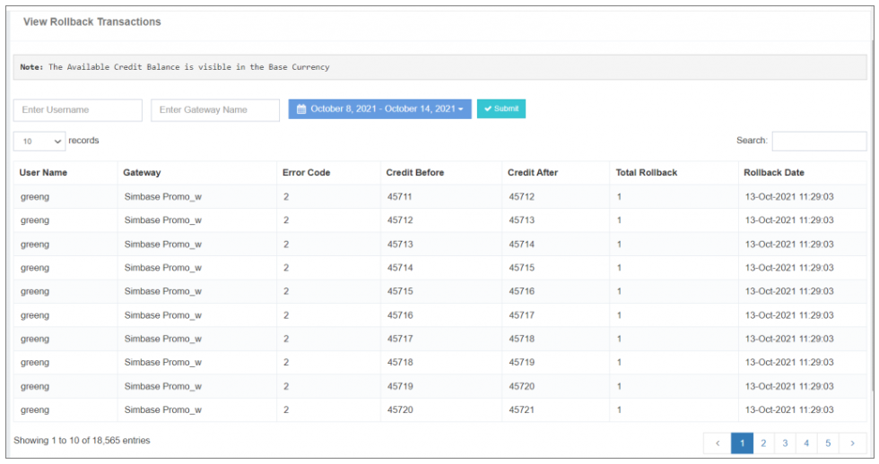

## 回滾交易

這個 **查看回滾交易** 選項 **退回交易的綜合歷史** 使用者賬戶內,具體與 **閘道器供應商出錯程式碼** 配置於 **網關出錯程式碼選項**。 。 。 。

### **關鍵資訊 :**

- **回滾交易歷史 :** 
 顯示 a **時間順序記錄** 提供深入瞭解 **閘道器供應商錯誤程式碼引發的活動**。 。 。 。

- **前-巴倫斯和後-巴倫斯細節 :** 
 提供使用者資訊 **前後結餘** 每一個回滾活動。 這種透明度有助於使用者理解 **退回交易的影響** 他們的賬戶餘額。

- **自定義日期和賬戶型別過濾器 :** 
 給予靈活性 **過濾回滾交易歷史** 基於 **具體日期** 財務報告和審定財務報表 **賬戶型別**。這可增強 **調整檢視** 根據使用者的偏好。

這個 **查看回滾交易** 特性是 **貴重工具** 用於監測和分析 **倒轉活動的影響** 使用者賬戶,為 **高效錯誤解析** 財務報告和審定財務報表 **財務管理**。 。 。 。

