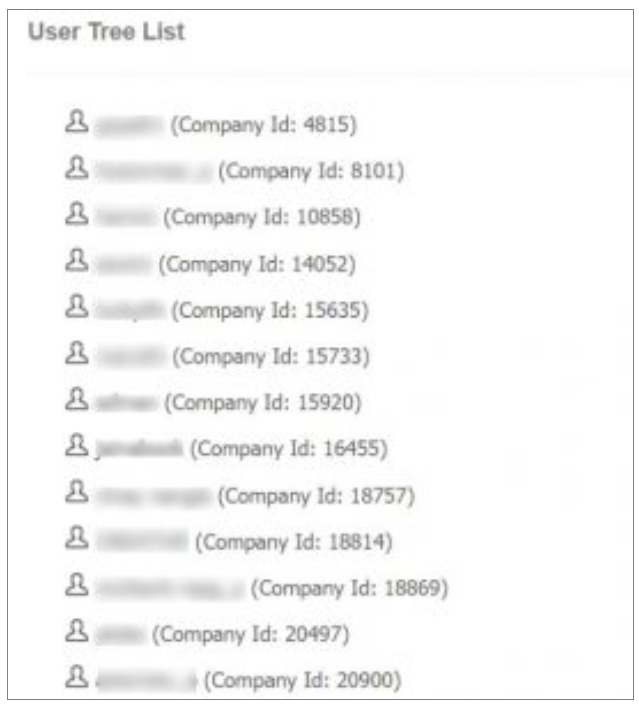

## Lista del árbol del usuario del sitio

El **función de jerarquía de usuario** proporciona un conveniente **vista jerárquica** de ambos **usuarios y revendedores**, permitiendo a los usuarios tener un **visión general de todos los clientes** simultáneamente.

Al seleccionar un específico **nombre de usuario dentro de la jerarquía**, los usuarios pueden sin esfuerzo **navegar a la información de perfil básico** de la cuenta de usuario correspondiente. Este proceso simplificado permite **acceso rápido a información detallada** sobre usuarios individuales, mejora **gestión de usuarios** y **navegación** dentro del sistema.

