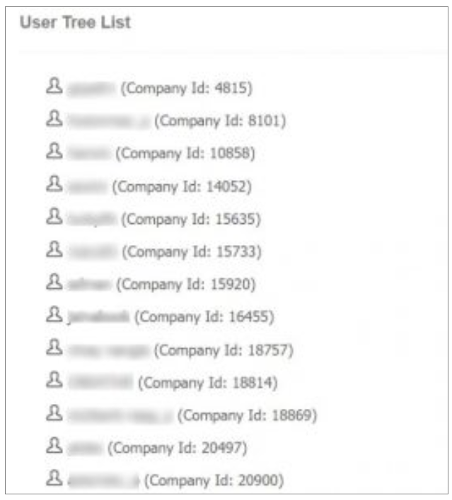

## 🌳 Site User Tree List

The **user hierarchy feature** provides a convenient **hierarchical view** of both **users and resellers**, allowing users to have a **comprehensive overview of all clients** simultaneously.

By selecting a specific **username within the hierarchy**, users can effortlessly **navigate to the basic profile information** of the corresponding user account. This streamlined process enables **quick access to detailed information** about individual users, enhancing **user management** and **navigation** within the system.

