## 🛠️ Administration

**Welcome to iTextPRO**, your gateway to efficient document management!

To get started with accessing the iTextPRO admin site, you'll need to log in using the **Admin URL** and **login credentials** provided by our Service Delivery team.

Once you've successfully logged in, you'll be greeted by a **user-friendly interface** equipped with various navigation controls. The primary navigation control to kickstart your experience is **'User Administration — User Management.'** Keep in mind that the associated controls nested under this menu will only become visible once you **input a specific username** and hit the **'View'** button.

For in-depth insights into the functionality of the Administration section, you'll find **comprehensive descriptions** of the various controls in the subsequent sections of this document.

---

## 👥 User Administration

Navigating to the **User Management** page is a breeze. Just click on the **'User Management'** option, and it will seamlessly guide you to the User Management page.

To continue, **enter the username** you're interested in within the dedicated search box and hit the **'View'** button. The search box **automatically populates matching records** in alphabetical order, making your search quick and effortless.

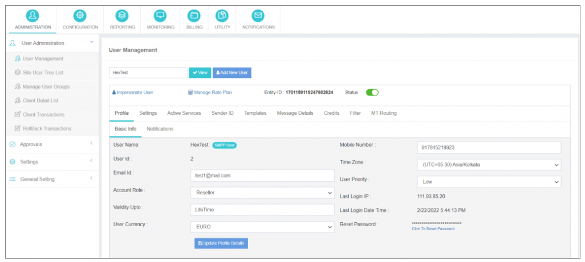

---

## ➕ Add New User

Diving into the process of expanding your user base is simple. Just click the **"Add New User"** button to initiate the creation of a brand-new user account.

However, to ensure a comprehensive setup, you'll need to provide the following essential information.

### **Step 1: Enter User Details**

Upon clicking the **"Add New User"** button, iTextPRO will guide you to a dedicated page. Fill in the following:

- **First Name**
- **Last Name**
- **Address**
- **User Name** – Must be unique.
- **Password** – Minimum 8 characters, with at least:
  - 1 uppercase letter
  - 1 lowercase letter
  - 1 numeric character
  - 1 special character
- **Email ID** – Used for email alerts including OTPs and welcome emails (based on Admin SMTP settings).
- **Mobile Number**
- **Time Zone** – Affects report timestamps and user-specific display.
- **User Currency** – Display purpose only; subject to real-time conversion.
- **User Account Validity**:
  - **Custom Validity** – Define an end date.
  - **Lifetime Validity** – No expiry (permanent access).
- **User Account Type**:
  - **User** – Access to User Panel.
  - **Reseller** – White-label account with branding and pricing options.

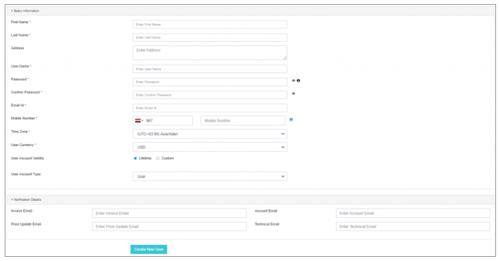

---

### **Step 2: Notification Details (Optional)**

Customize your notifications by adding multiple stakeholders' emails for alerts like:

- Login OTPs
- New User Verification
- Rate Plan Updates
- Approval Notifications

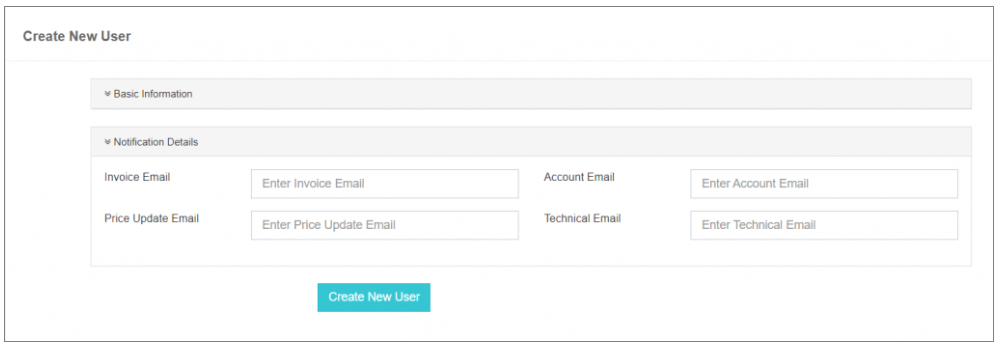

Upon clicking **"Create New User"**, a **welcome email** is sent (requires SMTP configuration). iTextPRO confirms success and presents:

- **I will do it some other time** – Redirects to the new user's profile.
- **OK! Let’s do it** – Launches the **Account Configuration Wizard**.

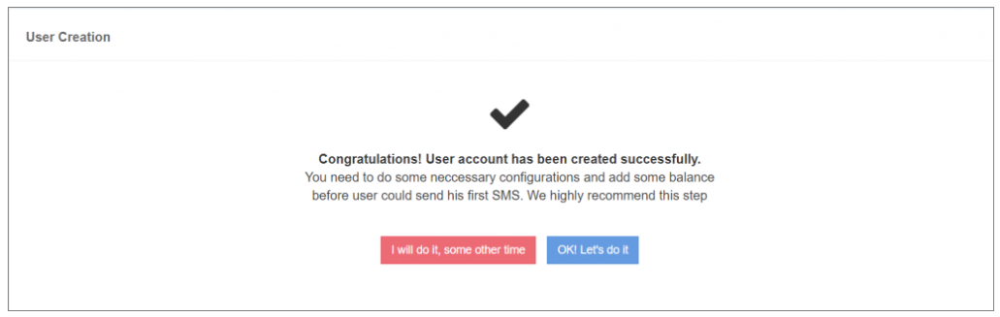

---

### **Step 3: Configuring Gateway Settings**

Choose your routing method:

- **Yes** – Use a **fixed gateway** for all messages.
- **No, I will add the routing rule later** – Let the **Main Routing Engine** dynamically handle routing.

You may also click **"Skip"** to proceed.

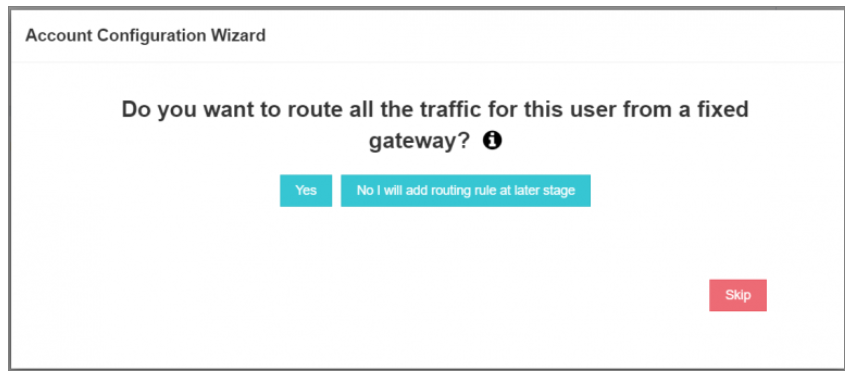
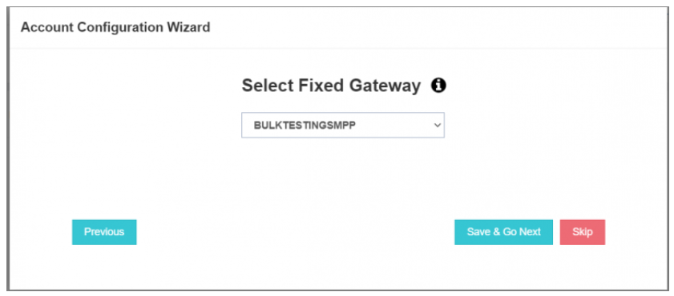

---

### **Step 4: Adding SMS Credits**

- **Enter Credits** – Number of SMS credits.
- **Save Changes**
- **Proceed to Next Step**

> 💡 All credit transactions are in **base currency only**.

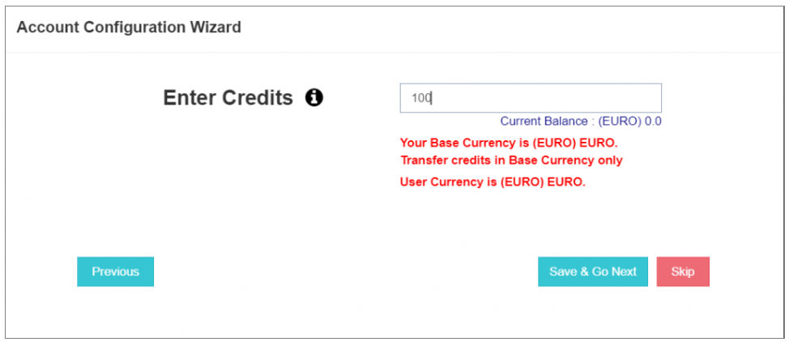

---

### **Step 5: Choosing Sender ID Policy**

Select from:

- **Dynamic Sender ID** – Users can use any sender ID (numeric/alphanumeric).
- **Fixed Sender ID** – Use a predefined sender ID for consistency.

Click **"Save"** to confirm.

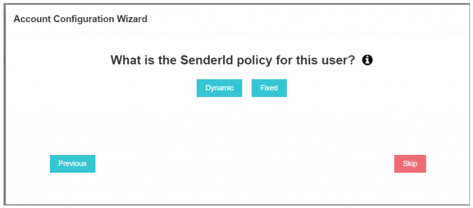
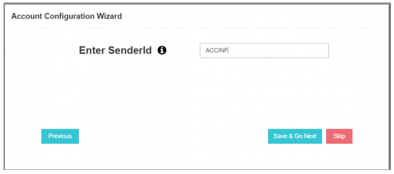

---

### **Step 6: Setting Up SMPP Account for Wholesale Customers**

To create an SMPP account:

- Select **Yes**
- Configure:
  - **System ID**
  - **Password**
  - **Whitelist IPs** (for security)

> 🛡️ Best Practice: Whitelist IPs to avoid SMS spamming.

Use **0.0.0.0** for open access (authentication via System ID & password).

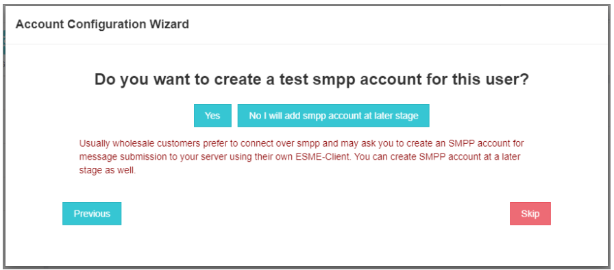
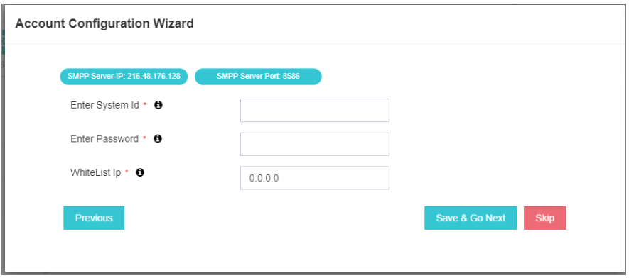

---

### **Step 7: Managing User Account**

After completing setup, you'll see the final message with 3 options:

#### **Option 1: Impersonate**
Log in as the user instantly—no need for separate credentials.

#### **Option 2: Setup Advance Billing**
Manage rate plans:

- **Add New Selling Price**:
  - Country
  - MCC/MNC
  - Selling Price
  - Activation status
- **Import Rate Plan Template**

> ⚠️ Ensure **selling price ≥ gateway cost** to avoid message drops (Loss Protection Policy).

#### **Option 3: Manage this User**
Access the **Profile** or **User Management** page for further adjustments.

A **welcome email** will be sent automatically.

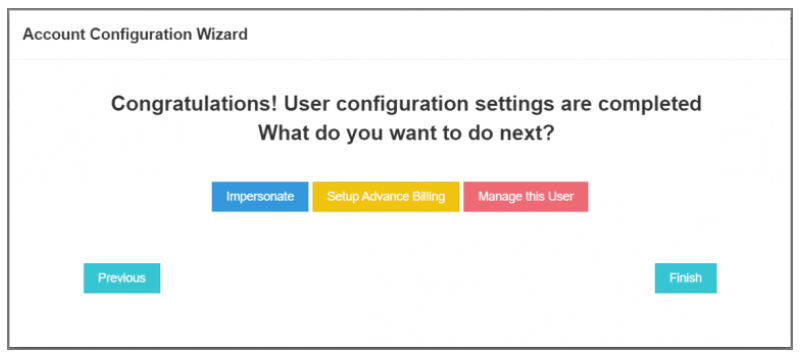
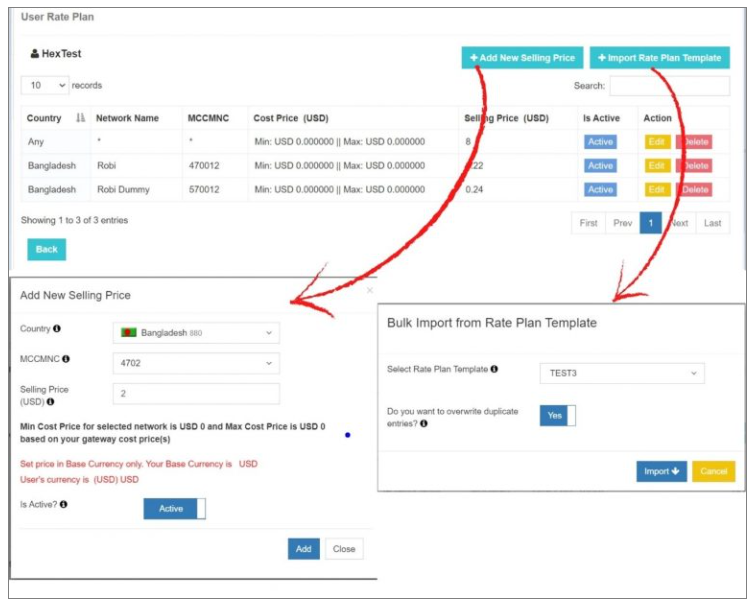

---

🎉 **You're all set!** You’ve now fully configured a user in **iTextPRO**, and are ready to manage users, billing, notifications, and much more—all from one place.

# User Management

The **User Management** section is organized into multiple tabs for improved control layout. This division of controls associated with the user account provides **convenience in managing the user account effectively**.

To find a specific user, simply **enter the username** in the search box and click on the **View** button. The search box is equipped with an **intelligent feature** that automatically populates the box with **matching records in alphabetical order**.

For a visual representation, please refer to the figure below:

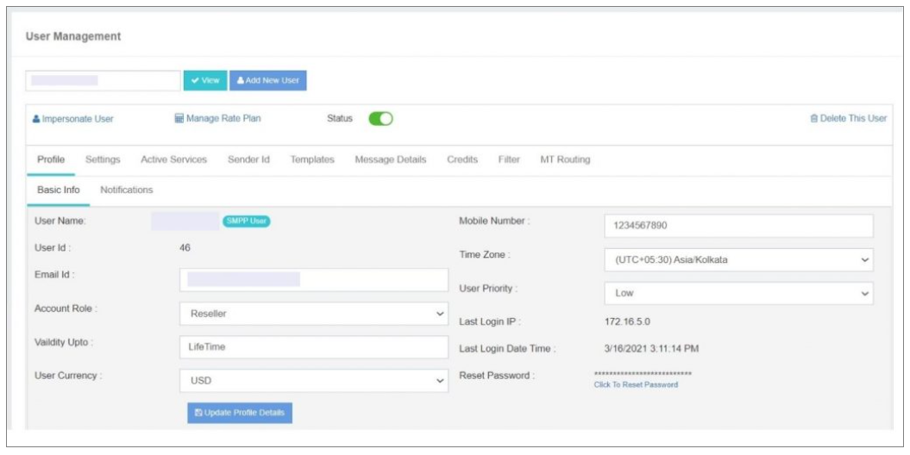

---

## User Management Tabs Details

### First Row Options

#### **Impersonation**
- **Description:** Selecting this option allows you to **log in or impersonate a user** into their account.
- **Authentication:** Enter the **admin password** for verification.
- **Note:** The user account opens in a **new tab** within the same browser window, facilitating **simultaneous management** of both user and admin accounts.

#### **Manage Rate Plan**
- **Functionality:** This hyperlink redirects you to the **User Rate Plan** page.
- **Purpose:** Configure **selling prices for countries and networks**.

#### **Status**
- **Usage:** **Activate or deactivate** a user/reseller account.
- **Result:** Deactivated users **cannot log in**.

#### **Delete this User**
- **Action:** Permanently **delete a user account**.
- **Caution:** Deleted users **cannot be restored**.

---

### Second Row Options

#### **Profile (Details Included)**

- User Name  
- User ID  
- Mobile Number  
- Email ID *(used for communication and alerts)*  
- Time Zone  
- User Priority *(for routing messages)*  
- Account Role *(Reseller or User)*  
- User Currency *(display currency, subject to conversion)*  
- Validity Up-to *(Custom or Lifetime)*  
- Last Login IP  
- Last Login Date Time  

**Functionality:** Access and manage **basic user profile information**.

#### **Reset Password**
- **Action:** Reset the password for **users or reseller accounts**.

> **Note:** All actions in the User Management section contribute to a **comprehensive and streamlined user account management** experience. For further details, consult the iTextPRO user manual.

---

## Additional Privileges and Advanced Settings

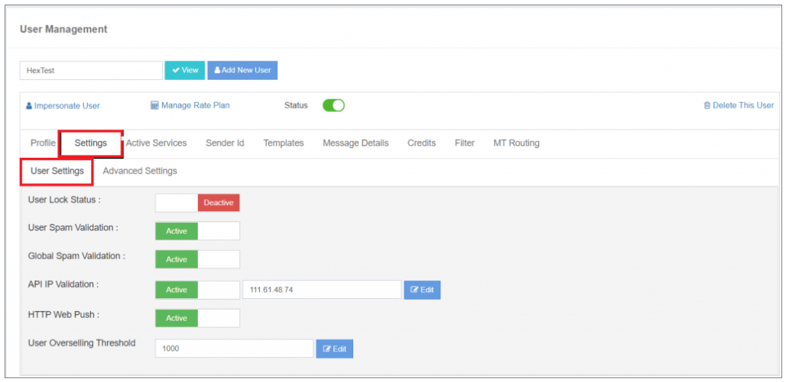

### **User Lock Status**
- **Description:** Enabling this option **locks the user account**, restricting login activities.

### **User Spam Validation**
- **Description:** When enabled, iTextPro **validates user SPAM keywords** for each campaign. Trusted users can **override** this by deactivating the toggle.

### **Global Spam Validation**
- **Description:** Enables the application to **validate Global SPAM keywords** for user campaigns. Trusted users can override this validation.

### **API IP Validation**
- **Description:** Enabling this option ensures iTextPRO **validates the whitelisted IP address** before processing API requests.

### **HTTP Web Push**
- **Description:** When enabled, the application **forwards DLR copies** to the HTTP endpoint URL configured in the user account's manage webhooks option.

### **User Overselling Threshold**
- **Description:** Enables configuration of an **Overselling Threshold limit** on users, allowing them to consume a specified amount beyond the allocated balance.

**Example:**  
If the threshold is set at **500 EUROS**, the user can consume up to **500 EUROS more** than the allocated balance.

---

## Advanced Settings

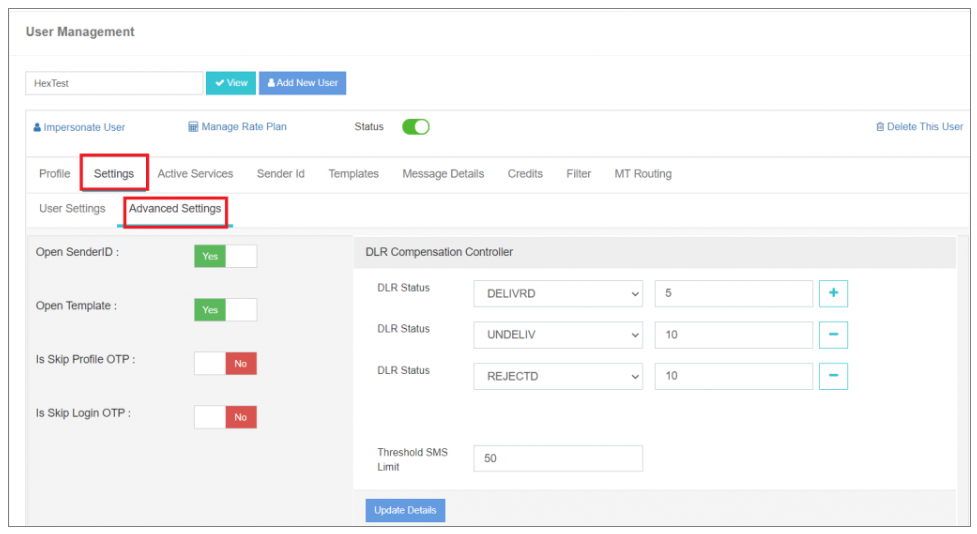

### **Open Sender**
- **Description:** Enables end-users to submit messages with a **dynamic sender ID** (numeric or alphanumeric).

### **Open Template**
- **Description:** Enables users to use **dynamic content** in messages by allowing open templates.

### **Is Skip Profile OTP**
- **Description:** Sends an **OTP to the user's registered email ID** for profile update activities.

### **Is Skip Login OTP**
- **Description:** Sends an **OTP to the user's registered email ID** for login activities.

### **Allow DLR Compensation**
- **Description:** Allows enabling or disabling **DLR compensation** for child reseller accounts.

### **DLR Compensation**
- **Description:** Defines **DLR compensation percentage** for different message statuses, generating **automatic fake DLRs** to maximize profitability.

**Properties:**

- **DLR Status and Compensation:** Select message status and corresponding percentage.  
- **Threshold SMS Limit:** Defines the destination number threshold for applying DLR compensation.

> **Note:** Advanced settings empower administrators to **customize user experiences** and **optimize profitability**.

**Example:**  
You’ve applied DLR compensation on the user account as below, and your user sends the campaign on 200 Mobile Numbers:

- **DLR Compensation:** 30%  
- **Threshold SMS Limit:** 100 Mobile Numbers  

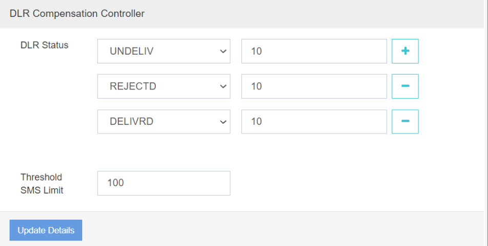

As per the configuration:
- Out of 200 messages, only **140 messages** will be submitted to the gateway vendor.
- For **60 messages**, iTextPRO generates **automatic fake DLRs**, resulting in maximizing your profitability for 60 messages.

If the user sends a campaign on **70 mobile numbers** (below threshold), **DLR compensation is not applied**.

---

## Active Services

This section consists of the **Plugins offered by iTextPRO**. These plugins need to be **opted separately** as they are not part of the packaged application.

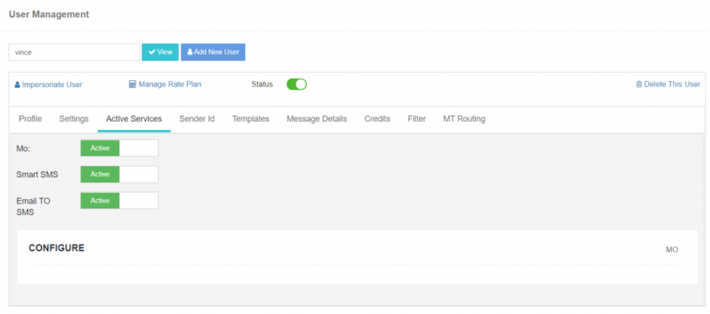

**Active Services Display:** Shows the plugins currently enabled.

### 1. **MO (Mobile Originator)**
- **Function:** Activates the **MO service** for users.
- Once iTextPRO receives the **incoming message (MO)**, it appears in the **user's inbox report**.
- Messages can be forwarded to **SMPP, HTTP push, email**, or trigger **automatic replies**.

### 2. **Smart SMS**
- **Function:** Activates the **smart SMS** feature.
- Converts long URLs into **shortened smart links**.
- Tracks:
  - User's **mobile number**,
  - **IP address**,
  - **Device details**,
  - **Geolocation**.

### 3. **Email to SMS**
- **Function:** Converts **emails into SMS messages**, enabling communication via email gateways.

---

## Sender ID

The **Sender ID** tab empowers users to configure their sender IDs directly. It displays:

- **Pending**
- **Approved**
- **Rejected** sender IDs

Accessible via the **"View Sender ID"** link.

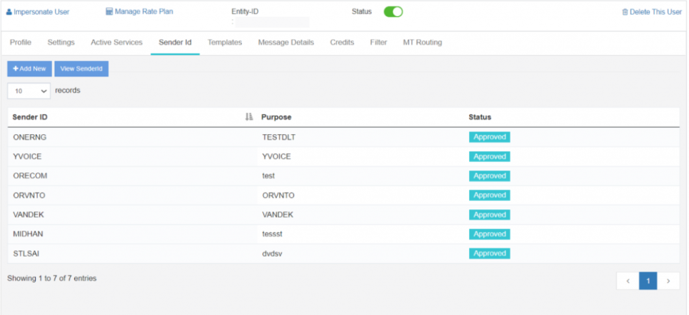

To **add a Sender ID**:

- Click **Add New**
- Define the **Sender ID** and **purpose**
- Click **Save**

The sender ID (status: **approved**) will be added to the user account.

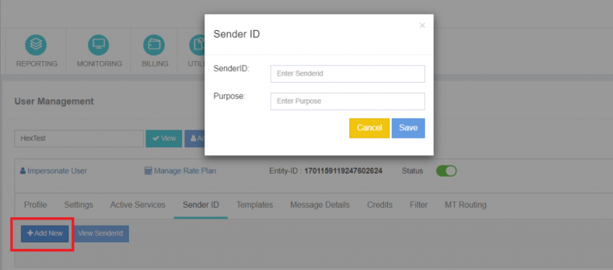

---

## Template

The **Template** section allows users to view existing templates. Each template's **status** (approved, pending, rejected) is clearly marked.

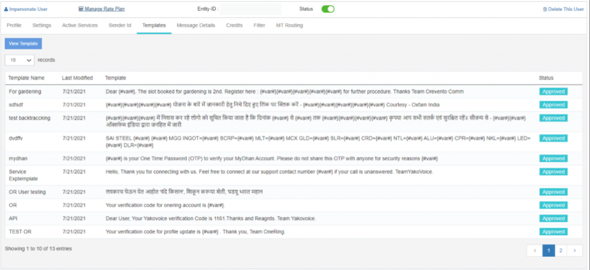

---

## Message Details

Users gain insight into the **last three campaign messages** and their **status-wise statistics**, helping assess **campaign performance**.

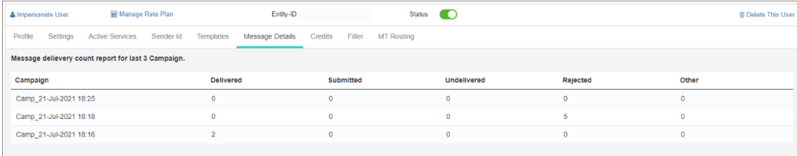

---

## Credits

The **Credits** tab shows:

- **User's available balance**
- **Transaction history**

Users can manage their account balance via **"Add More Credit"**:

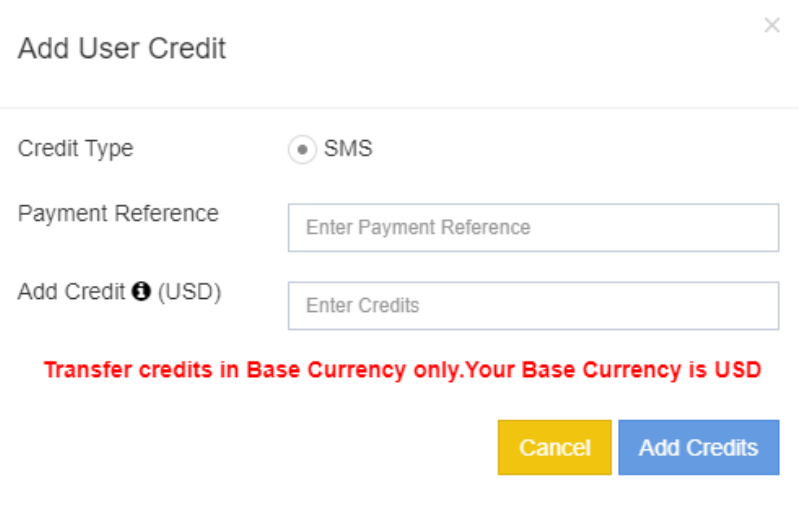

To add credits:

- Select **service type**
- Enter **payment details**
- Specify the **credit amount**

> **Note:** Credits must be added in the **base currency**.

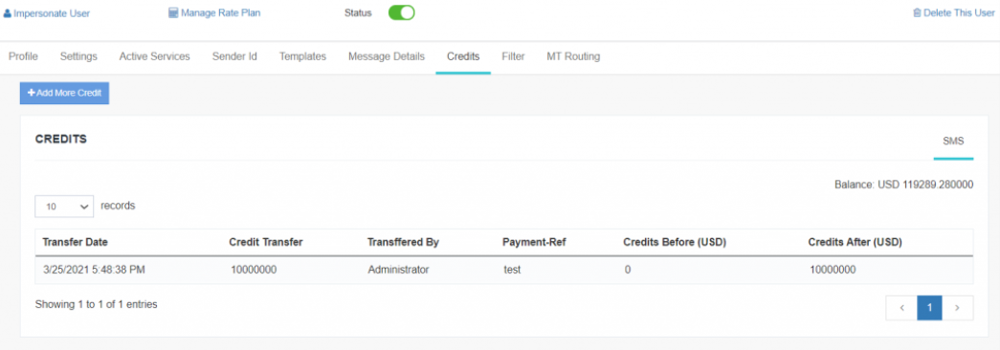

---

## Filter

The **Filter** option allows users to **whitelist mobile numbers**, ensuring **DLR compensation is not applied** to those.

Add mobile numbers with **country codes** easily.

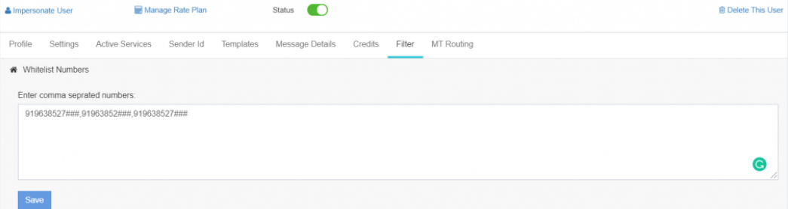

---

## MT Routing

The **MT Routing Rule** is a pivotal feature. You can:

- Create **routing rules** for directing SMS traffic
- Apply to:
  - **Web interface**
  - **APIs**
  - **SMPP submissions**

Users may also configure **fixed gateway routing rules**, auto-populating entries in the **Main Routing Engine**.

> **Note:** Configuring a fixed gateway is optional but enhances **routing efficiency**.

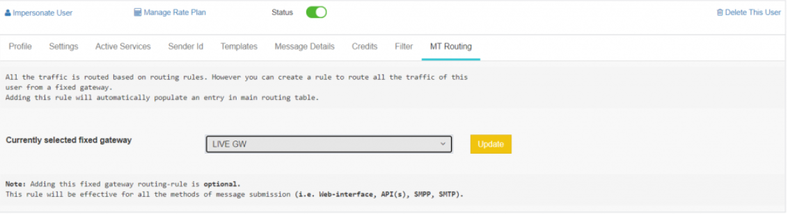
