## Administration

**Welcome to iTextPRO**, your gateway to efficient document management!

To get started with accessing the iTextPRO admin site, you'll need to log in using the **Admin URL** and **login credentials** provided by our Service Delivery team.

Once you've successfully logged in, you'll be greeted by a **user-friendly interface** equipped with various navigation controls. The primary navigation control to kickstart your experience is **'User Administration — User Management.'** Keep in mind that the associated controls nested under this menu will only become visible once you **input a specific username** and hit the **'View'** button.

For in-depth insights into the functionality of the Administration section, you'll find **comprehensive descriptions** of the various controls in the subsequent sections of this document.

---

## User Administration

Navigating to the **User Management** page is a breeze. Just click on the **'User Management'** option, and it will seamlessly guide you to the User Management page.

To continue, **enter the username** you're interested in within the dedicated search box and hit the **'View'** button. The search box **automatically populates matching records** in alphabetical order, making your search quick and effortless.

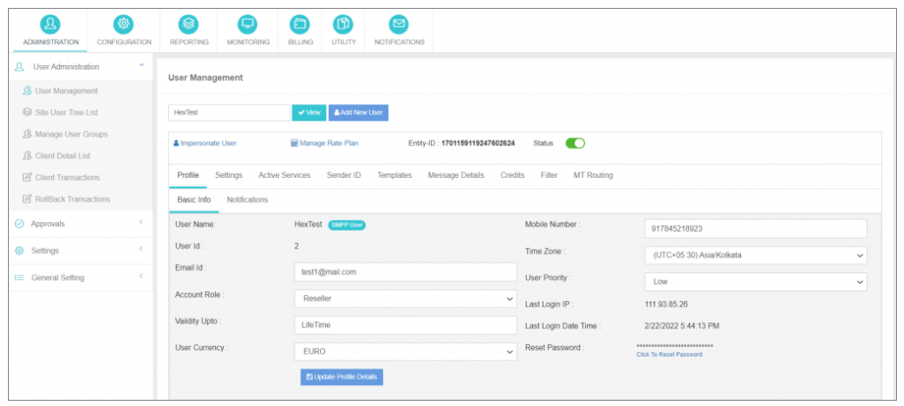

---

## Add New User

Diving into the process of expanding your user base is simple. Just click the **"Add New User"** button to initiate the creation of a brand-new user account.

However, to ensure a comprehensive setup, you'll need to provide the following essential information.

### **Step 1: Enter User Details**

Upon clicking the **"Add New User"** button, iTextPRO will guide you to a dedicated page. Fill in the following:

- **First Name**
- **Last Name**
- **Address**
- **User Name** – Must be unique.
- **Password** – Minimum 8 characters, with at least:
  - 1 uppercase letter
  - 1 lowercase letter
  - 1 numeric character
  - 1 special character
- **Email ID** – Used for email alerts including OTPs and welcome emails (based on Admin SMTP settings).
- **Mobile Number**
- **Time Zone** – Affects report timestamps and user-specific display.
- **User Currency** – Display purpose only; subject to real-time conversion.
- **User Account Validity**:
  - **Custom Validity** – Define an end date.
  - **Lifetime Validity** – No expiry (permanent access).
- **User Account Type**:
  - **User** – Access to User Panel.
  - **Reseller** – White-label account with branding and pricing options.

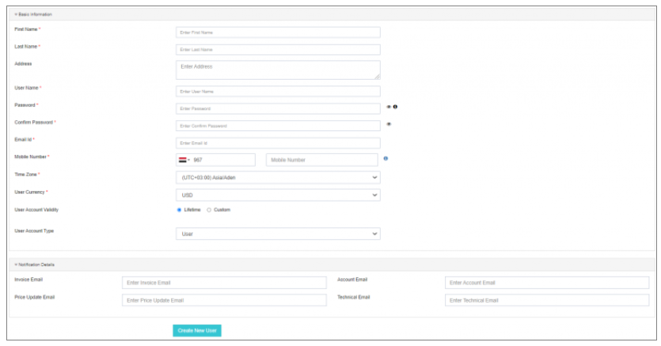

---

### **Step 2: Notification Details (Optional)**

Customize your notifications by adding multiple stakeholders' emails for alerts like:

- Login OTPs
- New User Verification
- Rate Plan Updates
- Approval Notifications

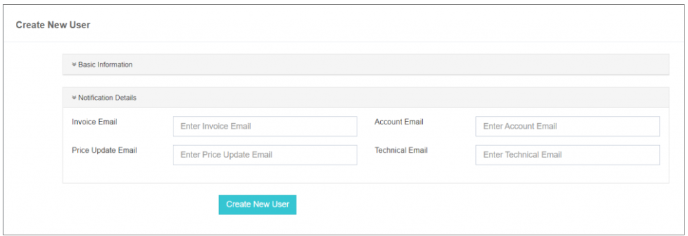

Upon clicking **"Create New User"**, a **welcome email** is sent (requires SMTP configuration). iTextPRO confirms success and presents:

- **I will do it some other time** – Redirects to the new user's profile.
- **OK! Let’s do it** – Launches the **Account Configuration Wizard**.

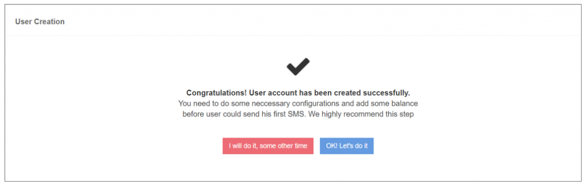

---

### **Step 3: Configuring Gateway Settings**

Choose your routing method:

- **Yes** – Use a **fixed gateway** for all messages.
- **No, I will add the routing rule later** – Let the **Main Routing Engine** dynamically handle routing.

You may also click **"Skip"** to proceed.

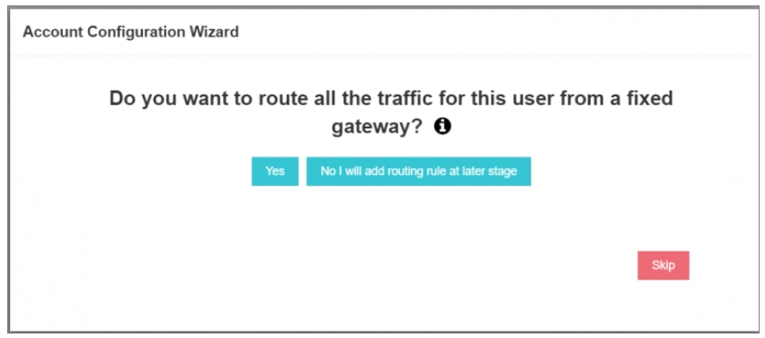
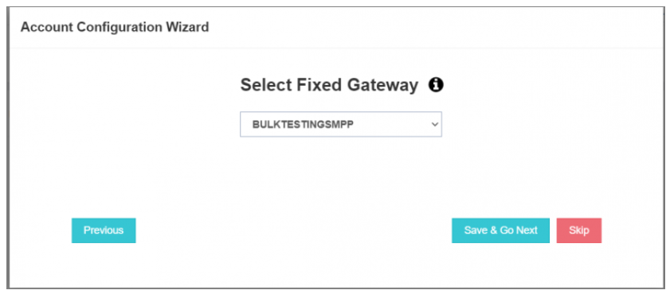

---

### **Step 4: Adding SMS Credits**

- **Enter Credits** – Number of SMS credits.
- **Save Changes**
- **Proceed to Next Step**

!!! note
    All credit transactions are in **base currency only**.

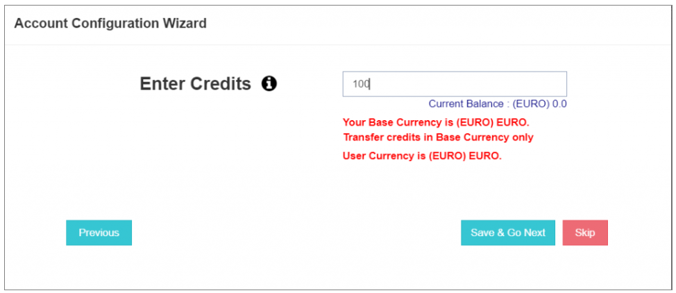

---

### **Step 5: Choosing Sender ID Policy**

Select from:

- **Dynamic Sender ID** – Users can use any sender ID (numeric/alphanumeric).
- **Fixed Sender ID** – Use a predefined sender ID for consistency.

Click **"Save"** to confirm.

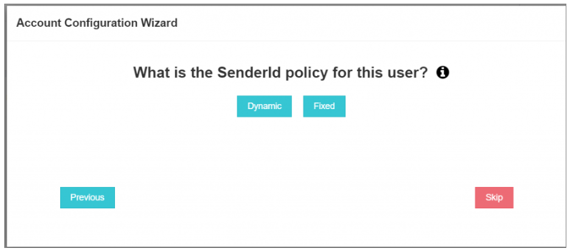
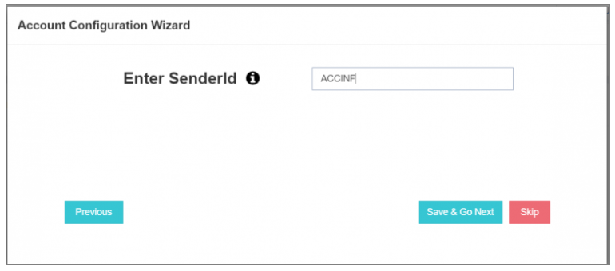

---

### **Step 6: Setting Up SMPP Account for Wholesale Customers**

To create an SMPP account:

- Select **Yes**
- Configure:
  - **System ID**
  - **Password**
  - **Whitelist IPs** (for security)

!!! tip "Best Practice"
    Whitelist IPs to avoid SMS spamming.

Use **0.0.0.0** for open access (authentication via System ID & password).

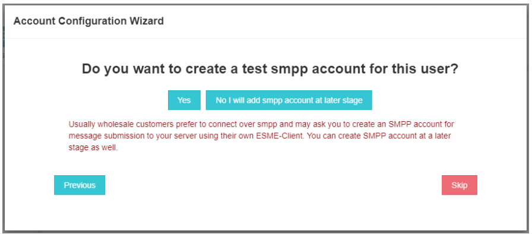
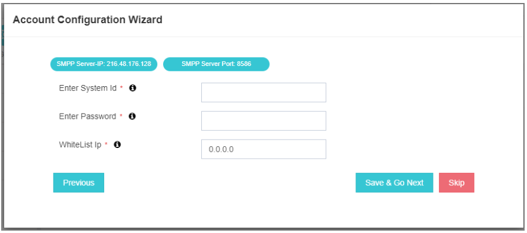

---

### **Step 7: Managing User Account**

After completing setup, you'll see the final message with 3 options:

#### **Option 1: Impersonate**
Log in as the user instantly—no need for separate credentials.

#### **Option 2: Setup Advance Billing**
Manage rate plans:

- **Add New Selling Price**:
  - Country
  - MCC/MNC
  - Selling Price
  - Activation status
- **Import Rate Plan Template**

!!! warning "Loss Protection"
    Ensure **selling price ≥ gateway cost** to avoid message drops (Loss Protection Policy).

#### **Option 3: Manage this User**
Access the **Profile** or **User Management** page for further adjustments.

A **welcome email** will be sent automatically.

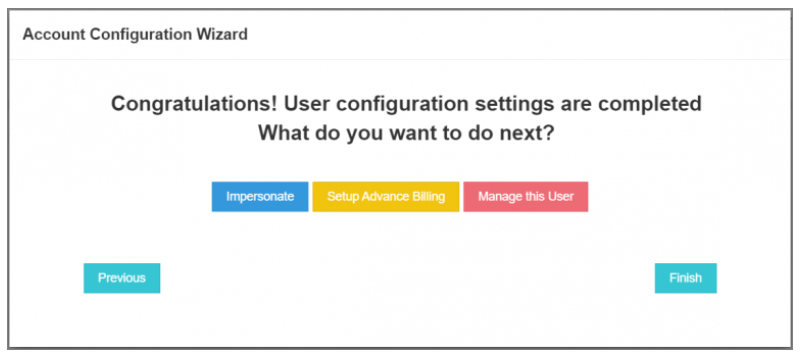
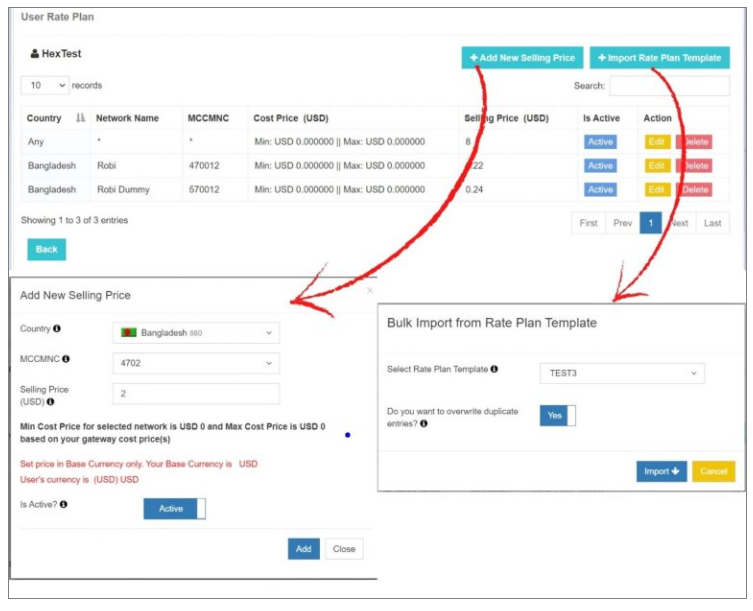

---

🎉 **You're all set!** You’ve now fully configured a user in **iTextPRO**, and are ready to manage users, billing, notifications, and much more—all from one place.

# User Management

The **User Management** section is organized into multiple tabs for improved control layout. This division of controls associated with the user account provides **convenience in managing the user account effectively**.

To find a specific user, simply **enter the username** in the search box and click on the **View** button. The search box is equipped with an **intelligent feature** that automatically populates the box with **matching records in alphabetical order**.

For a visual representation, please refer to the figure below:

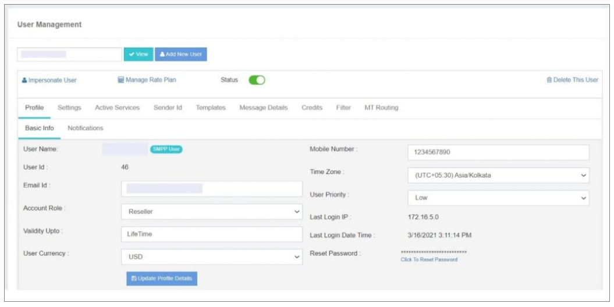

---

## User Management Tabs Details

### First Row Options

#### **Impersonation**
- **Description:** Selecting this option allows you to **log in or impersonate a user** into their account.
- **Authentication:** Enter the **admin password** for verification.
- **Note:** The user account opens in a **new tab** within the same browser window, facilitating **simultaneous management** of both user and admin accounts.

#### **Manage Rate Plan**
- **Functionality:** This hyperlink redirects you to the **User Rate Plan** page.
- **Purpose:** Configure **selling prices for countries and networks**.

#### **Status**
- **Usage:** **Activate or deactivate** a user/reseller account.
- **Result:** Deactivated users **cannot log in**.

#### **Delete this User**
- **Action:** Permanently **delete a user account**.
- **Caution:** Deleted users **cannot be restored**.

---

### Second Row Options

#### **Profile (Details Included)**

- User Name  
- User ID  
- Mobile Number  
- Email ID *(used for communication and alerts)*  
- Time Zone  
- User Priority *(for routing messages)*  
- Account Role *(Reseller or User)*  
- User Currency *(display currency, subject to conversion)*  
- Validity Up-to *(Custom or Lifetime)*  
- Last Login IP  
- Last Login Date Time  

**Functionality:** Access and manage **basic user profile information**.

#### **Reset Password**
- **Action:** Reset the password for **users or reseller accounts**.

!!! note
    All actions in the User Management section contribute to a **comprehensive and streamlined user account management** experience. For further details, consult the iTextPRO user manual.

---

## Additional Privileges and Advanced Settings

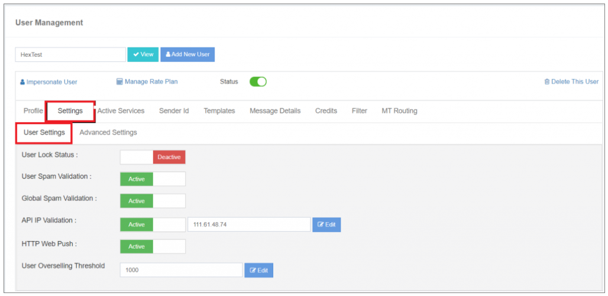

### **User Lock Status**
- **Description:** Enabling this option **locks the user account**, restricting login activities.

### **User Spam Validation**
- **Description:** When enabled, iTextPro **validates user SPAM keywords** for each campaign. Trusted users can **override** this by deactivating the toggle.

### **Global Spam Validation**
- **Description:** Enables the application to **validate Global SPAM keywords** for user campaigns. Trusted users can override this validation.

### **API IP Validation**
- **Description:** Enabling this option ensures iTextPRO **validates the whitelisted IP address** before processing API requests.

### **SMS HTTP Web Push**
- **Description:** When enabled, the application **forwards DLR copies** to the HTTP endpoint URL configured in the user account's manage webhooks option.

### **WhatsApp HTTP Web Push**
- **Description:** Enabling this toggle button allows admin to enable the **WhatsApp webhook option** for the user to receive the WhatsApp DLRs/Conversations to the configured endpoints.

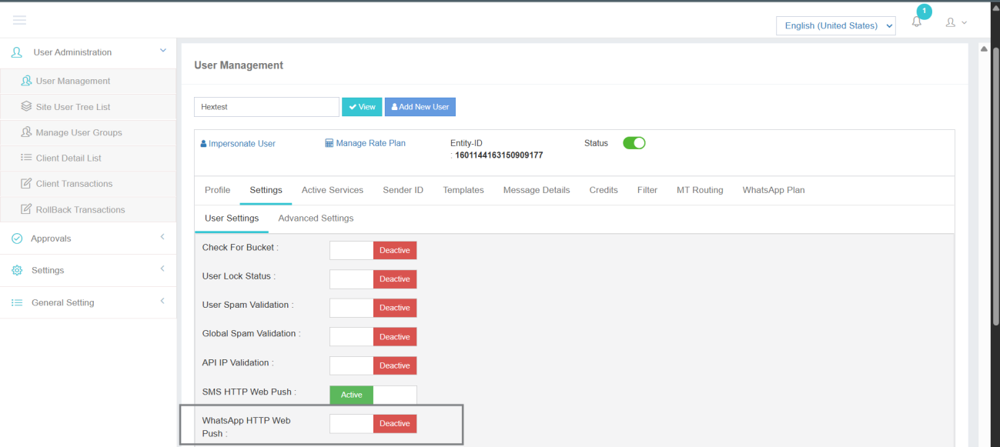

### **Show Masked Mobile Number**
- **Description:** The show masked number allows admin to enable the feature of **number masking**. Once this toggle button has been set as active, all the mobile numbers on which the campaigns have been initiated from the application, their **last four digits** for the mobile number will be masked.

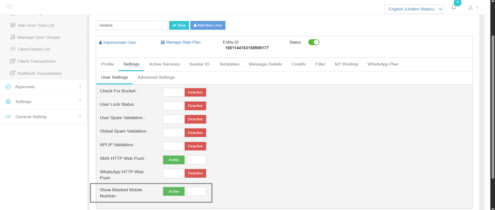

!!! example
    In the user's Campaign Report, masked numbers appear as `91738737XXXX`.

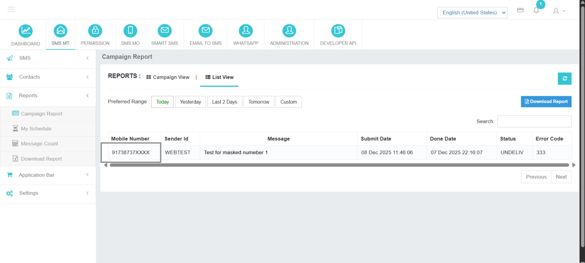

### **User Overselling Threshold**
- **Description:** Enables configuration of an **Overselling Threshold limit** on users, allowing them to consume a specified amount beyond the allocated balance.

**Example:**  
If the threshold is set at **500 EUROS**, the user can consume up to **500 EUROS more** than the allocated balance.

---

## Advanced Settings

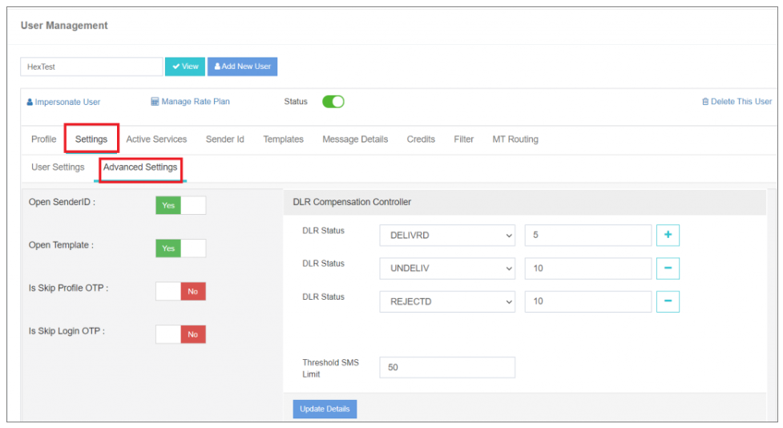

### **Open Sender**
- **Description:** Enables end-users to submit messages with a **dynamic sender ID** (numeric or alphanumeric).

### **Open Template**
- **Description:** Enables users to use **dynamic content** in messages by allowing open templates.

### **Is Skip Profile OTP**
- **Description:** Sends an **OTP to the user's registered email ID** for profile update activities.

### **Is Skip Login OTP**
- **Description:** Sends an **OTP to the user's registered email ID** for login activities.

### **Allow DLR Compensation**
- **Description:** Allows enabling or disabling **DLR compensation** for child reseller accounts.

### **DLR Compensation**
- **Description:** This feature allows admin to generate some additional profit by applying compensation on the messages and generating the DLR from the application **without submitting the messages to the gateway**.

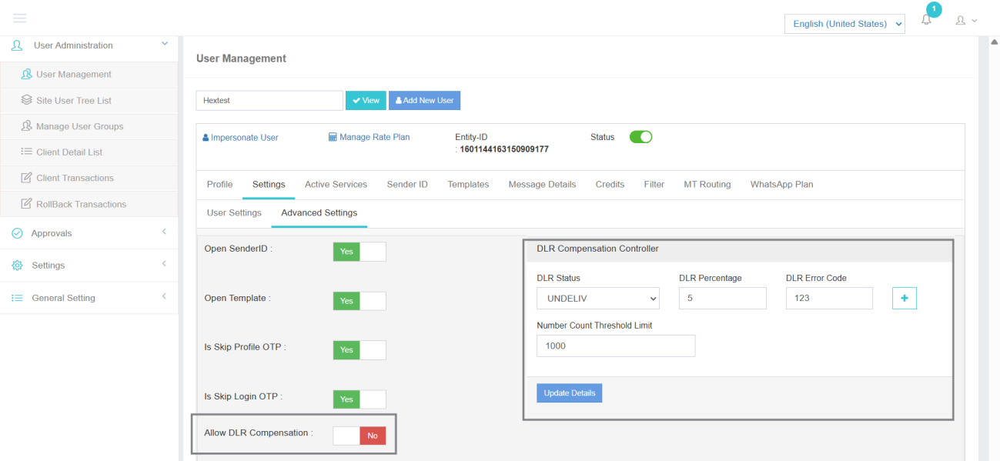

**Configuration:**

- **DLR Status:** Select message status which needs to be applied for the messages on which the compensation has been applied.
- **Percentage:** Add the percentage value to which compensation needs to be applied.
- **Error Code:** Configure error code against the status, so the same will be updated in reports.
- **Threshold SMS Limit:** Defines the destination number threshold for applying DLR compensation. Once the threshold is reached, the compensation will be applied according to the configuration.

!!! note
    For web interface the threshold limit will work on the basis of campaign and in case of SMPP/API, the threshold will work on daily basis.

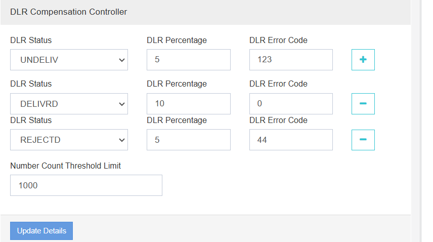

??? example "DLR Compensation Example"
    A user has initiated a campaign on 2000 numbers with the following configuration:

    - **DLR Compensation:** 20 Percent
    - **Threshold Limit:** 1000

    As per the configuration:

    - Out of 2000 messages, only **1600 messages** will be submitted to the gateway vendor.
    - For **400 messages**, iTextPRO generates **automatic fake DLRs**, resulting in maximizing your profitability for 400 messages.

    If the user sends a campaign on **1000> mobile numbers** (below threshold), **DLR compensation is not applied**.

---

## Active Services

This section consists of the **Plugins offered by iTextPRO**. These plugins need to be **opted separately** as they are not part of the packaged application.

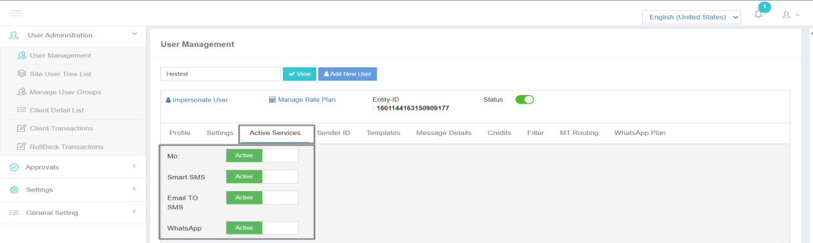

**Active Services Display:** Shows the plugins currently enabled. Also, the admin can activate or deactivate the plugins from the toggle button.

### 1. **MO (Mobile Originator)**
- **Function:** Activates the **MO service** for users.
- Once iTextPRO+ receives the **incoming message (MO)**, it appears in the **user's inbox report**.
- Messages can be forwarded to **SMPP, HTTP push, email**, or trigger **automatic replies**.

### 2. **Smart SMS**
- **Function:** Activates the **smart SMS** feature.
- Converts long URLs into **shortened smart links**.
- Tracks:
  - User's **mobile number**,
  - **IP address**,
  - **Device details**,
  - **Geolocation**.

### 3. **Email to SMS**
- **Function:** Converts **emails into SMS messages**, enabling communication via email gateways.

### 4. **WhatsApp**
- **Function:** It enables the **WhatsApp services** to the user.
- Once the plugin has been activated, the WhatsApp module will appear in the application.
- Users can connect their business account to the application.
- Add templates, configure the webhooks for DLR and Conversations.
- Get APIs to send messages through APIs.

---

## Sender ID

The **Sender ID** tab empowers users to configure their sender IDs directly. It displays:

- **Pending**
- **Approved**
- **Rejected** sender IDs

Accessible via the **"View Sender ID"** link.

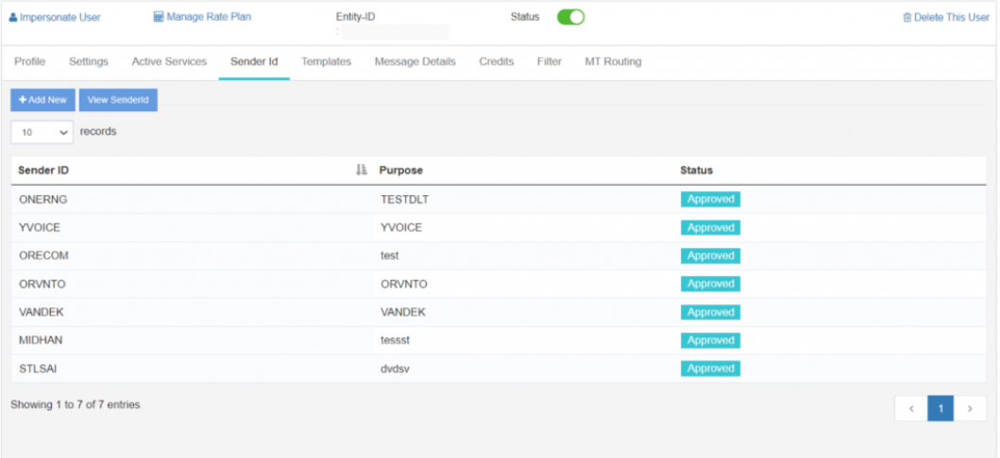

To **add a Sender ID**:

- Click **Add New**
- Define the **Sender ID** and **purpose**
- Click **Save**

The sender ID (status: **approved**) will be added to the user account.

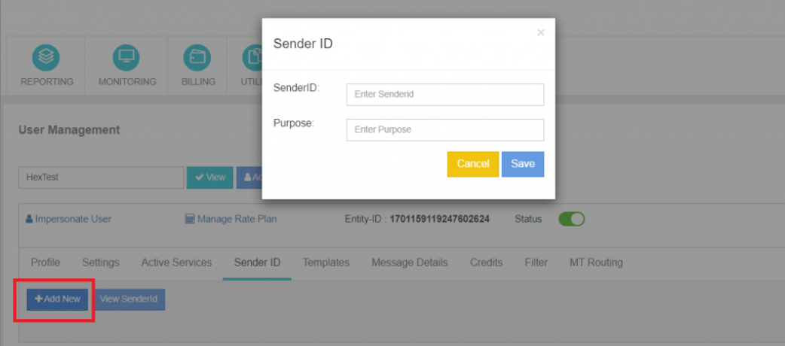

---

## Template

The **Template** section allows users to view existing templates. Each template's **status** (approved, pending, rejected) is clearly marked.

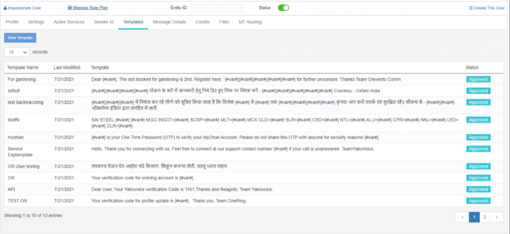

---

## Message Details

Users gain insight into the **last three campaign messages** and their **status-wise statistics**, helping assess **campaign performance**.

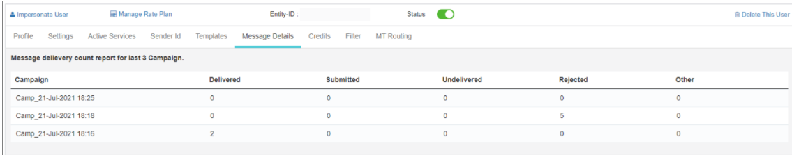

---

## Credits

The **Credits** tab shows:

- **User's available balance**
- **Transaction history**

Users can manage their account balance via **"Add More Credit"**:

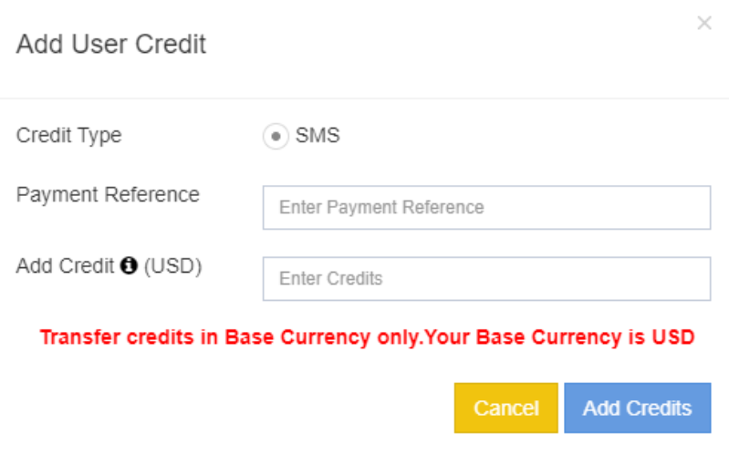

To add credits:

- Select **service type**
- Enter **payment details**
- Specify the **credit amount**

!!! note
    Credits must be added in the **base currency**.

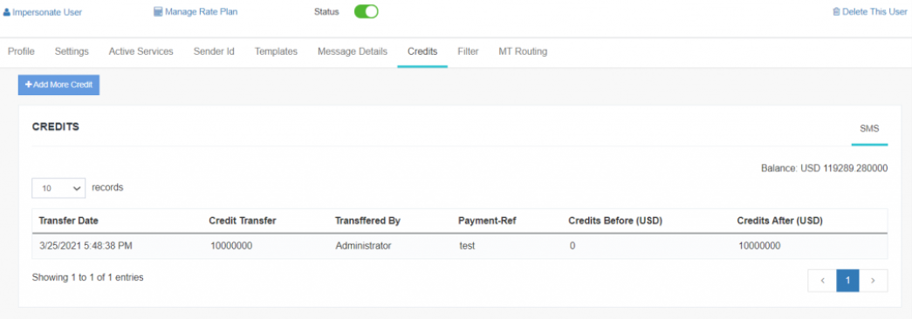

---

## Filter

The **Filter** option allows users to **whitelist mobile numbers**, ensuring **DLR compensation is not applied** to those.

Add mobile numbers with **country codes** easily.

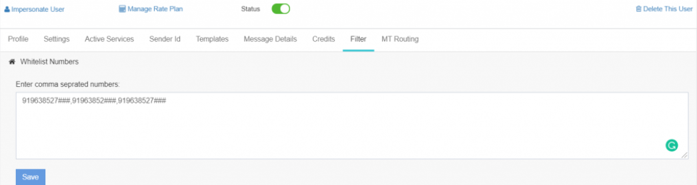

---

## MT Routing

The **MT Routing Rule** is a pivotal feature. You can:

- Create **routing rules** for directing SMS traffic
- Apply to:
  - **Web interface**
  - **APIs**
  - **SMPP submissions**

Users may also configure **fixed gateway routing rules**, auto-populating entries in the **Main Routing Engine**.

!!! tip
    Configuring a fixed gateway is optional but enhances **routing efficiency**.

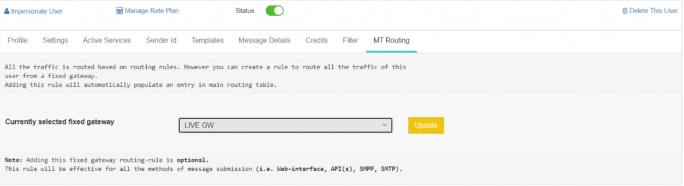

---

## Manage Rate Plan

The **Manage Rate Plan** option allows the admin to configure the **selling price** for the user.

**Selling Price:** The amount admin will be charging to their user per message will be the selling price.

To add a selling price to the user, follow the below steps:

**Step 1:** Go to Administration >> User Administration >> User Management >> Search User >> **Manage Rate Plan**.

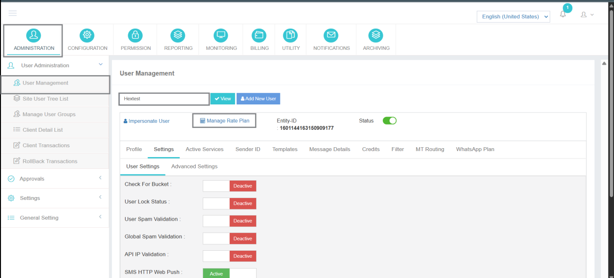

**Step 2:** Choose the appropriate method to add selling price.

### 1] Add New Selling Price

This allows the admin to enter selling price one-by-one to the Country and Networks for the user.

Select the Interface Type: **ALL** or **SMPP**

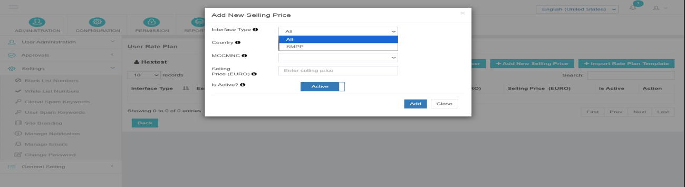

#### a) ALL Interface

If the interface has been chosen as ALL, the admin needs to specify the Country & Network then the selling price. Once all the details have been added, click on **ADD** to save the configuration.

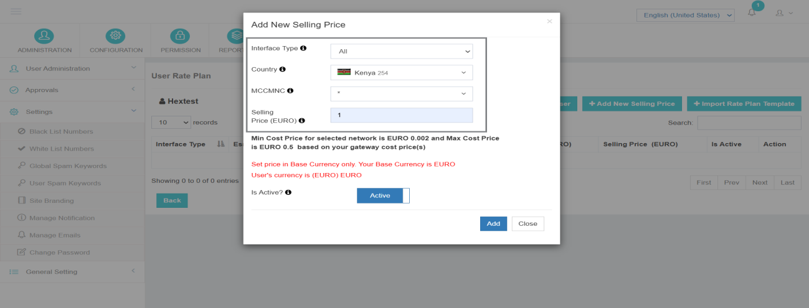

#### b) SMPP Interface

If the Interface has been chosen as SMPP, the admin needs to specify the **SMPP Connector name or ESME name**, so the rate plan will be applicable for that specific SMPP account. Then specify the Country & Network and the selling price. Once all the details have been added, click on **ADD** to save the configuration.

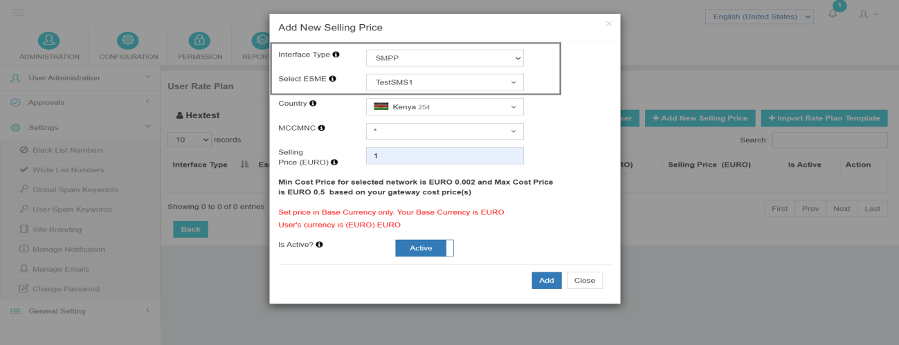

!!! info "ALL vs SMPP Interface"
    **ALL** indicates messages initiated from all the interfaces (Web, API and SMPP). **SMPP** indicates a rate plan only applicable when the user is sending traffic using the SMPP interface. If no SMPP-specific selling price is configured, messages will be processed with the price configured for ALL.

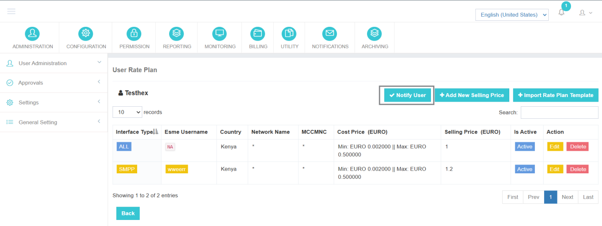

### 2] Import Rate Plan Template

This option allows the admin to import all the existing rates or prepared sheet of rates to the user account in one go. It will reduce the iterations to adding several selling prices to the user account.

**Step 1:** Select the rate plan
**Step 2:** Admin can choose the interface as well (ALL or SMPP)
**Step 3:** Option to overwrite any existing selling price.
**Step 4:** Click on the Import button to add the selling price to the user account.

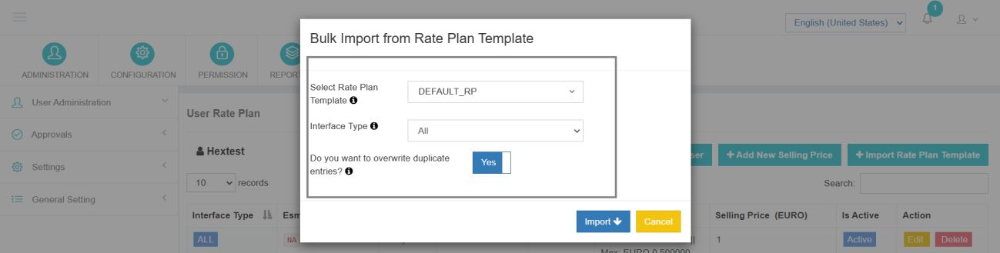

### Notify User

Whenever the selling price is updated by the admin, an email will be sent to the email registered in the user account with the subject line **"Pricing Update Notification - Your Messaging Rates Have Been Revised"**.

This email contains the excel files for all the selling prices configured in the application.

Also, the admin/Reseller can click on the **Notify User** button to trigger the email to the user in case they have not received any email.

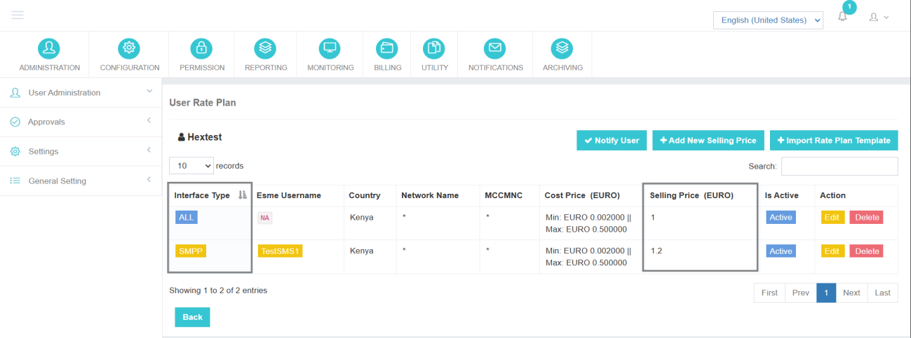

---

## User Creation - Billing Mode

During **user creation**, if the **Invoicing module** is enabled in the application, the administrator must configure the **Billing Mode** for the user. The selected billing mode determines how message usage is charged and how invoices are generated.

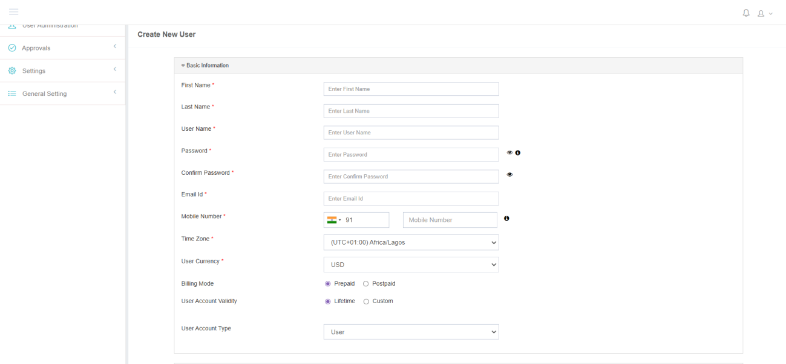

The following billing modes are available:

=== "Prepaid"

    When a user is configured as **Prepaid**:

    - The administrator must **generate an invoice manually**.
    - The invoice amount must be **credited to the user's account**.
    - Only after the invoice is claimed and balance is available will the user be able to send messages from the application.
    - Message sending is restricted based on the available prepaid balance.

=== "Postpaid"

    When a user is configured as **Postpaid**:

    - The administrator must **assign an overdraft limit** to the user.
    - The application will **automatically generate invoices** based on the configured **Billing Cycle**.
    - The user can continue sending messages until the assigned overdraft limit is reached.
    - Billing is calculated based on actual usage during the billing period.

!!! warning "Key Notes"
    - The **Billing Mode** is applicable only when the Invoicing module is active.
    - Billing configuration directly impacts user message delivery and invoice generation.
    - Proper overdraft limits and billing cycles must be configured for postpaid users to avoid service disruption.
