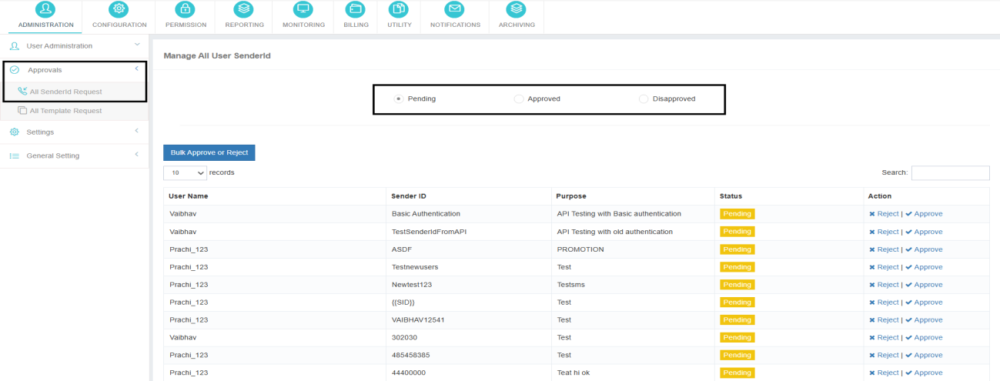

# Approvals

The **Approvals** section enables administrators to review and manage all approval requests initiated by users or resellers. This includes **Sender ID** and **Template** requests submitted for validation and compliance purposes.

Administrators can review submitted requests and **approve or reject** them as required. Decisions can also be **reconsidered at any time**, allowing an approved request to be rejected or a rejected request to be approved.

---

## All Sender ID Requests

This section displays **all Sender ID requests** initiated by users or resellers, categorized by status:

- **Pending**
- **Approved**
- **Rejected**

Administrators can review the request details and take appropriate action directly from this section.

---

### Pending Sender ID Requests

Here, you can **review and take action** on pending Sender ID approval requests from your users and resellers.

**Actions available:**

- **Approve**
- **Reject**

---

### Approved Sender IDs

This category lists all **approved Sender IDs**.

You have the **flexibility to reject** previously approved Sender IDs at any given time, offering full control over sender ID lifecycle management.

---

### Disapproved Sender IDs

Displays a list of **Sender IDs that have been rejected**.

You can **approve** these disapproved Sender IDs at any point, allowing for reconsideration and dynamic adjustments.

---

## Approval Actions

Administrators can **approve or reject** any Sender ID or Template request.

- An **approved request can be rejected**, and a **rejected request can be approved**, if reconsideration is required.
- All actions are applied immediately and reflected in the request status.

## Bulk Approval and Rejection

The **Bulk Approve** and **Bulk Reject** options allow administrators to:

- Select all requests, or
- Select specific requests

This feature enables faster processing of multiple requests in a single action.

---

!!! info "Key Notes"
    - Approval controls are applicable to both **users and resellers**.
    - All request statuses are visible for audit and tracking purposes.
    - Changes in approval status take effect instantly across the application.
