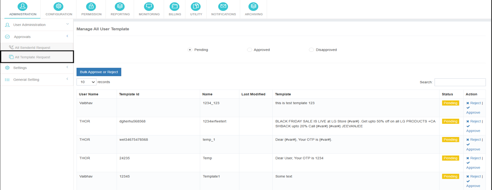

# All Template Requests

This section displays **all Template requests** initiated by users or resellers, categorized by status:

- **Pending**
- **Approved**
- **Rejected**

Administrators can review the template content and approve or reject the request based on compliance and business requirements.

---

### Pending Template Requests

Allows you to **manage and respond** to pending template approval requests efficiently.

**Actions available:**

- **Approve**
- **Reject**

---

### Approved Templates

Lists all **templates that have been approved**.

You have the **flexibility to reject** previously approved templates if necessary.

---

### Disapproved Templates

Displays a list of **templates that have been rejected**.

You have the option to **approve** these previously disapproved templates at any point.

---

## Approval Actions

Administrators can **approve or reject** any Template request.

- An **approved request can be rejected**, and a **rejected request can be approved**, if reconsideration is required.
- All actions are applied immediately and reflected in the request status.

## Bulk Approval and Rejection

The **Bulk Approve** and **Bulk Reject** options allow administrators to:

- Select all requests, or
- Select specific requests

This feature enables faster processing of multiple requests in a single action.

---

This organized structure within the Approvals section streamlines the management of both Sender ID and Template approval processes, providing clarity and control over the status of all requests.
