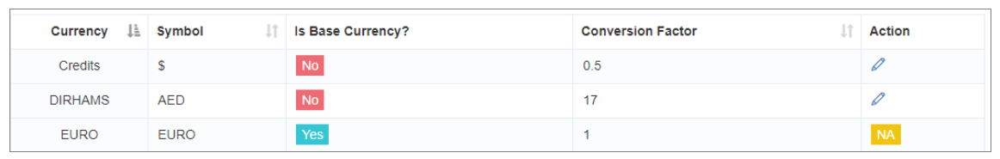

# Currency Manager

For businesses operating globally, **iTextPRO's Currency Manager** ensures seamless handling of multi-currency transactions with precision and stability.

---

## 1. Setting Base Currency

- **Crucial Decision** – The **base currency** is defined during the initial setup via iTextPRO's **Preinstallation Form**.
- **Early Decision Advantage** – Changing the base currency later is complex due to conversion dependencies, so it’s best to choose correctly from the start.

---

## 2. Handling Multiple Currencies

- **System Flexibility** – Work with multiple currencies within the system.
- **Base Currency Relation** – All calculations are evaluated in reference to the base currency.

---

## 3. Conversion Factor Maintenance

- **Administrator Responsibility** – Admins maintain the conversion factors for each display currency relative to the base currency.
- **Ensuring Accuracy** – Correct conversion factors guarantee precise and reliable currency calculations across the system.

---

## 4. Preinstallation Form

- **Smooth Setup** – The form requests the base currency to ensure correct configuration from the beginning.
- **Data Accuracy** – Accurate initial inputs improve the system’s performance in managing multiple currencies.

---

## Summary

The **Currency Manager** offers:
- Accurate base currency configuration
- Support for multiple currencies
- Administrator-controlled conversion factors

This ensures **stability**, **accuracy**, and **ease of use** for international financial operations.
