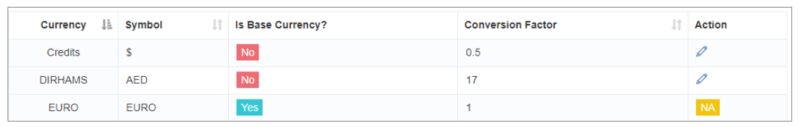

# Para Yöneticisi

Küresel olarak faaliyet gösteren işletmeler için **iTextPRO'in Para Yöneticisi** Hassas ve stabilite ile çoklu yeterlilik işlemlerinin sorunsuz bir şekilde işlenmesini sağlar.

---

## 1. Setting

- **Crucial Decision** - The - The **Temel para birimi** iTextPRO'in ilk kurulumu sırasında tanımlanır **Preinstallation Form**.
- **Erken Karar Avantajı** - Daha sonra temel para birimini değiştirmek dönüşüm bağımlıları nedeniyle karmaşıktır, bu yüzden baştan doğru seçim yapmak en iyisidir.

---

## 2. Multi Currencies

- **Sistem Flexability** - Sistem içinde birden fazla para birimi ile çalışın.
- **Base Para Relation** - Tüm hesaplar temel para birimine referans olarak değerlendirilir.

---

## 3. Dönüşüm Faktörü Bakım Faktörü

- **Yönetici Sorumluluk Sorumluluk** - Yöneticiler her ekran para birimi için dönüşüm faktörlerini temel para birimine göre korurlar.
- **Ensuring Truth** - Doğru dönüşüm faktörleri sistem genelinde kesin ve güvenilir para hesaplamalarını garanti eder.

---

## 4. Kurulum Formu

- **Parlak Kurulum** - Form, başlangıçta doğru yapılandırmayı sağlamak için temel para talep eder.
- **Veri Analizi** - Doğru ilk girişler, sistemin performansını birden fazla para birimi yönetmek için geliştirir.

---

## Özet Özet Özet Özet

The The The The The The The The **Para Yöneticisi** Teklifler:
- Doğru temel para yapılandırma konfigürasyonu
- Birden fazla para birimi için destek
- Yönetici kontrollü dönüşüm faktörleri

Bu, sağlar **istikrar istikrar istikrarı**, **doğruluk doğruluk**Ve **Kullanım kolaylığı** Uluslararası finansal operasyonlar için.
