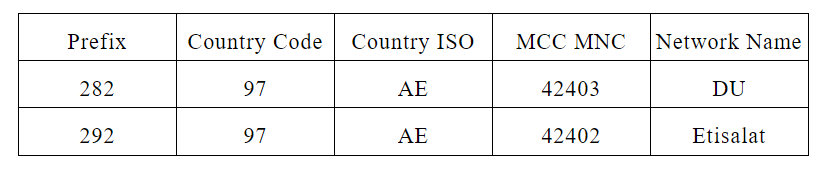
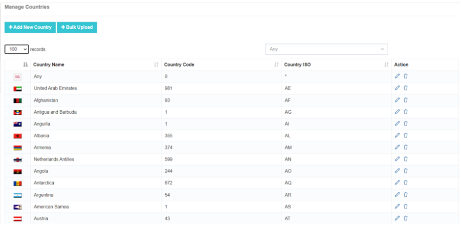
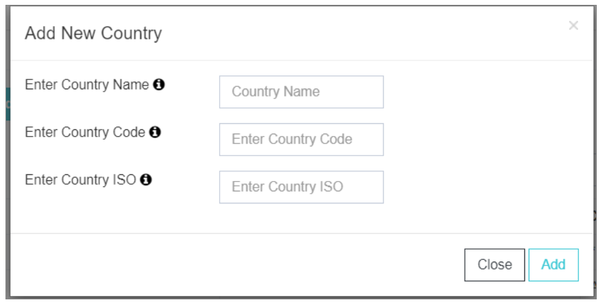
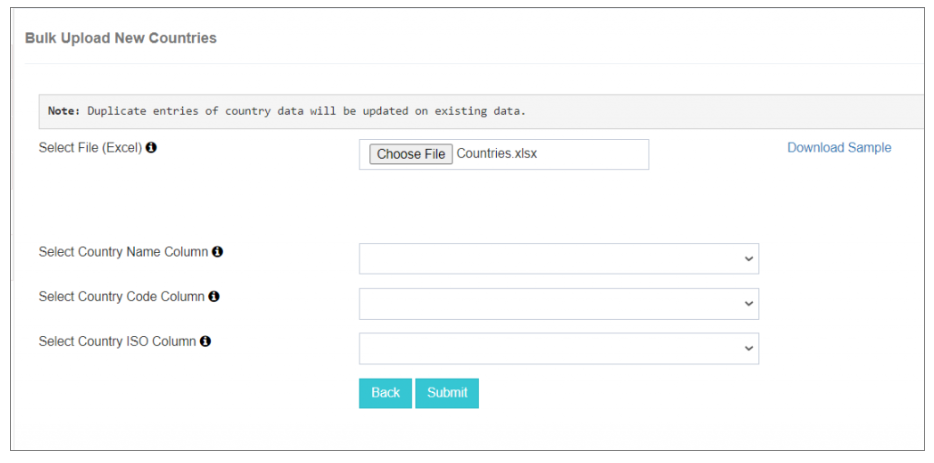
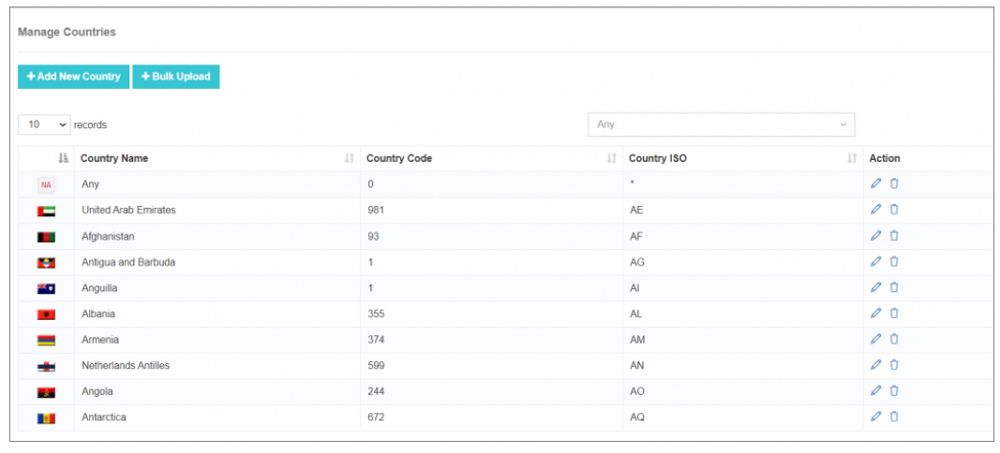

# Billing

## Simplified Billing Management with iTextPRO

Aggregators in the SMS industry often face challenges in managing **multiple gateways**, **diverse pricing structures**, and **international transactions**.  
The **iTextPRO Billing Module** addresses these challenges with advanced features that ensure streamlined, accurate, and profitable operations.

---

## 1. Setting up Base Currency

- **Importance**: Ensures consistency and accuracy in financial transactions.
- **Recommendation**: Euro (EUR) is widely used in the global SMS aggregation industry.
- **Consideration**: Once the base currency is set, changing it can be complex. Decide early in the business journey.

---

## 2. Understanding MCC and MNC Codes

- **MCC (Mobile Country Code)** and **MNC (Mobile Network Code)** are crucial for customizing pricing based on mobile networks within a country.
- **Operator Pricing**: Many telecom operators base their pricing on MCC + MNC combinations.
- **Flexibility**: iTextPRO enables **network-specific pricing** for greater revenue optimization.

---

## 3. Understanding Prefix for Reverse Engineering Mobile Numbers

- **Purpose**: Identifies the origin and network of a mobile number.
- **Prefix**: The first 3–4 digits help detect **Country Code** and **Mobile Network**.
- **Example**:  
  - Number: `+9728028022`  
  - Country Code: `+97` (UAE)  
  - With flat pricing: Cost calculation is straightforward.  
  - With MCC/MNC pricing: Additional lookup is required (no current tool provides MCC/MNC directly from this number).

---

## 4. Currency Conversion

- **Base Currency**: Used for internal transactions.
- **Display Currency**: Users can view transactions in their preferred currency.
- **Benefit**: Simplifies international operations while maintaining accounting accuracy.

---

## 5. Loss Protection Policy

- **Revenue Leakage Tool**: Identifies potential revenue losses in real time.
- **Preventive Measures**: Stops transactions caused by typos, number manipulation, or admin errors.
- **Financial Safeguard**: Protects against revenue loss and ensures billing accuracy.

---

## Key Benefits

- **Operational Simplification** – Streamlined global SMS billing.  
- **Precise Pricing** – Network-level control for competitive pricing.  
- **Clear Currency Handling** – Seamless base and display currency management.  
- **Financial Security** – Automated loss prevention policies.  

---

# Master Data Manager

The **Master Data Manager** section contains four key configuration options:

1. **Manage Countries**  
2. **Manage MCC/MNC**  
3. **Manage Prefix**  
4. **Manage Gateway Price**

---

## 1. Manage Countries

The **Manage Countries** feature allows configuration and management of SMS traffic termination across multiple countries.

### Adding a Single Country

- **Country Name** – Full country name for clear identification.  
- **Country Code** – Unique identifier for routing.  
- **Country ISO Code** – Standardized code for global compatibility.  
- **Add Process** – Click **Add** to include the country in the master list.

---

### Bulk Upload Functionality

- **Download Sample Excel** – Pre-formatted with all countries for easy editing.  
- **Choose File & Upload** – Supports multiple entries at once.  
- **Column Mapping** – Map Excel fields to **Country Name**, **ISO**, and **Code**.  
- **Submit & Display** – Bulk add countries and customize record display.

---

### Action Feature

- **Edit** – Update existing details.  
- **Update** – Refresh country data.  
- **Delete** – Remove unused entries.  

---

**Best Practice:**  
Regularly review and update your **Master Data Manager** to ensure country and network configurations remain accurate for pricing and routing.
