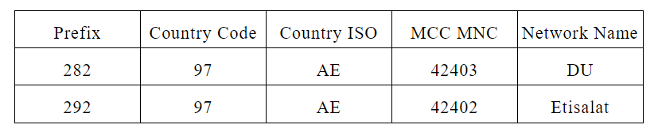
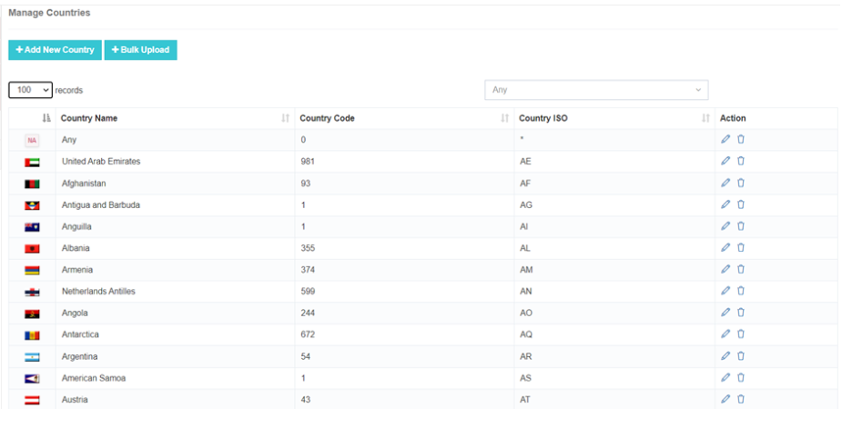
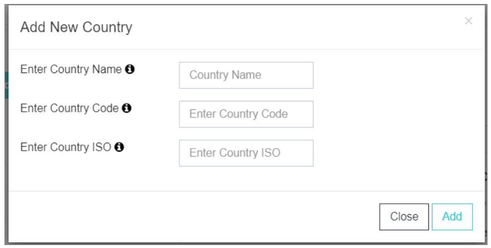
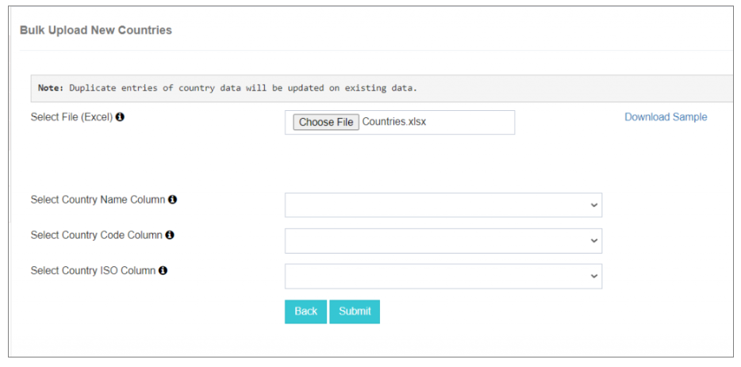
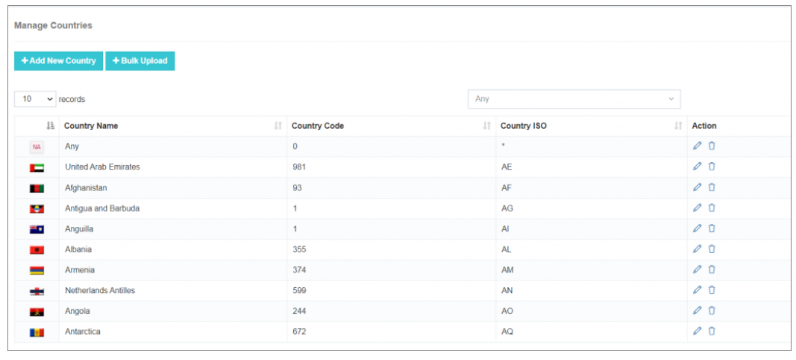

---
tags:
  - Billing
  - Rate Plan
  - Pricing
---

# 計費

## 用 iTextPRO 簡化計費管理

簡訊業的彙總者在管理方面經常面臨挑戰。 **多個閘道器**, (中文(簡體) ). **不同的定價結構**,以及 **國際交易**。 。 。 。 
這個 **iTextPRO 計費模組** 以先進特點應對這些挑戰,確保業務精簡、準確和有利可圖。

---

## 1. 建立基本貨幣

- **重要性**:確保金融交易的一致性和準確性。
- **建議**: Euro (EUR)被廣泛用於全球短訊息聚合行業.
- **審議情況**: 基幣一被設定,改變它就可能很複雜. 早點決定出行

---

## 2. 瞭解MCC和MNC編碼

- **MCC(機動國家程式碼)** 財務報告和審定財務報表 **MNC(行動網路程式碼)** 這對於根據國內行動網路定製定價至關重要。
- **運算子定價**: 許多電信運營商將其定價基於MCC+MNC組合.
- **靈活性**: iTextPRO 啟用 **網路特定定價** 以更好地最佳化收入。

---

## 3. 理解反向工程移動號碼的字首

- **目的**: 識別移動號碼的來源和網路.
- **字首**: 前三至四位數幫助檢測 **國家程式碼** 財務報告和審定財務報表 **行動網路**。 。 。 。
- **示例**數字 : 
  - 數量 :  
  - 國家程式碼:  (阿聯酋) 
  - 採用平價:費用計算簡單。 
  - 使用MCC/MNC定價:需要額外的查詢(目前沒有任何工具直接從這個號碼中提供MCC/MNC).

---

## 4. 貨幣兌換

- **基準貨幣**: 用於內部交易。
- **顯示貨幣**:使用者可以以首選貨幣檢視交易.
- **養卹金**:簡化國際業務,同時保持會計準確.

---

## 5. 損失保護政策

- **收入洩漏工具**:實時確定潛在收入損失.
- **預防措施**: 停止由打字,數字操縱或管理錯誤所引發的交易.
- **財政保障**:防止收入損失,確保收費準確。

---

## 主要惠益

- **業務簡化** ——簡化全球短訊息收費. 
- **精確定價** ——網路層面對競爭性定價的控制. 
- **清除貨幣處理** ——無縫地基並顯示貨幣管理. 
- **金融安全** - 自動防止損失政策。 

---

# 主資料管理器

這個 **主資料管理器** 節包含四個關鍵配置選項:

1. **管理國家** 
2. **管理管理中心/多國** 
3. **管理字首** 
4. **管理閘道器價格**

---

## 1. 管理國家

這個 **管理國家** 功能允許對多國的簡訊流量終止進行配置和管理。

### 新增單一國家

- **國家名稱** ——明確識別的全國名. 
- **國家程式碼** ——出行專用標識. 
- **國家 ISO 程式碼** – 全球相容性標準化程式碼. 
- **新增程序** - 點選 **新增** 將國家列入主列表。

---

### 大塊上傳功能

- **下載樣本Excel** - 為方便編輯而與所有國家預先格式化。 
- **選擇檔案上傳( U)** – 立即支援多個條目. 
- **列對映** - 將Excel 欄位對映到 **國家名稱**, (中文(簡體) ). **ISO 標準**,以及 **程式碼**。 。 。 。 
- **提交顯示( D)** – 批次新增國家並自定義記錄顯示.

---

### 動作特性

- **編輯** - 更新現有細節。 
- **更新** - 更新國家資料。 
- **刪除** - 刪除未使用的條目。 

---

**最佳做法:** 
定期審查和更新您的 **主資料管理器** 確保國家和網路配置在定價和路線上保持準確。
