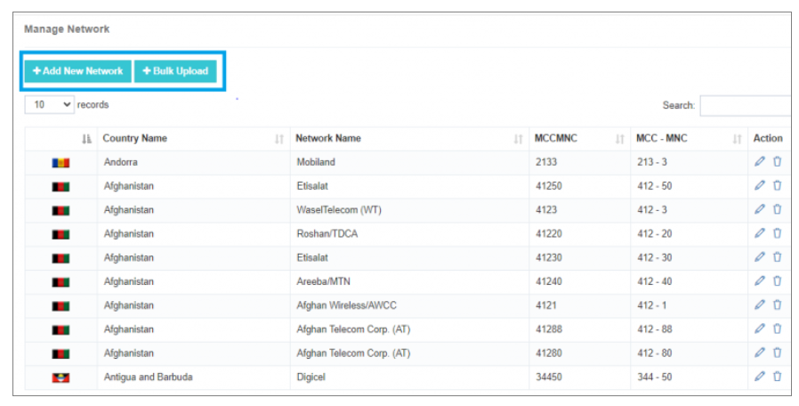
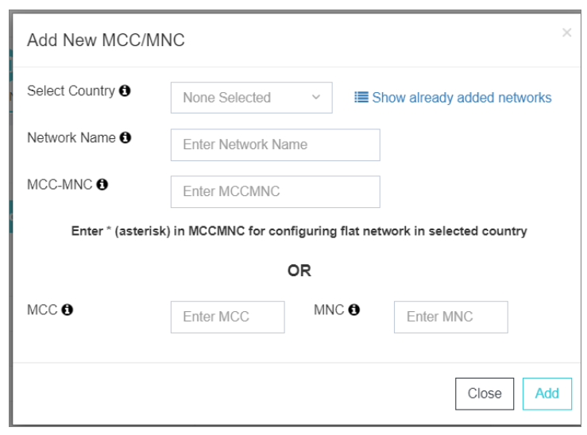
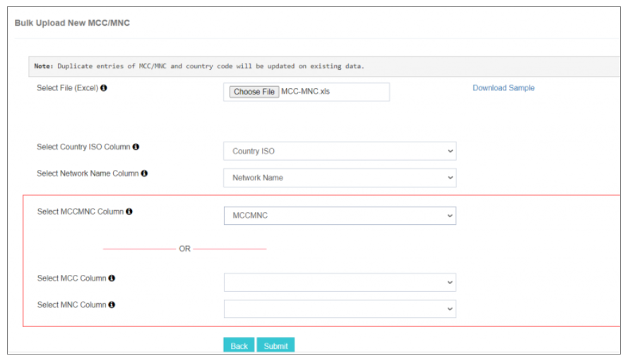

# Manage Networks (MCC-MNC)

The **Manage MCC-MNC** feature in iTextPRO is a key tool for configuring and managing network operators within the system. It offers an intuitive and detailed interface, making operator management simple and efficient.

---

## Adding a Single Network Operator

1. **Select Country** – Choose the specific country for which you want to configure a network operator, ensuring relevance to that country.
2. **Network Name** – Enter the name of the network operator for clear identification.
3. **MCC-MNC Configuration** –  
   - **MCC:** Mobile Country Code  
   - **MNC:** Mobile Network Code  
   - **Wildcard:** Use `*` for a flat network without any prefix.
4. **Adding Process** – Click **Add** to save the network operator. This process streamlines operator setup and reduces complexity.

---

## Bulk Upload Functionality

1. **Prepare Excel File** – Download the sample Excel template to prepare your list of network operators, ensuring correct column formatting.
2. **Upload File** – Use the **Choose File** option to upload the prepared Excel file and add multiple operators at once.
3. **Column Mapping** – Match Excel columns to required fields such as:
   - `Country ISO`
   - `Network Name`
   - `MCC-MNC`
4. **Submit and Display** – Click **Submit** to process the bulk upload. You can also customize which records are displayed in the list.

---

## Managing Existing Operators

The **Action** menu lets you:
- **Edit** operator details
- **Update** configurations
- **Delete** operators

This ensures you can keep network operator settings accurate and up to date at all times.

