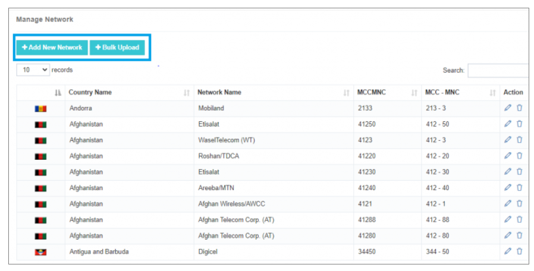
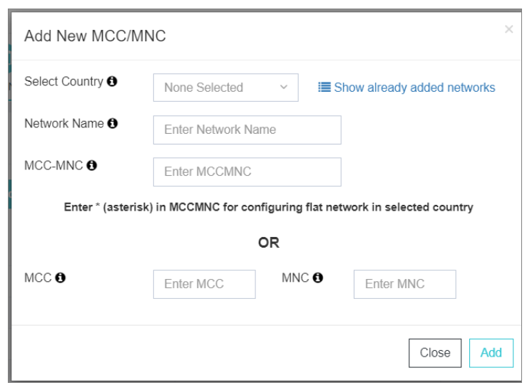
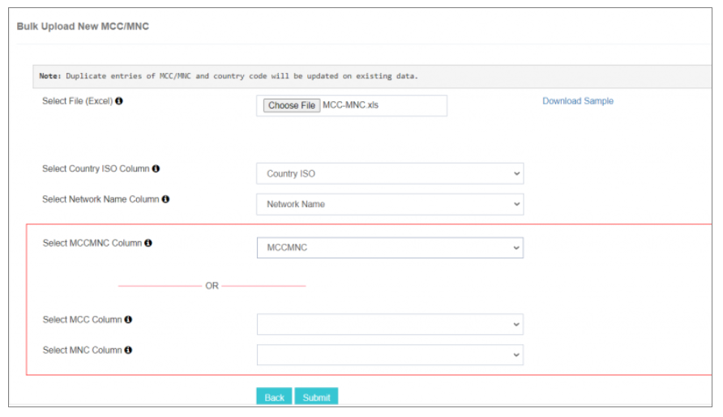

# Ağları Yönetin (MCC-MNC)

The The The The The The The The **MCC-MNC** iTextPRO'deki özellik, sistem içindeki ağ operatörlerinin yapılandırılması ve yönetilmesi için anahtar bir araçtır. Bu sezgisel ve detaylı bir arayüz sunar, operatör yönetimi basit ve verimli hale getirir.

---

## Tek Bir Ağ Operatörü ekle

1. **Ülke Seç** - Bir ağ operatörü yapılandırmak istediğiniz belirli ülkeyi seçin, bu ülkeye ilgi sağlamak.
2. **Network Name Network Name** - Net kimlik için ağ operatörü adını girin.
3. **MCC-MNC Build** – 
   - **MCC:** Mobile Country Code 
   - **MNC:** Mobile Network Code Code 
   - **Wildcard:** Use Use Use Use Use Use  Herhangi bir ek olmadan düz bir ağ için.
4. **Add Process** - Click - Click **Add Add Add Add Add Add Add Add Add Add Add Add Add Add Add Add Add Add Add Add Add Add Add Add Add Add Add Add Add Add Add Add Add Add Add Add Add Add Add Add Add Add Add Add Add Add Add Add Add Add Add Add Add Add Add Add Add Add Add Add Add Add Add Add Add Add Add Add Add Add Add Add Add Add Add Add Add Add Add Add Add Add Add Add Add Add Add Add Add Add Add Add Add Add Add Add Add Add Add Add Add Add Add Add Add Add Add Add Add Add Add Add Add Add Add Add Add Add Add Add Add Add Add Add Add Add Add Add Add Add Add Add Add Add Add Add Add Add Add Add Add Add Add Add Add Add Add Add Add Add Add Add Add Add Add Add Add Add Add Add Add Add Add Add Add Add Add Add Add Add Add Add Add Add Add Add Add Add Add Add Add Add Add Add Add Add Add Add Add Add Add Add Add Add Add Add Add Add Add Add Add Add Add Add Add Add Add Add Add Add Add Add Add Add Add Add Add Add Add Add Add Add Add Add Add Add Add Add Add Add Add Add Add Add Add Add Add Add Add Add Add Add Add Add Add Add Add Add Add Add Add Add Add Add Add Add** Ağ operatörünü kurtarmak için. Bu süreç operatör kurulumu kolaylaştırır ve karmaşıklığı azaltır.

---

## Bulkload Fonksiyonelity

1. **Excel File** - Network operatörleri listesini hazırlamak için örnek Excel şablonunu indirin, doğru sütun formatı sağlamak.
2. **File File** – Kullanın **Dosyayı seçin** Hazır Excel dosyasını yüklemek ve birden fazla operatör ekleyin.
3. **Köşe** - Match Excel sütunları gibi alanları gerekli:
   - 
   - 
   - 
4. **Gönder ve Ekran** - Click - Click **Gönder** Toplu yükleme işlemini yapmak için. Listede hangi kayıtların görüntülendiğini de özelleştirebilirsiniz.

---

## Mevcut Operatörlerin Yönetimi

The The The The The The The The **Eylem** Menü size izin verir:
- **Edit** operatör detayları
- **Update Update Update Update Update Update Update** konfigürasyonlar
- **Delete** Operatörler operatörleri

Bu, ağ operatör ayarlarını doğru ve her zaman güncel tutabileceğinizi sağlar.
