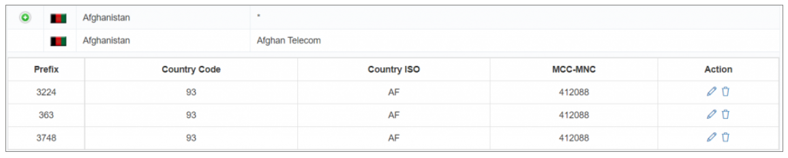
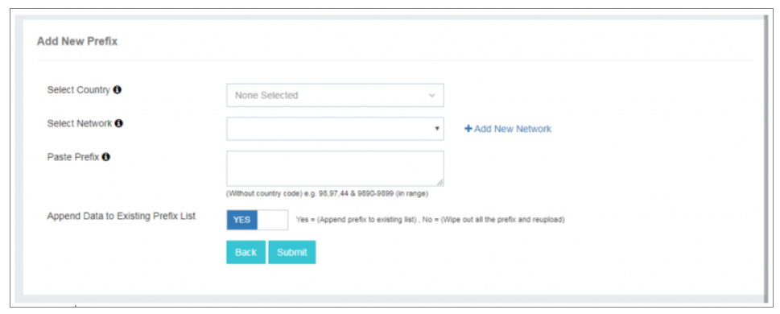
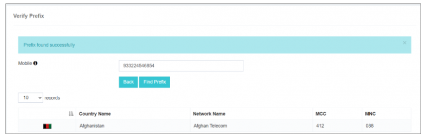

# Manage Prefix

El **Manage Prefix** característica en iTextPRO está diseñado para manejar eficientemente los prefijos de números móviles asociados con países específicos y operadores de red. Desempeña un papel importante para asegurar una cartografía y facturación precisas de la red.

---

## Caso de uso para gestionar prefijos

### Consideraciones de la estructura de proyectos

#### Facturación basada en la red (MCC-MNC)
- **Prefijo como parámetro de reproducción** – Cuando la facturación se basa en la red (MCC-MNC), añadir prefijos es crucial. Los prefijos actúan como parámetros de mapeo para identificar patrones de facturación de red con precisión.
- **Precisión de la facturación mejorada** – La gestión de prefijos asegura que el sistema de facturación se ajuste a las configuraciones de red específicas vinculadas a los códigos MCC-MNC.

#### Facturación de base nacional
- **No se requiere gestión de prefijo** – Para facturación plana basada en el país, no se necesitan prefijos. Billing se maneja directamente sobre la base de códigos de país.
- **Proceso de facturación simplificado** – El sistema factura las transacciones utilizando sólo el código del país, racionalizando el proceso.

---

## Añadiendo nuevos prefijos

1. **Selección País y Operador** – Seleccione el país deseado y el operador de red asociado.
2. **Entrada de prefijo** – Pegar o introducir manualmente el prefijo (sin el código del país) en la caja de entrada.
3. **Opciones de apéndice o sustitución** – 
   - Seleccione **Sí.** para anexar el nuevo prefijo a la lista existente. 
   - Seleccione **No** para reemplazar completamente la lista de prefijo existente.
4. **Submission** - Haga clic **Submit** para finalizar la importación de prefijo.

---

## Verificar la funcionalidad del prefijo

El **Verificar Prefijo** herramienta proporciona detalles de red rápidos para un número de móvil dado.

1. **Introduzca el número de móvil** – Ingrese el número que desea verificar.
2. **Visualización de resultados** – El sistema muestra:
   - Nombre del país
   - Nombre de la red
   - MCC-MNC

Esto ayuda a confirmar la exactitud de los detalles de número móvil y la información de red asociada.
