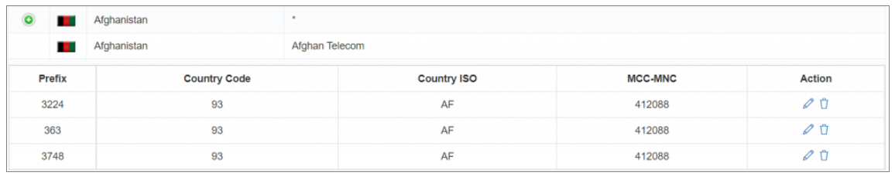
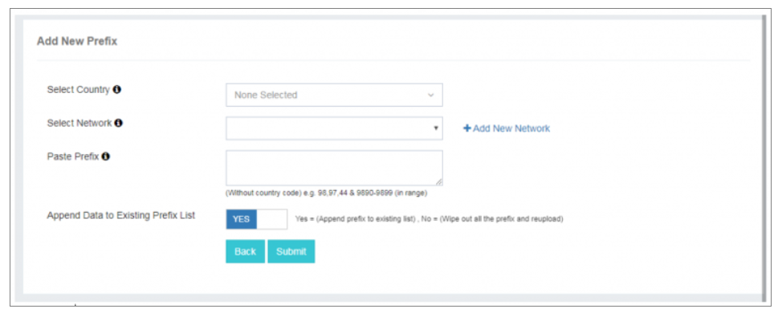
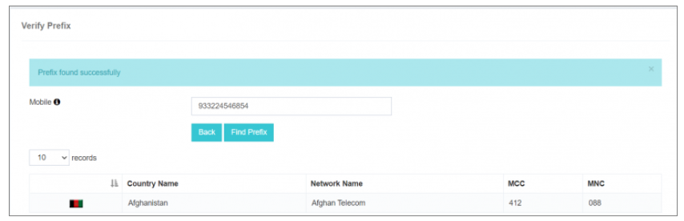

# Manage Prefix

The **Manage Prefix** feature in iTextPRO is designed to efficiently handle mobile number prefixes associated with specific countries and network operators. It plays an important role in ensuring accurate network mapping and billing.

---

## Use Case for Managing Prefixes

### Billing Structure Considerations

#### Network-Based Billing (MCC-MNC)
- **Prefix as Mapping Parameter** – When billing is based on network (MCC-MNC), adding prefixes is crucial. Prefixes act as mapping parameters to identify network-wise billing patterns accurately.
- **Enhanced Billing Precision** – Prefix management ensures the billing system aligns with the specific network configurations tied to MCC-MNC codes.

#### Country-Based Billing
- **No Prefix Management Required** – For flat, country-based billing, prefixes are not needed. Billing is handled directly based on country codes.
- **Simplified Billing Process** – The system bills transactions using only the country code, streamlining the process.

---

## Adding New Prefixes

1. **Country and Operator Selection** – Select the desired country and the associated network operator.
2. **Prefix Entry** – Paste or manually enter the prefix (without the country code) into the input box.
3. **Append or Replace Options** –  
   - Select **Yes** to append the new prefix to the existing list.  
   - Select **No** to replace the existing prefix list entirely.
4. **Submission** – Click **Submit** to finalize the prefix import.

---

## Verify Prefix Functionality

The **Verify Prefix** tool provides quick network details for a given mobile number.

1. **Enter Mobile Number** – Input the number you wish to verify.
2. **Result Display** – The system shows:
   - Country Name
   - Network Name
   - MCC-MNC

This helps confirm the accuracy of mobile number details and associated network information.
