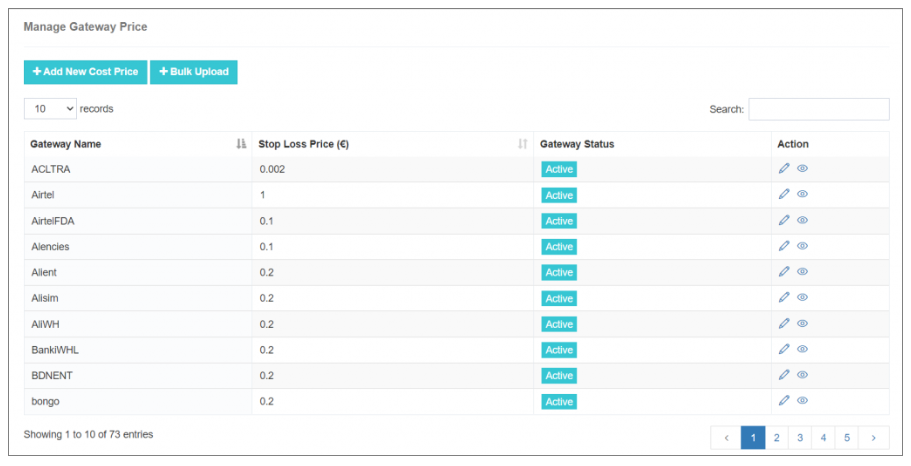
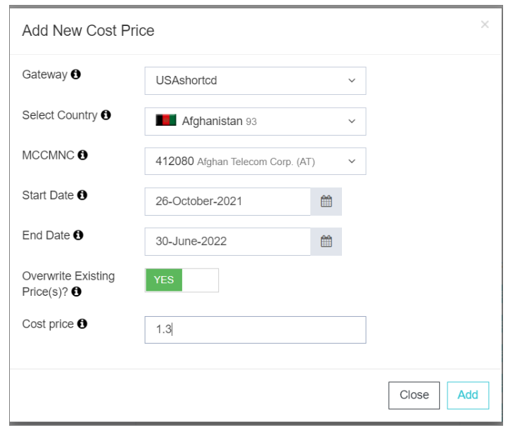
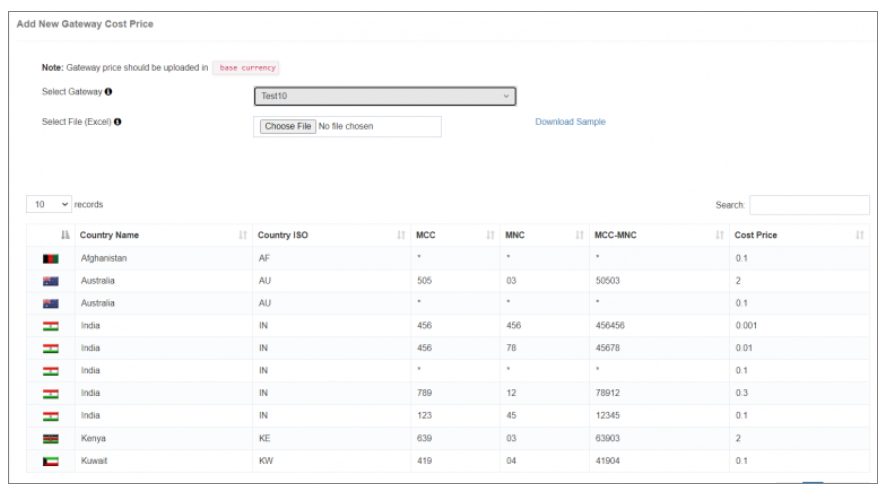
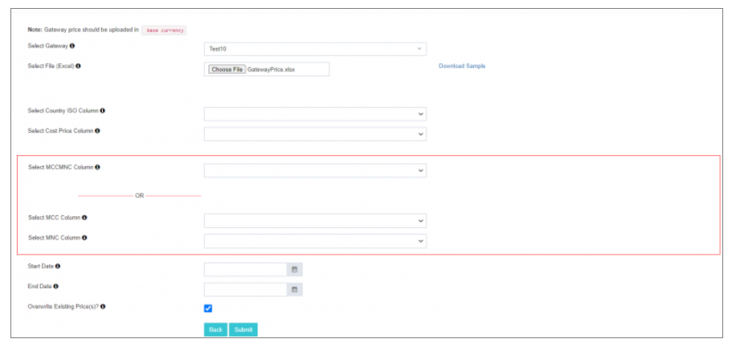
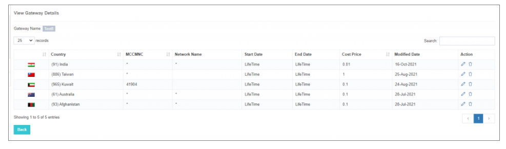

# Manage Gateway Price

**Optimizing Financial Accuracy with Gateway Price Management in iTextPRO**

In iTextPRO, precise financial tracking and loss prevention are vital for maintaining a robust SMS service. Managing gateway prices ensures accurate billing, cost tracking, and long-term profitability.

---

## Importance of Gateway Cost Price

- **Financial Accuracy** – Setting the cost price for configured network operators is essential for precise financial reporting. This is especially important when applying a flat price for a specific country.
- **Loss Protection** – By storing the gateway cost price in the base currency, iTextPRO helps prevent revenue leakage and safeguards against pricing discrepancies.

---

## Configuring Gateway Cost Price

### 1. Add New Cost Price
- Navigate to **Add New Cost Price** in iTextPRO.
- Configure details:
  - Gateway vendor
  - Country / MCC-MNC (use `*` for flat cost price)
  - Start and end dates
  - Option to overwrite existing pricing

---

### 2. Bulk Upload

The Bulk Upload feature streamlines the setup of multiple gateway prices at once.

#### Bulk Upload Steps

1. **Prepare Excel File**  
   - Download the sample Excel template from iTextPRO.  
   - Fill in your Gateway Price list with the required columns.

   

2. **Select Gateway**  
   - Choose the gateway for which you want to import cost prices.  
   - The system displays any existing cost prices for reference.

3. **Upload Excel File**  
   - Click **Choose File** to upload your Excel file.  
   - Map the columns to:
     - **Country ISO**
     - **Cost Price**
     - **MCC-MNC**

4. **Submit**  
   - Click **Submit** to import the data.

5. **Viewing Imported Prices**  
   - Select the gateway and click **View**.  
   - Review the imported prices for accuracy.

---

## Action Feature

The **Action** feature gives full control over gateway price management.  
You can:
- Edit existing prices  
- Update configurations  
- Delete outdated prices  

---

By leveraging iTextPRO's Gateway Price Management, businesses can **improve financial precision**, **streamline cost control**, and **reduce risks** — turning pricing into a strategic advantage in SMS operations.
