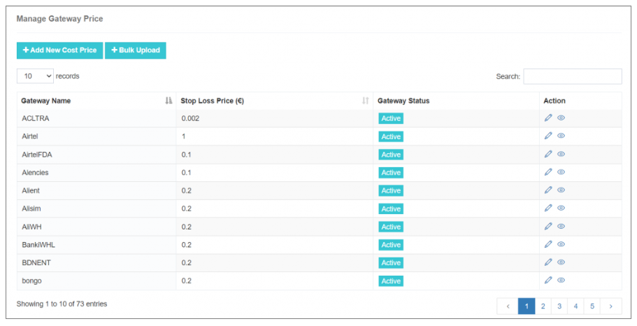
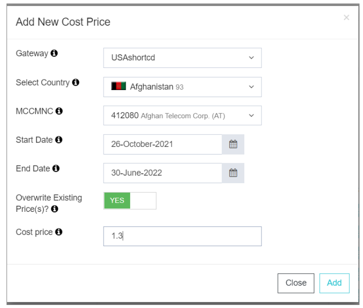
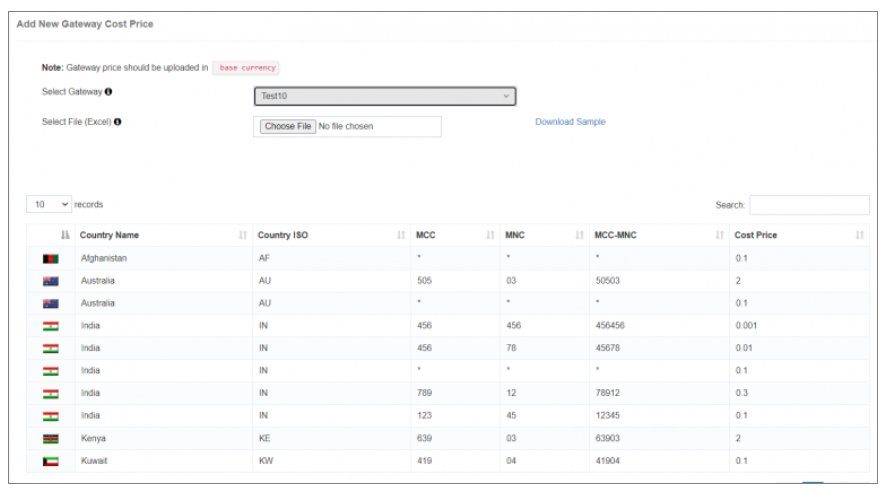
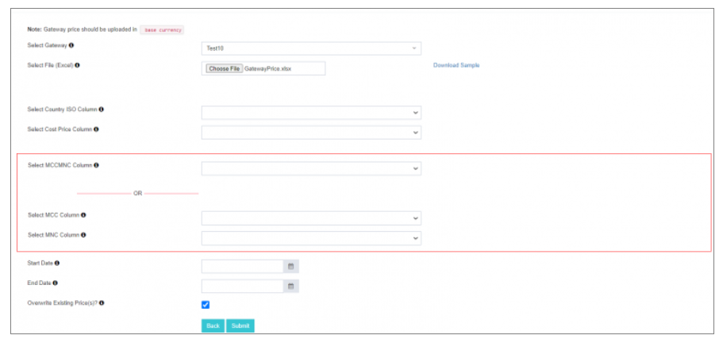
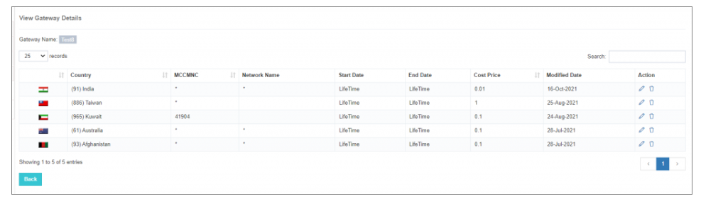

# 管理閘道器價格

**最佳化iTextPRO中閘道器價格管理的財務準確性**

在iTextPRO中,精確的財務跟蹤和預防損失對於維持強有力的簡訊服務至關重要。 管理閘道器價格確保了準確的計費、成本跟蹤和長期盈利。

---

## 閘道器成本價格的重要性

- **財務準確性** - 為已配置的網路運營商確定成本價格對準確的財務報告至關重要。 在對特定國家適用統一價格時,這一點尤其重要。
- **損失保護** - iTextPRO透過將閘道器成本價格以基準貨幣儲存,有助於防止收入流失並防範價格差異。

---

## 配置閘道器成本價格

### 1. 新增新的成本價格
- 導航到 **新增新成本價格** 在 iTextPRO 中。
- 配置細節 :
  - 閘道器供應商
  - 國家/管理協委會 -- -- MNC(使用)  固定成本價格)
  - 開始和結束日期
  - 覆蓋現有定價的選項

---

### 2. 散裝上傳

Bulk上傳功能一併簡化了多個閘道器價格的設定.

#### 大塊上傳步驟

1. **準備 Excel 檔案** 
   - 從 iTextPRO 下載樣本 Excel 模板。 
   - 將所需的列填入您的閘道器價格列表。

 

2. **選擇閘道器** 
   - 選擇要匯入成本價格的閘道器 。 
   - 該系統顯示任何現有成本價格以供參考。

3. **上傳 Excel 檔案** 
   - 點選 **選擇檔案** 上傳您的 Excel 檔案。 
   - 將列對映到:
     - **國家 ISO**
     - **價格**
     - **MCC - MNC 移動控制中心**

4. **提交** 
   - 點選 **提交** 以匯入資料。

5. **檢視匯入價格** 
   - 選擇閘道器並單擊 **檢視**。 。 。 。 
   - 審查進口價格的準確性。

---

## 動作特性

這個 **行動** 特性可以充分控制閘道器價格管理。 
你可以這樣:
- 編輯現有價格 
- 更新配置 
- 刪去過時的價格 

---

透過利用iTextPRO的門戶價格管理,企業可以 **提高財務精確度**, (中文(簡體) ). **簡化費用控制**,以及 **減少風險** ——將定價轉化為簡訊業務的戰略優勢.
