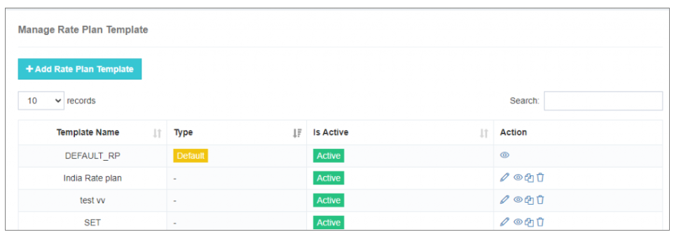
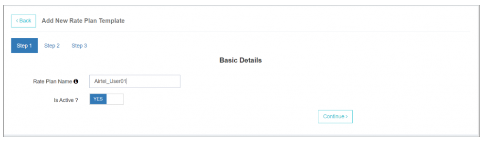
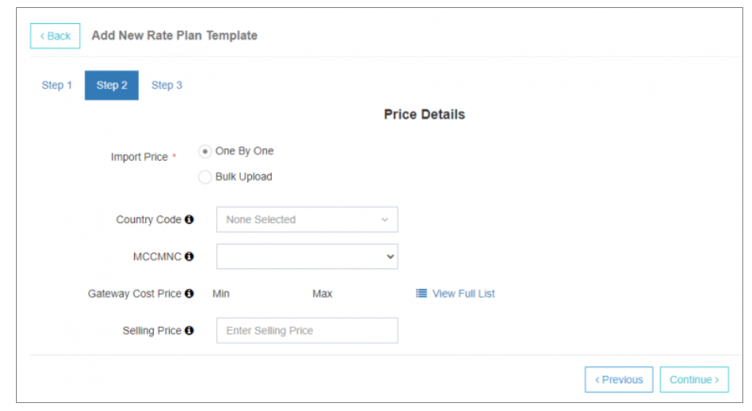
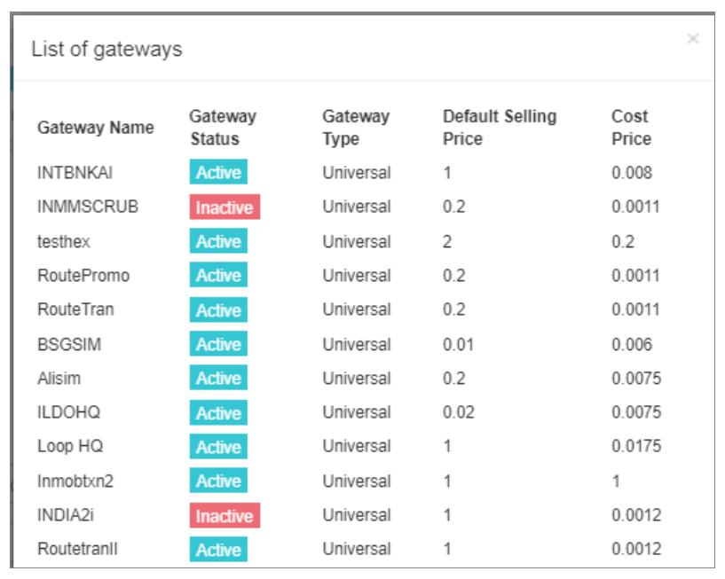
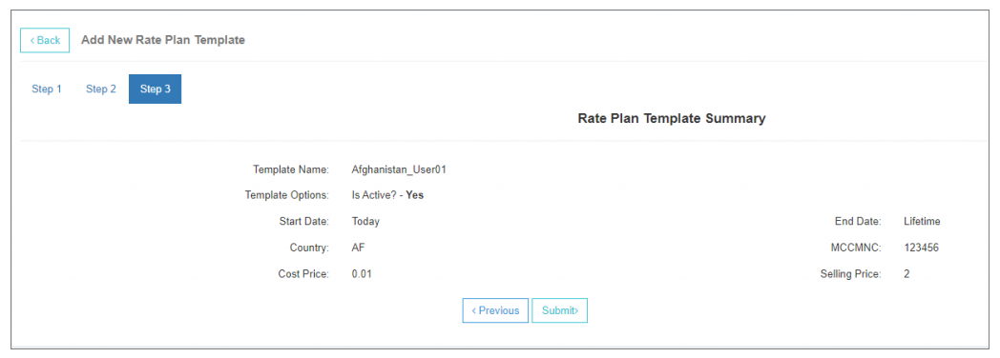
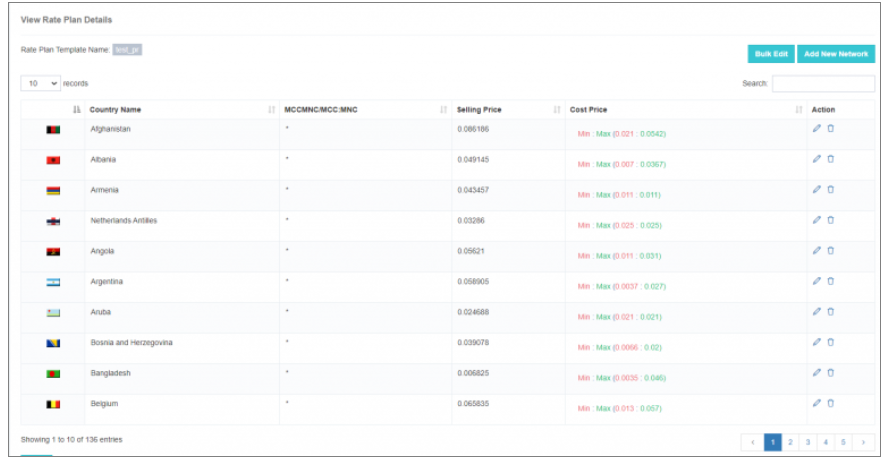
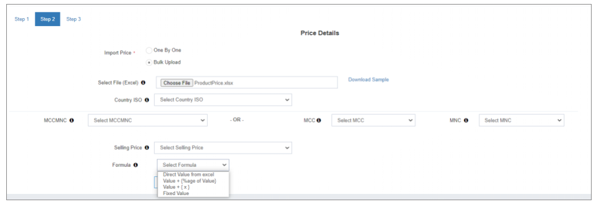
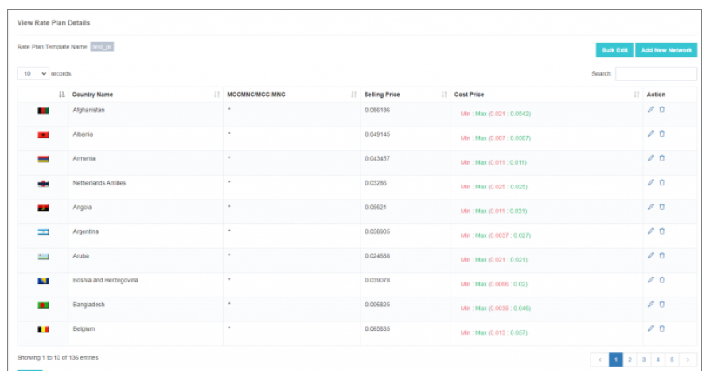
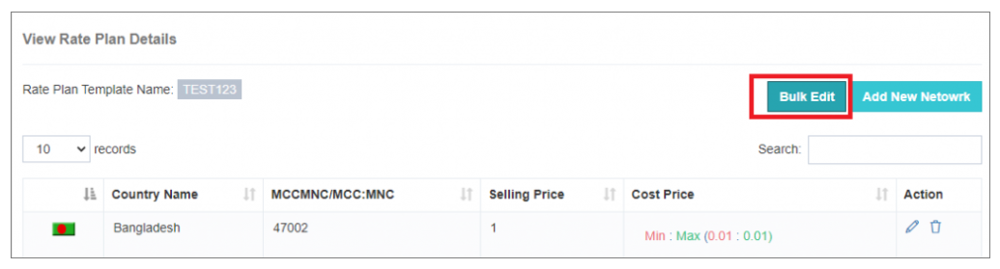
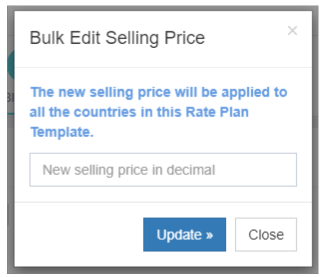

# Rate Plan Templates

In the competitive SMS industry, managing rates efficiently is crucial for maximizing revenue and ensuring sustainable profit margins. iTextPRO's **Rate Plan Manager** automates the process, enabling accurate, scalable, and easy-to-manage selling price configurations.

---

## 1. Importance of Selling Price

- **Revenue Maximization** – Accurate rates based on country and MCC-MNC ensure optimal revenue while balancing service quality and cost.  
- **Loss Protection** – Setting selling prices in the base currency safeguards against revenue leakage and maintains consistent billing accuracy.

---

## 2. Adding Selling Prices

### a. Default Rate Plan Application
- New user accounts automatically inherit the **default rate plan**, ensuring quick onboarding and consistency.

### b. Adding a Rate Plan Template
1. Click **Add Rate Plan Template**.
2. Enter a **friendly name** for the template.
3. Choose an import method:
   - **One by One**
   - **Bulk Upload**

---

## 3. One by One Configuration

- **Country / MCC-MNC** – Select the country and network operator.  
  - Use `*` for a flat selling price across all networks in that country.
- **Gateway Cost Price** – View the **minimum** and **maximum** cost prices from **Manage Gateway Prices**.
- **Full List View** – Access all gateways and their configured cost prices for the selected network.

- **Verify & Confirm** – Review the rate plan summary and click **Submit** to save changes.

---

## 4. Viewing Configured Selling Prices

  
- Click **View** to see all selling prices imported into the template.  
- Use this view for **comprehensive rate plan analysis**.

---

## 5. Bulk Upload

**Steps:**
1. **Prepare Excel File**
   - Download the sample file.
   - Organize the selling price list with required details.

2. **Upload File**
   - Click **Choose File** to upload your prepared Excel.

3. **Map Columns**
   - Assign columns for:
     - **Country ISO**
     - **Selling Price**
     - **MCC-MNC**

4. **Select Selling Price Formula**
   - Options:
     - Direct value from Excel
     - Value + {% of Value}
     - Value + {x}
     - Fixed Value

5. **Complete Upload**
   - Confirm and apply the selling prices to the specified regions and networks.

---

## 6. Bulk Edit – Quick Selling Price Updates

**Steps:**
1. Click **Bulk Edit** in the Rate Plan Manager.
2. Enter the **new selling price** in the pop-up.
3. Apply changes to **multiple networks at once**.

---

By using iTextPRO's **Rate Plan Templates**, businesses can:
- **Automate rate management**
- **Respond faster to market changes**
- **Maintain profitability at scale**
