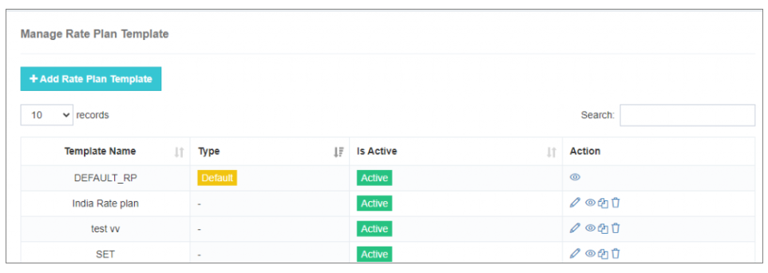
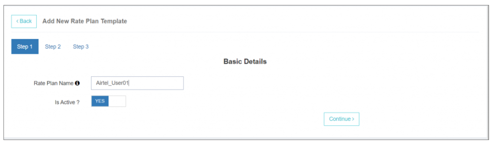
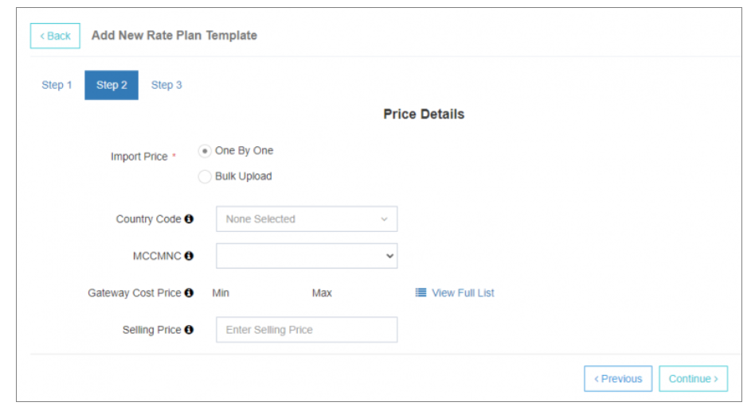
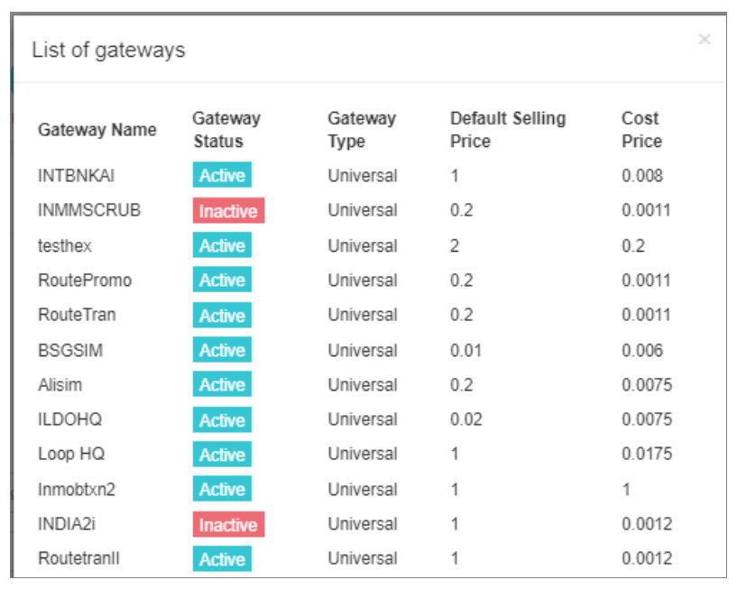
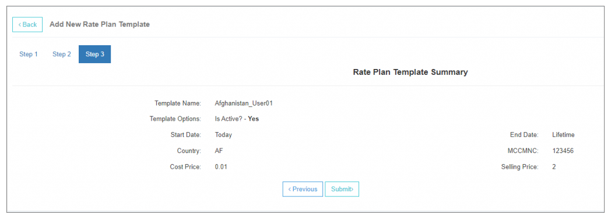
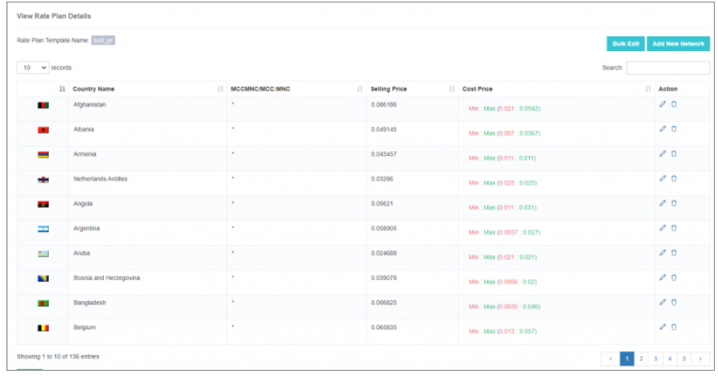
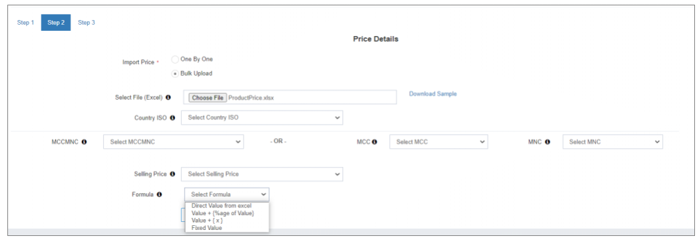
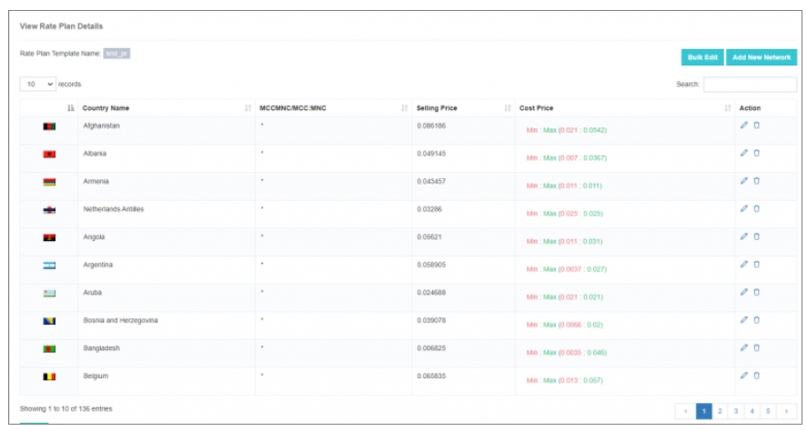
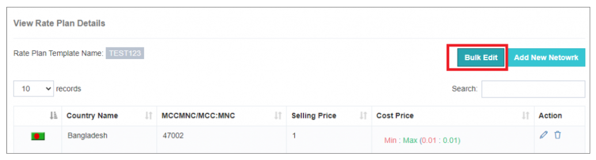
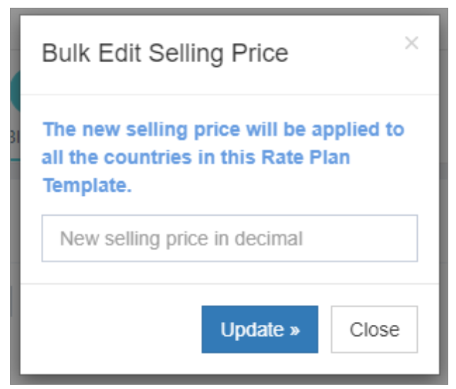

# 速率計劃模板

在有競爭力的簡訊業中,有效管理費率對最大限度地增加收入和確保可持續利潤幅度至關重要。 iTextPRO 軟體 **比率計劃管理器** 實現過程自動化,實現準確、可擴充套件和易於管理的價格配置。

---

## 1. 出售價格的重要性

- **收入最大化** - 基於國家和MCC-MNC的準確費率確保最佳收入,同時平衡服務質量和成本。 
- **損失保護** - 以基準貨幣確定銷售價格,防止收入流失,並保持一貫的計費準確性。

---

## 2. 增加銷售價格

### a. 預設比率計劃應用
- 新使用者賬戶自動繼承 **違約率計劃**,確保快速入職和一致性。

### b. 新增速率計劃模板
1. 點選 **新增速率計劃模板**。 。 。 。
2. 輸入 a **友好名稱** 用於模板。
3. 選擇匯入方法 :
   - **一個接一個**
   - **批次上傳**

---

## 3. 一個組合

- **國家/管理協委會-多國** - 選擇國家和網路操作員。 
  - 使用  全國所有網路的平價銷售。
- **閘道器成本價格** - 檢視 **最低** 財務報告和審定財務報表 **上限** 成本價格 **管理閘道器價格**。 。 。 。
- **完整列表檢視** – 訪問所有閘道器及其為所選網路配置的成本價格.

- **校驗確認( V)** - 審查費率計劃摘要並點選 **提交** 以儲存更改。

---

## 4. 檢視配置的銷售價格

 
- 點選 **檢視** 將所有銷售價格輸入模板。 
- 使用此檢視 **綜合費率計劃分析**。 。 。 。

---

## 5. 散裝上傳

**步驟 :**
1. **準備 Excel 檔案**
   - 下載樣本檔案 。
   - 組織銷售價格清單,提供所需細節。

2. **上傳檔案**
   - 點選 **選擇檔案** 上傳您準備的 Excel。

3. **地圖列**
   - 指定列用於:
     - **國家 ISO**
     - **銷售價格**
     - **MCC - MNC 移動控制中心**

4. **選擇銷售價格公式**
   - 選項 :
     - 來自 Excel 的直接值
     - 數值 + {% of Value}
     - 數值 + {x}
     - 固定價值

5. **完成上傳**
   - 確認並應用特定區域和網路的銷售價格。

---

## 6. 批次編輯-快速銷售價格更新

**步驟 :**
1. 點選 **批次編輯** 在比率計劃管理器中。
2. 輸入 **新銷售價格** 在彈出。
3. 應用更改到 **多個網路同時出現**。 。 。 。

---

透過使用 iTextPRO 的 **速率計劃模板**企業可以:
- **自動費率管理**
- **對市場變化的反應更快**
- **保持規模盈利**
