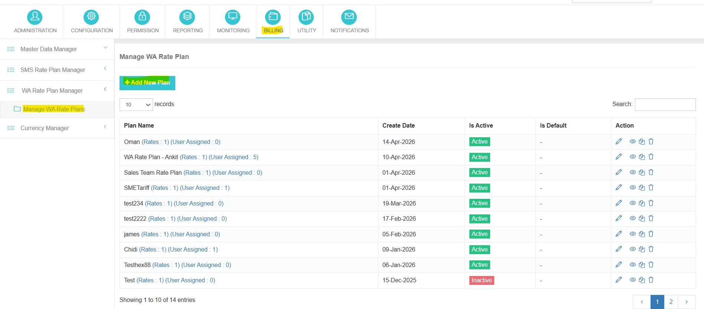
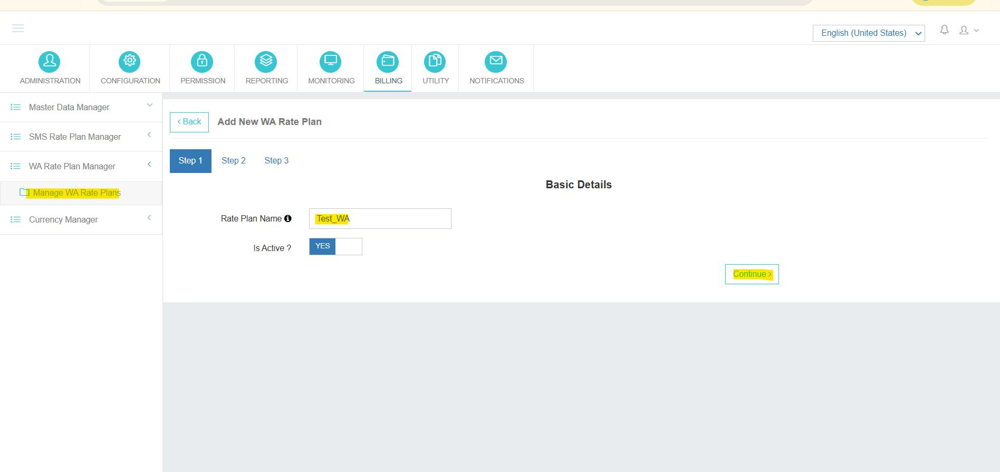
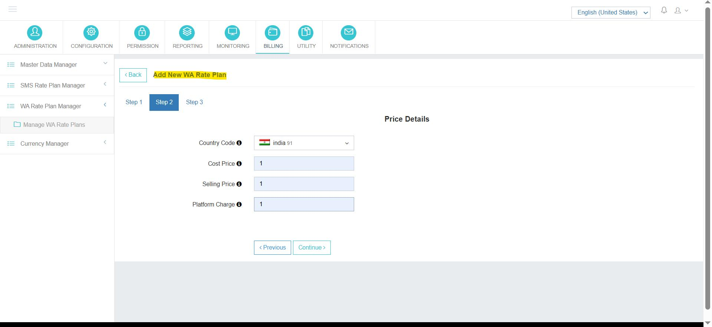

---
tags:
  - Billing
  - WhatsApp
  - Rate Plan
---

# Configuração do plano da taxa do WhatsApp

**Navegação:**  □  □  □ .

## Visão geral

A **Configuração do plano da taxa do WhatsApp** módulo permite aos administradores definir **modelos de preços** para mensagens WhatsApp. Esses planos de taxa regulam como as mensagens são faturadas e rastreadas dentro da plataforma PowerSMPP e são atribuídas a contas de usuário para gerenciamento de custos e receitas precisos.

---

## Criar um novo plano de taxa de WhatsApp

O processo de criação do plano de taxas é estruturado em **três passos**.

### Passo 1: Detalhes Básicos

| Campo | Designação das mercadorias |
|-------|-------------|
| **Nome do Plano de Taxa** | Atribuir um nome único e descritivo para o plano. |
| **Está Ativo** | Alternar o plano para  ou  Situação. |

### Passo 2: Detalhes do preço (por país)

Definir a estrutura de preços para cada país de destino.

| Campo | Designação das mercadorias |
|-------|-------------|
| **Código do país** | Selecione o país de destino (por exemplo, ). Plano de taxas suporta preços multi-países. |
| **Preço de Custo** | O custo de compra / atacado por mensagem WhatsApp para o país selecionado. |
| **Preço de Venda** | O preço de varejo cobrado ao usuário final ou cliente para cada mensagem WhatsApp. |
| **Carga da Plataforma** | Taxa de plataforma adicional aplicada em cima do preço de venda (se aplicável). |

### Passo 3: Atribuir aos Usuários

Uma vez que o plano de taxa é salvo, ele fica disponível para atribuição para contas de usuários individuais. A atribuição do plano garante que todas as mensagens WhatsApp enviadas pelo usuário sejam faturadas de acordo com a estrutura de preços configurada.

---

## Gestão de Planos de Taxas existentes

A **Gerenciar plano de taxa de WA** tela lista todos os planos de taxa configurados WhatsApp com as seguintes informações:

| Coluna | Designação das mercadorias |
|--------|-------------|
| **Nome do plano** | Identificador do plano de taxas. |
| **Taxas** | Número de entradas por país configuradas. |
| **Atribuído pelo Utilizador** | Número de usuários atualmente atribuídos ao plano. |
| **Criar data** | Data em que o plano foi criado. |
| **Está Ativo** | Situação actual ( / ). |
| **É Padrão** | Se o plano é o padrão do sistema. |
| **Acção** | , , , ou  O plano. |

---

## Finalidade da configuração do plano da taxa WhatsApp

!!! info "Usar este módulo para..."
    - Defina o preço de mensagens WhatsApp específico do país.
    - Apoiar planos de taxas multipaíses dentro de um único modelo.
    - Atribuir planos de taxa para contas de usuário específicas para faturamento.
    - Acompanhe os custos da mensagem WhatsApp e a receita por usuário.
    - Habilite relatórios financeiros precisos para o tráfego do WhatsApp.
    - Gerencie as taxas de plataforma juntamente com os preços de custo e de venda.

!!! tip
 Clonagem é a maneira mais rápida de girar uma variante regional de um plano existente — clonar a mãe, ajustar um ou dois preços de país, e atribuir ao novo grupo de usuários.
