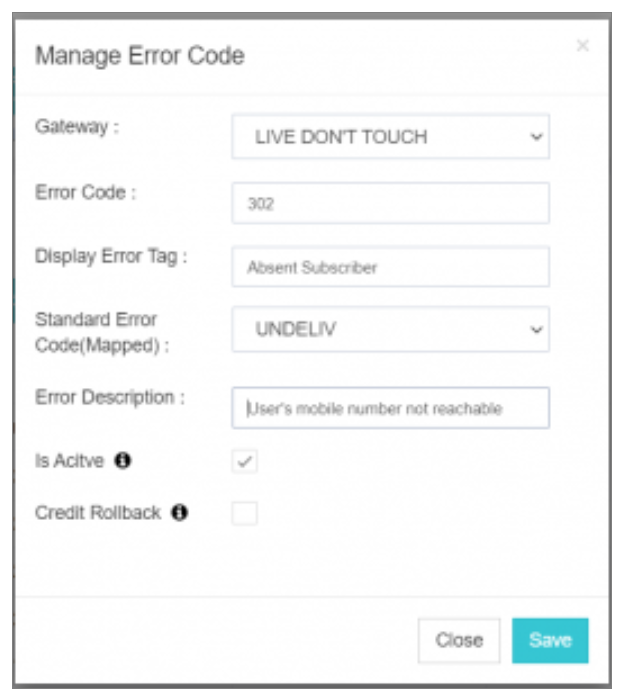
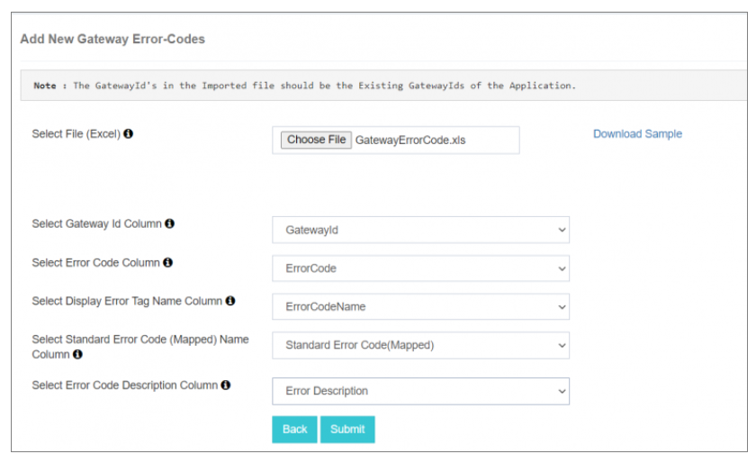

## Gateway Error Codes

**Gateway Error Codes** in iTextPRO allow you to interpret and manage response messages from the **Short Message Service Center (SMSC)** when message delivery fails. This feature enhances visibility over delivery failures and enables credit rollbacks based on specific error codes.

---

### 1. Overview
When the SMSC cannot deliver a message, it returns a **non-zero error code** along with a reference message status. These are referred to as **Gateway Error Codes**.

### 2. Purpose
iTextPRO enables administrators to configure and map these error codes. When a **Delivery Report (DLR)** is received, iTextPRO checks the configuration and:
- Displays a **custom error-tag**
- Maps it to a **standard SMPP status**  
This information is shown in both **Admin** and **User Reports**, improving transparency.

### 3. Prerequisites
Before configuration, obtain a **Gateway Error Code List** from your SMSC.

---

### 4. Configuration Steps

#### a. Gateway Selection
Choose the gateway for which you are configuring the error code.

#### b. Error Code
Enter the **specific error code** received from your SMSC.

#### c. Display Error Tag
Insert the **reference status** or tag name from the SMSC (e.g., `ESME_ROK`, `ERR_105`).

#### d. Standard Error Code (Mapped)
Map the error to one of the standard SMPP statuses:
- `DELIVRD`
- `EXPIRED`
- `UNDELIV`
- `UNKNOWN`
- `REJECTD`

#### e. Error Description
Provide a **brief description** of the error tag. This will be shown in the **User Reports** to aid in understanding the delivery status.

#### f. Is Active
Toggle the error code **on or off** as required.

#### g. Credit Rollback
Enable this option to **roll back user credits** automatically if a message fails with the mapped error code.

---

### 5. Bulk Upload

- Use the **Bulk Upload** feature to configure multiple error codes simultaneously.
- Click **"Bulk Upload"**, then:
  - **Download the Sample File**
  - **Map column headers** in the import wizard

---

### 6. Submit
Once configured, click **"Submit"** to save the error codes for the selected gateway.

📌 **Note:**  
Proper error code configuration improves monitoring and allows precise tracking of **message delivery failures**, **rollback actions**, and **reporting accuracy**.

---
