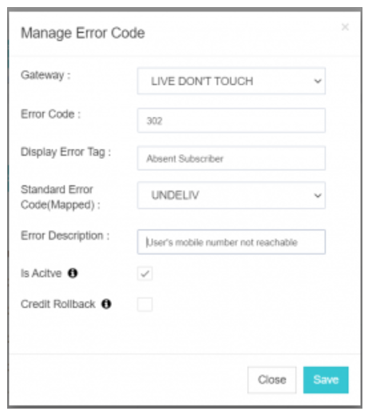
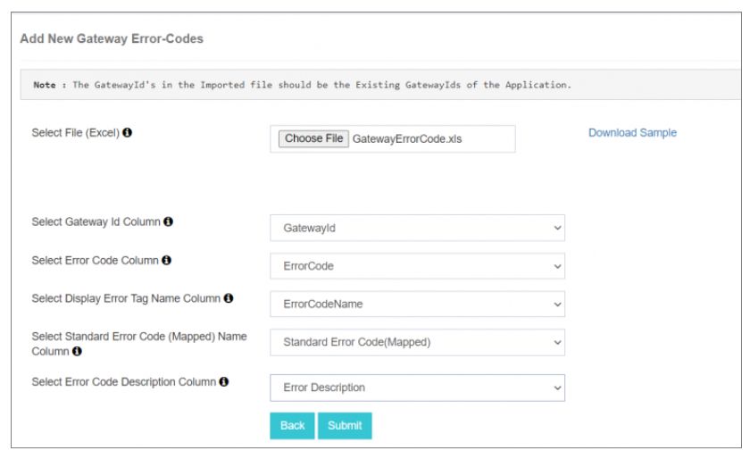

## 网关出错代码

**网关出错代码** 在 iTextPRO 中允许您解释和管理来自 **短信息服务中心( SMSC)** 当信件发送失败时。 这一功能提高了交付失败的能见度并使得基于特定出错代码的信用回滚成为可能.

---

### 1. 概览
当短信中心无法发送消息时, 它返回 a **非零出错代码** 带有参考消息状态。 这些称为: **网关出错代码**。 。 。 。

### 2. 目的
iTextPRO使管理员能够配置和映射这些出错代码. 当a **交付报告(DLR)** 收到后,iTextPRO检查配置并:
- 显示 a **自定义错误标签**
- 地图到一个 **标准 SMPP 状态** 
以上信息均列于 **管理员** 财务报告和审定财务报表 **用户报告**提高透明度。

### 3. 先决条件
在配置前,获取一个 **网关出错代码列表** 从你的短信中心。

---

### 4. 配置步骤

#### a. 选择门户
选择您正在配置错误代码的网关 。

#### b. 错误代码
输入 **特定错误代码** 从您的短信中心收到。

#### c. 显示出错标记
插入 **参考状态** 或标记名称来自短消息中心(例如, , (中文(简体) ). ) (中文(简体) ).

#### d. 标准出错代码(已安装)
将错误映射到标准的 SMPP 状态之一 :
- 
- 
- 
- 
- 

#### e. 错误描述
提供a **简介** 错误标记。 这将显示在 **用户报告** 帮助了解交付状况。

#### f. 活动
切换错误代码 **打开或关闭** 视需要而定。

#### g. 信贷回滚
启用此选项 **收回用户信用** 如果信件与映射出的错误代码相悖,则自动失败 。

---

### 5. 散装上传

- 使用 **批量上传** 特性以同时配置多个错误代码。
- 点击 **"烟花上传"**,则:
  - **下载样本文件**
  - **地图列标题** 在导入向导中

---

### 6. 提交
配置后,单击 **"投诚"** 以保存选定网关的错误代码。

📌 **说明:** 
正确的错误代码配置改进了监测,并允许精确跟踪 **消息发送失败**, (中文(简体) ). **回滚动作**,以及 **报告准确性**。 。 。 。

---
