---
tags:
  - HTTP
  - Gateway
  - Configuration
---

# Gateway HTTP

Dans **Puissance SMPP**, nous soutenons les deux **SMPP** et **HTTP** les protocoles pour la connectivité des fournisseurs. Par conséquent, l'administrateur a la possibilité de configurer une passerelle SMPP ou une passerelle HTTP. Ce document donne un aperçu concis de la configuration de la passerelle HTTP. Il est conçu pour aider les administrateurs à comprendre et à configurer une passerelle HTTP dans l'application Power SMPP avec facilité.

Comme le nom l'indique, la passerelle HTTP est basée sur le **Protocole de transfert d'hypertexte (HTTP)**. Ce protocole permet aux clients d'envoyer des messages via une API qui agit comme passerelle dans l'application Power SMPP.

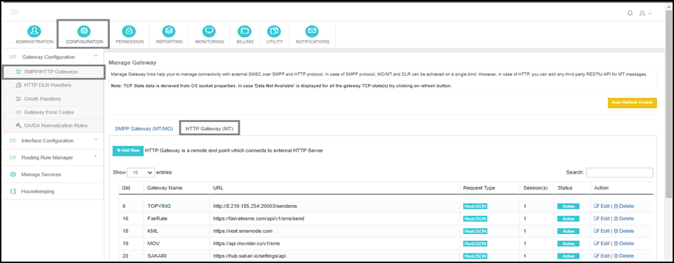

**Navigation:** <span data-ph="0"></span> - Oui. <span data-ph="1"></span> - Oui. <span data-ph="2"></span> - Oui. <span data-ph="3"></span> - Oui. <span data-ph="4"></span>.

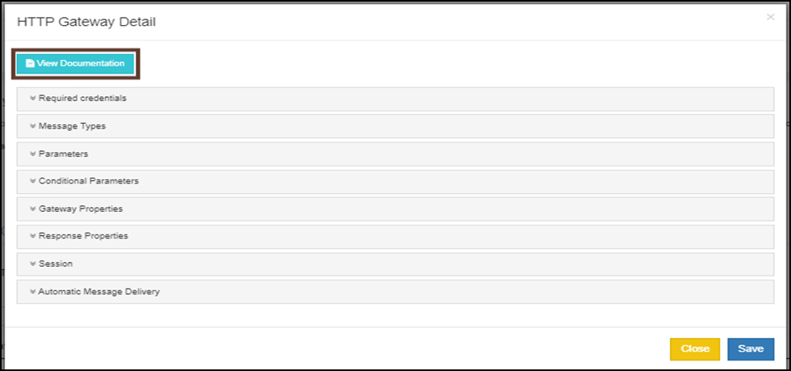

!!! tip "Voir la documentation"
 En cliquant sur **Ajouter un nouveau**, la première option sera **Voir la documentation**. Nous recommandons que l'administrateur examine ce document pour se familiariser avec les termes mentionnés dans la configuration de passerelle.

L'écran HTTP Gateway Detail est organisé dans les sections suivantes :

- Pouvoirs requis
- Types de messages
- Paramètres
- Paramètres conditionnels
- Propriétés de la passerelle
- Propriétés de la réponse
- Séance
- Livraison automatique des messages

---

## Section 1 : Pouvoirs requis

Dans la présente section, divers éléments d'information sont requis, notamment : **Nom de la passerelle**, **Type de demande**, **Authentification**, **URL de base**et **UDH**.

**Nom de la passerelle** — Un nom facile à retenir pour la passerelle HTTP.

**L'UDH est-elle nécessaire?** — Précise si **UDH (En-tête des données utilisateur)** est nécessaire pour les messages envoyés depuis cette passerelle. UDH est utilisé pour les messages concaténés.

**Type de demande** — Spécifie le type de requête HTTP. Ça pourrait être **Simple HTTP**, **REST/JSON**ou **SOAP**. Différents types de requêtes nécessitent des configurations différentes. En général, Simple HTTP est utilisé pour <span data-ph="0"></span> méthodes, tandis que REST/JSON peut être utilisé pour les deux <span data-ph="1"></span> et <span data-ph="2"></span> méthodes.

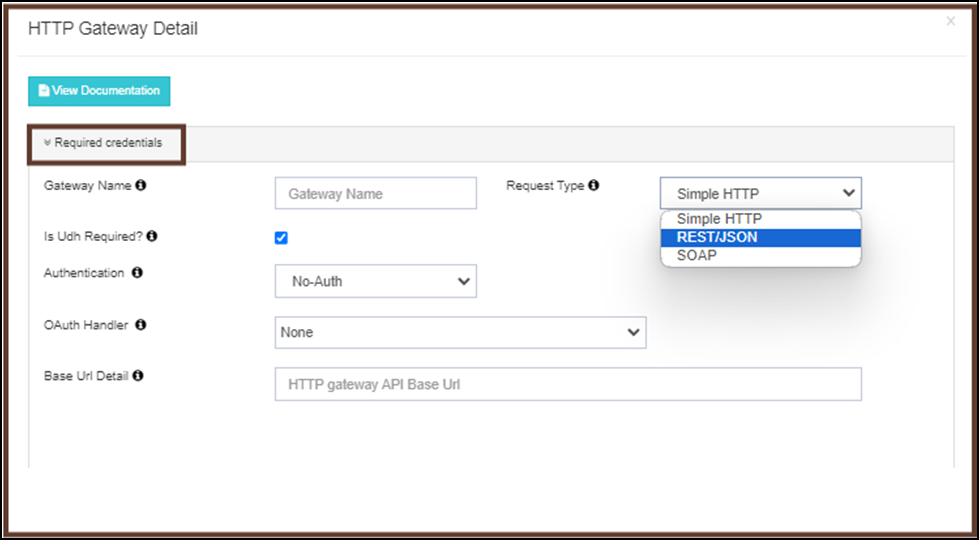

**Détail de l'URL de base** — Spécifie l'URL de base de l'API HTTP, **hors** tous les autres paramètres.

!!! example
 Si l'URL de l'API est <span data-ph="0"></span>, alors l'URL de base doit être configurée comme <span data-ph="1"></span>.

**Authentification** — Power SMPP soutient actuellement trois types d'autorisation:

| ♪ | Type | Désignation des marchandises |
|---|------|-------------|
| 1 | **Pas d'heure** | Aucune autorisation n'est requise. |
| 2 | **Niveau de base** | Un nom d'utilisateur et un mot de passe sont requis pour l'authentification sécurisée de l'API. |
| 3 | **Auth 2.0** | La dernière version de l'autorisation, utilisée pour régénérer de nouveaux identifiants après une certaine période pour maintenir une haute sécurité de l'API en utilisant **Maître OAuth** API. |

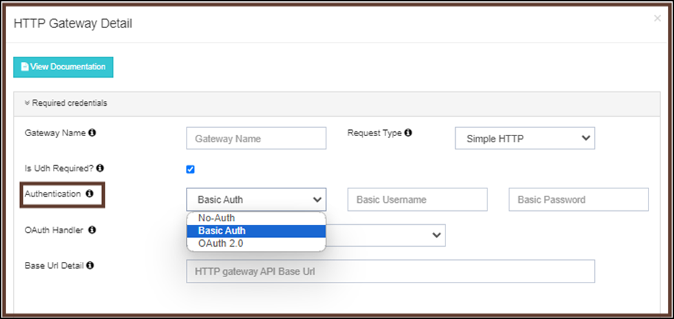

---

## Section 2: Types de messages

**Type de message** est une section optionnelle où l'administrateur peut configurer la valeur du codage des données accepté par le fournisseur. Les valeurs par défaut pour chaque type de codage de données sont mentionnées entre parenthèses.

| Type | Par défaut | Objet |
|------|---------|---------|
| **TEXTE** | <span data-ph="0"></span> | Cartographie du type de message spécifique à la passerelle pour les messages texte simples. |
| **UNICODE** | <span data-ph="0"></span> | Cartographie du type de message spécifique à la passerelle pour les messages Unicode. |
| **BINAIRE** | <span data-ph="0"></span> | Cartographie du type de message spécifique à la passerelle pour les messages binaires. |
| **FLASH** | <span data-ph="0"></span> ou <span data-ph="1"></span> | Cartographie du type de message spécifique à la passerelle pour les messages flash. |

!!! note
 Cartez vos types de messages spécifiques à la passerelle avec les types de messages système. Laisser les champs vides s'ils ne s'appliquent pas.

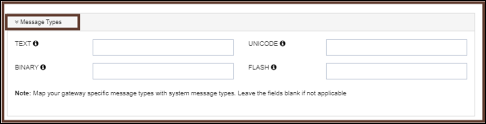

---

## Section 3: Paramètres

Les **Paramètres** section permet à l'administrateur de configurer les détails de la passerelle et les paramètres de demande fournis par le fournisseur de passerelle. Ces paramètres sont utilisés par Power SMPP pour construire et transmettre les données/corps de demande d'API au fournisseur de passerelle respectif pour le traitement et la livraison des messages.

Les paramètres configurés définissent comment la requête HTTP sera générée et exécutée pendant la communication API.

### Méthode

Power SMPP prend en charge les méthodes HTTP suivantes pour l'exécution des API :

#### 1] Méthode GET

La méthode GET permet à l'administrateur de configurer les paramètres de requête dans **paire de valeurs clés** modèle. Pendant l'exécution de l'API, tous les paramètres configurés sont ajoutés directement à l'URL comme **paramètres de la requête**.

Cette méthode est généralement utilisée pour:

- Demandes d'API simples
- Transmission des paramètres à base d'URL
- Intégrations d'API légère
- Intégrations HTTP héritées

!!! example
 <span data-ph="0"></span>

Dans la méthode GET, Power SMPP prend en charge les types de paramètres suivants:

##### Nom du parent

Les **Nom du parent** le champ est principalement utilisé pour **Bases SOAP** Intégrations d'API où les paramètres doivent être regroupés sous un nœud XML parent ou un objet de requête.

Cette configuration permet de générer des charges utiles structurées SOAP selon les spécifications de l'API fournisseur.

!!! example
    ```xml
    <SendSMS>
        <username>admin</username>
        <password>test123</password>
    </SendSMS>
    ```
 Dans l'exemple ci-dessus, <span data-ph="0"></span> agit comme nom de famille.

##### Paramètres d'en-tête

Les **Paramètres d'en-tête** section est utilisée pour configurer les valeurs d'en-tête HTTP nécessaires lors de l'exécution de l'API.

Ces paramètres sont généralement utilisés pour:

- Jetons d'authentification
- Clés API
- Pouvoirs
- Définitions du type de contenu
- En-têtes de fournisseurs personnalisés

!!! example
    ```
    Authorization: Bearer xxxxx
    Content-Type: application/json
    ```

Les paramètres d'en-tête sont transmis dans l'en-tête de requête HTTP pendant la communication API.

##### Paramètre corporel

Les **Paramètre corporel** section contient tous les paramètres généraux de requête requis pour la requête API HTTP.

Ces paramètres comprennent généralement:

- Numéro mobile
- Contenu du message
- ID de l'expéditeur
- Numéro de modèle
- Numéro d'identification de l'entité
- Paramètres de routage
- Paramètres des fournisseurs personnalisés

Pour **Allez** requêtes, ces paramètres sont ajoutés dans l'URL de requête comme paramètres de requête pendant l'exécution de l'API.

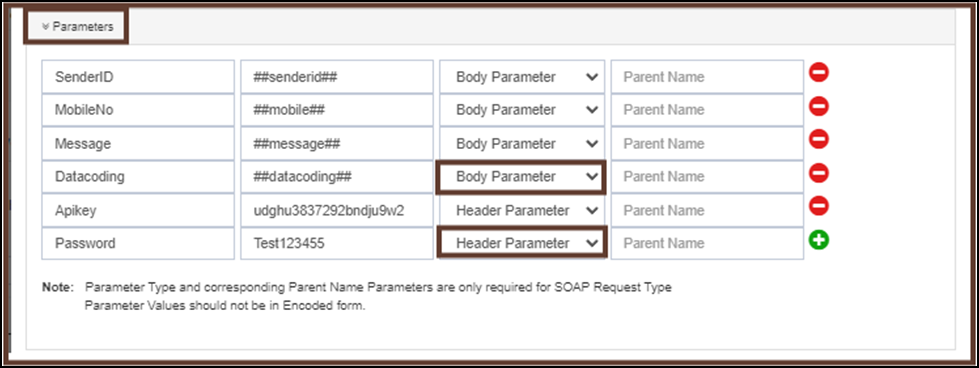

#### 2] Méthode POST

Les **POSTE** méthode permet à l'administrateur de configurer la passerelle en envoyant tous les paramètres de requête requis dans le **organisme de demande** au lieu de les ajouter dans l'URL. Cette méthode est recommandée pour les intégrations d'API où de grandes quantités de données, paramètres d'authentification, en-têtes, jetons ou structures de charge utile complexes sont nécessaires.

L'utilisation de la méthode POST présente les avantages suivants:

- Réduit la longueur et la complexité de l'URL.
- Améliore la sécurité en évitant l'exposition aux informations sensibles dans l'URL.
- Supporte des données structurées et volumineuses.
- Permet la compatibilité avec les intégrations API avancées.
- Permet un formatage flexible du corps de requête basé sur les exigences de l'API.

La charge utile configurée est transmise dans le corps de requête HTTP pendant l'exécution de l'API.

##### Type de charge utile

Lors de la sélection de la méthode POST, l'administrateur peut configurer la charge utile de requête en utilisant l'un des types de charge utile suivants:

###### I] Paramètre de valeur clé [DONNEES DU FORMULAIRE POST]

Cette option permet à l'administrateur de configurer la charge utile de la requête dans un standard **paramètre key-value** format, où chaque paramètre est défini séparément en utilisant un nom de champ et une valeur correspondante.

Ce type de charge utile convient aux API qui acceptent :

- Données du formulaire
- Paramètres encodés par URL
- Organes de demande structurés simples

!!! example
    ```
    Key        Value
    username   admin
    password   test123
    senderid   ABCDEF
    ```

**Avantages:**

- Facile à configurer et à gérer.
- Convient pour les intégrations d'API simples.
- Permet la cartographie dynamique des paramètres.
- Simplifie la validation des demandes et le dépannage.

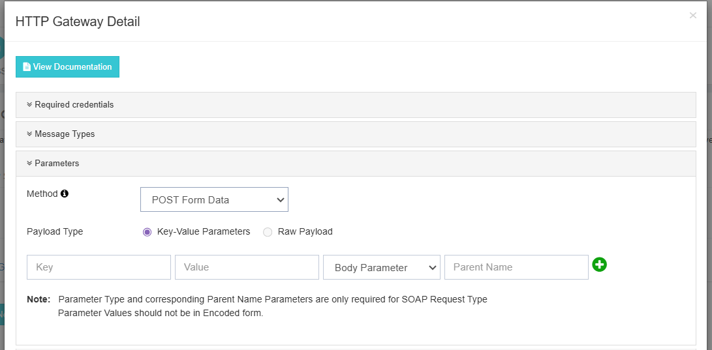

###### II] Charge utile RAW

Cette option permet à l'administrateur de passer **organisme de demande complet** directement en tant que contenu brut sans définir séparément les paramètres de valeur clé.

La méthode RAW Payload est principalement utilisée lorsque l'API cible nécessite:

- JSON Charge utile
- Charge utile XML
- Charge utile en texte clair
- Données structurées personnalisées

L'administrateur peut directement coller ou configurer le contenu complet de charge utile exactement comme requis par l'API de destination.

**Formats de charge utile RAW pris en charge :** <span data-ph="0"></span>, <span data-ph="1"></span>, <span data-ph="2"></span>.

!!! example "JSON Charge utile"
    ```json
    {
      "username": "admin",
      "password": "test123",
      "senderid": "ABCDEF"
    }
    ```

**Avantages:**

- Soutient des structures de charge utile complexes et imbriquées.
- Permet une intégration transparente avec les API modernes REST.
- Fournit une flexibilité pour les formats de demande d'API personnalisés.
- Permet de contrôler directement la structure et le formatage de la charge utile.

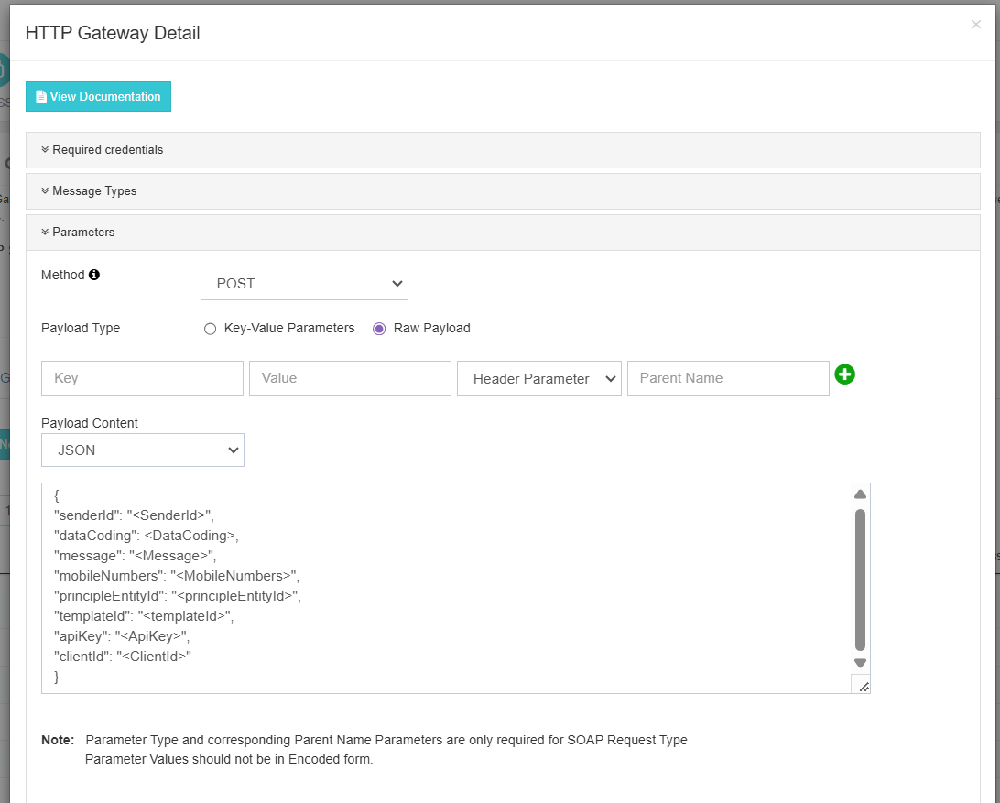

Dans Power SMPP, l'administrateur peut définir **titulaires de places** pour diverses valeurs, telles que <span data-ph="0"></span> pour l'identifiant de l'expéditeur, <span data-ph="1"></span> pour le contenu du texte, <span data-ph="2"></span> pour la destination, et beaucoup plus. Cela permet à l'administrateur de configurer diverses valeurs dynamiques pour les paramètres. De plus, l'administrateur peut modifier le type de paramètre, qu'il s'agisse **En-tête** ou une **Corps** paramètre, tout en configurant les valeurs.

---

## Section 4: Paramètres conditionnels

Dans la section de **Paramètres conditionnels**, l'application a une fonction pour modifier n'importe quelle des valeurs du paramètre configuré en configurant une condition.

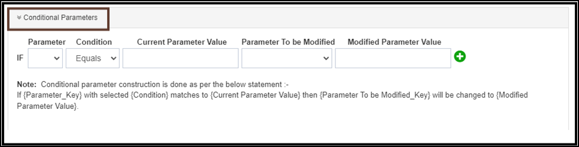

La construction de paramètres conditionnels se fait selon la logique suivante:

> Si <span data-ph="0"></span> avec la sélection <span data-ph="1"></span> correspond à la <span data-ph="2"></span>, alors <span data-ph="3"></span> sera changé en <span data-ph="4"></span>.

| Champ | Désignation des marchandises |
|-------|-------------|
| **Paramètres** | Le paramètre clé de la liste des charges utiles sur laquelle la condition doit être appliquée. |
| **État** | Type de condition à vérifier. |
| **Valeur du paramètre actuel** | La valeur du paramètre sélectionné à comparer dans l'état. |
| **Paramètres à modifier** | Le paramètre clé de la liste des charges utiles dont la valeur sera modifiée si la condition ci-dessus est remplie. |
| **Valeur du paramètre modifié** | La nouvelle valeur à attribuer au paramètre clé si la condition est remplie. |

---

## Section 5 : Propriétés de la passerelle

**Configuration des propriétés de la passerelle** permet à l'administrateur de configurer la méthode et le type de réponse pris en charge par le fournisseur pour le fonctionnement sans faille de la passerelle HTTP.

| Biens | Désignation des marchandises |
|----------|-------------|
| **Méthode** | Spécifie la méthode d'envoi des requêtes vers la passerelle HTTP. L'administrateur peut configurer la méthode prise en charge par le fournisseur : <span data-ph="0"></span>, <span data-ph="1"></span>ou <span data-ph="2"></span>. |
| **Type de réponse** | Le format dans lequel la réponse doit être reçue de la passerelle: <span data-ph="0"></span>, <span data-ph="1"></span>ou <span data-ph="2"></span>. |
| **Prix d'arrêt de la perte** | Utilisé comme prix par défaut pour la passerelle lors du routage des messages **Routage aveugle**. |
| **Est-ce que le routage aveugle ?** | Permet d'acheminer les messages même si le prix de la passerelle n'est pas configuré pour le pays et le réseau. Dans de tels cas, **Prix d'arrêt de la perte** sera appliqué. |
| **Zone horaire de la passerelle** | Configurer le fuseau horaire d'exploitation du fournisseur dans l'application pour s'assurer que **Reçu de livraison** les temps de mise à jour sont enregistrés avec précision. |
| **Est-ce actif ?** | Basculer pour activer ou désactiver la passerelle. |
| **Porte ouverte / Heure de fermeture** | Fenêtre temporelle opérationnelle pour la passerelle <span data-ph="0"></span> modèle. |

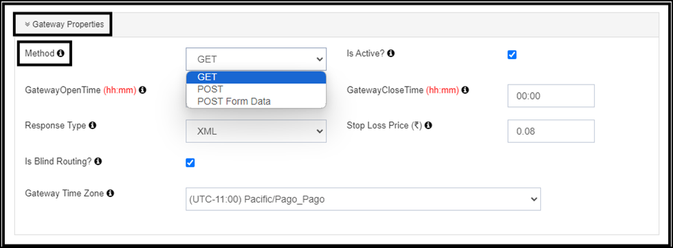

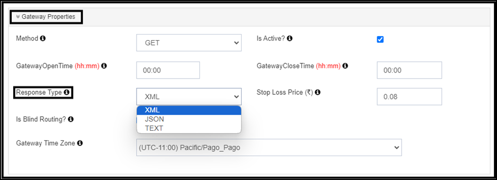

---

## Section 6: Propriétés de la réponse

Les **Propriétés de la réponse** dans la demande sont utilisés pour **cartographier la réponse** reçu du fournisseur de passerelle dans les rapports, qui sont ensuite utilisés pour la mise à jour **Recettes de livraison (DLR)**.

Voici les types de configuration de réponse disponibles dans l'application:

### 1] JSON ou XML

Si le fournisseur supporte le type de réponse comme **JSON** ou **XML**, la configuration de la réponse peut être configurée avec les champs suivants:

| Champ | Désignation des marchandises |
|-------|-------------|
| **Champ de code d'erreur** | Le champ où se trouve le code d'erreur dans la réponse. |
| **Champ MessageId** | Le champ où se trouve l'ID du message dans la réponse. |
| **Champ d'état du message** | Le champ où l'état du message se trouve dans la réponse. |
| **Champ Numéro Mobile** | Le champ qui contient le numéro mobile dans la réponse. |

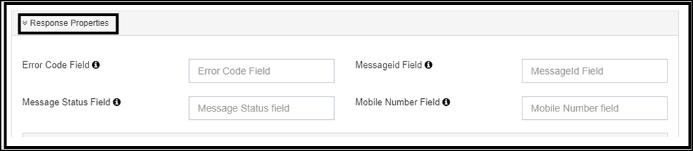

### 2] TEXTE

Si le fournisseur supporte le type de réponse comme **TEXTE**, l'administrateur doit configurer des paramètres supplémentaires sous Propriétés de réponse:

| Champ | Désignation des marchandises |
|-------|-------------|
| **Splitteur de valeur des clés** | Le délimiteur utilisé pour séparer et identifier les paires de valeurs clés de la réponse. Ce champ n'est utilisé que pour le type de réponse TEXTE. Par exemple, si la réponse reçue est <span data-ph="0"></span>, alors le séparateur serait <span data-ph="1"></span>. |
| **Séparateur de propriété** | Le délimiteur utilisé pour séparer différentes propriétés dans la réponse. Ce champ est également spécifique au type de réponse TEXTE. |
| **Champ de code d'erreur** | Indique le champ où se trouve le code d'erreur dans la réponse. |
| **Champ MessageId** | Indique le champ où se trouve l'ID du message dans la réponse. |
| **Champ d'état du message** | Indique le champ où se trouve l'état du message dans la réponse. |
| **Champ Numéro Mobile** | Utilisé pour récupérer le numéro mobile de la réponse. L'administrateur doit spécifier le champ qui contient le numéro mobile dans la réponse. |

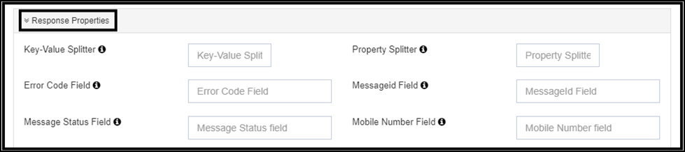

!!! note
 Dans la configuration de réponse, l'administrateur doit configurer les noms de paramètres qui stockent les valeurs des champs mentionnés ci-dessus.

!!! example
 Envisagez la réponse suivante :
    ```json
    { "data": [{
        "message_error_code": 0,
        "message_error_description": "Success",
        "mobile_number": "9174XXXXXXX",
        "message_id": "b349f1c2-5ae9-4076-867e-5fa15044b207"
    }]}
    ```
 Dans cette réponse de JSON:

    - Les **Champ de code d'erreur** contiendra le nom du paramètre <span data-ph="0"></span>.
    - Les **Champ MessageId** contiendra le nom du paramètre <span data-ph="0"></span>.

Lors de la configuration des propriétés de réponse pour un **TEXTE** réponse, les valeurs seront semblables. De plus, vous devez préciser ce qui suit :

- **Splitteur de valeur des clés** — dans la réponse, <span data-ph="0"></span> est <span data-ph="1"></span>. Le diviseur de valeur de la clé est le délimiteur utilisé pour séparer la clé de la valeur, qui dans ce cas est un côlon (<span data-ph="2"></span>). Donc, le diviseur de valeur clé serait <span data-ph="3"></span>.
- **Séparateur de propriété** — Dans la réponse, des paramètres comme <span data-ph="0"></span> et <span data-ph="1"></span> sont séparés par une virgule (<span data-ph="2"></span>). Par conséquent, le séparateur de propriété pour séparer ces paramètres serait <span data-ph="3"></span>.

Cette configuration aide à cartographier et extraire les champs nécessaires de la réponse, que le type de réponse soit JSON, XML ou TEXTE.

---

## Chapitre 7: Session

Les **de la session** indique le nombre de connexions, et la session recommandée pour une passerelle HTTP est **1**.

| Champ | Valeur recommandée |
|-------|-------------------|
| **Nombre de sessions** | <span data-ph="0"></span> |

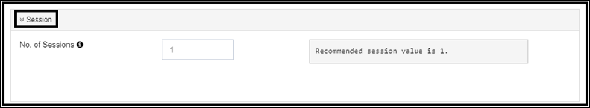

---

## Section 8: Livraison automatique des messages

Si le fournisseur de passerelle n'envoie pas **Recettes de livraison (DLR)**, la configuration de la passerelle HTTP comprend une fonctionnalité appelée **Livraison automatique**. Cette fonctionnalité permet à l'administrateur de configurer un état afin que les DLR soient mis à jour automatiquement.

| Champ | Désignation des marchandises |
|-------|-------------|
| **Est-il automatiquement marqué comme livré?** | Mettre à jour l'état de livraison des messages même si un DLR n'est pas reçu du fournisseur de passerelle. Dans ce cas, **État DLR par défaut** sera utilisé. |
| **État DLR par défaut** | L'état de livraison par défaut attribué aux messages si la fonction de livraison automatique est activée. Il est utilisé lorsque le système doit marquer les messages tels qu'ils sont livrés en l'absence d'un DLR depuis la passerelle. Options: <span data-ph="0"></span>, <span data-ph="1"></span>, <span data-ph="2"></span>, <span data-ph="3"></span>. |

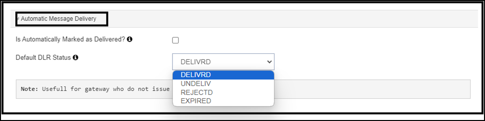

!!! info "Utile pour les passerelles qui ne délivrent pas de DLR"
 Activer la livraison automatique uniquement lorsque le fournisseur en amont ne retourne vraiment jamais un DLR. Sinon, laissez-le désactivé pour que les vrais DLR du vendeur conduisent le rapport.
