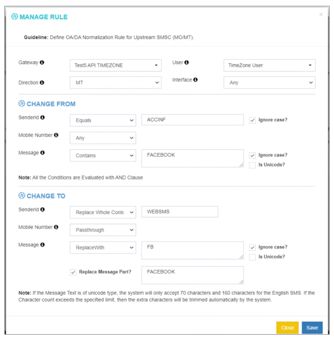

## Reglas de Normalización OA/DA en iTextPRO

**OA (Originator Address)** y **DA (Dirección de Destino)** Normalización en iTextPRO permite contenido de mensajes, remitente (fuente) y direcciones receptoras **Móvil Terminado (MT)** mensajes que se ajustarán automáticamente según reglas predefinidas.

Esta característica es crucial cuando se trabaja con diferentes proveedores o portales de telecomunicaciones que pueden seguir diversos protocolos o requisitos de formato.

---

### 1. Propósito
Normalizar **originator (OA)** y **destino (DA)** direcciones a:
- Meet **Directrices reglamentarias**
- Fulfill **requisitos específicos de formato de negocio o proveedores**

---

### 2. iTextPRO OA/DA Engine
iTextPRO incluye un **Motor de normalización OA/DA** que opera junto al motor de enrutamiento. 
Permite modificaciones dinámicas de **PDU (Protocol Data Unit)** encabezados para la entrega de mensajes sin costura y el cumplimiento.

---

### 3. Ejemplo del mundo real

#### Original Message Sent:
- **ID del remitente**:  
- **Mensaje**: 
 

#### Mensaje después de la aprobación de la norma OA/DA:
- **ID del remitente**:  
- **Mensaje modificado**: 
 

Esta transformación es manejada automáticamente por las reglas de normalización OA/DA establecidas en iTextPRO.

---

### 4. Nota sobre caracteres Unicode

- Para **Unicode** mensajes: límite máximo de caracteres = **70 caracteres**
- Para **Inglés (GSM)** mensajes: límite máximo de caracteres = **160 caracteres**

NOVEDAD Si un mensaje excede estos límites, el sistema **automáticamente trims** los caracteres adicionales para permanecer dentro de las restricciones de codificación SMS.

---

### 5. Medidas de aplicación

Para aplicar la normalización de la AOD/DA:

1. **Crear nuevas Reglas de AOD/DA** en el panel de configuración.
2. Definir la lógica de transformación:
   - Modificar el ID de remitente
   - Reescribir el contenido del mensaje
   - Ajuste el formato del número de destino
3. Assign the rules to relevant gateways or traffic sources.

---

### 6. Beneficios fundamentales

- Identificar la interoperabilidad del vendedor sin costura
- Cumplimiento de normas de telecomunicación o regulación
- Identificar o reescribir contenido automático
- ✅ Personalización del ID de remitente y el contenido de mensajería

---

**OA/DA Normalización** en iTextPRO ofrece un poderoso mecanismo para el formato y el cumplimiento de mensajes, permitiendo el enrutamiento de mensajes que sea técnicamente robusto y respetuoso con la regulación.
