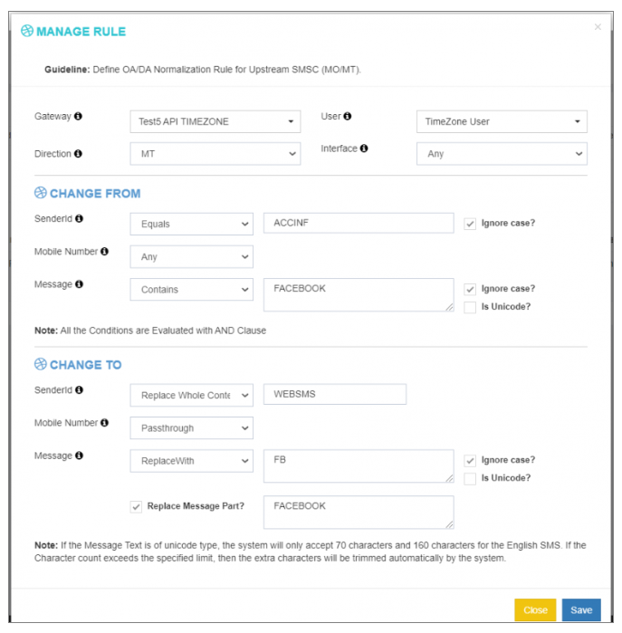

## OA/DA Normalization Rules in iTextPRO

**OA (Originator Address)** and **DA (Destination Address)** Normalization in iTextPRO allows message content, sender (source), and recipient addresses of **Mobile Terminated (MT)** messages to be automatically adjusted based on predefined rules.

This feature is crucial when working with different vendors or telecom gateways that may follow varying protocols or formatting requirements.

---

### 1. Purpose
Normalize **originator (OA)** and **destination (DA)** addresses to:
- Meet **regulatory guidelines**
- Fulfill **specific business or vendor formatting requirements**

---

### 2. iTextPRO OA/DA Engine
iTextPRO includes a built-in **OA/DA normalization engine** that operates alongside the routing engine.  
It enables dynamic modifications of **PDU (Protocol Data Unit)** headers for seamless message delivery and compliance.

---

### 3. Real-World Example

#### Original Message Sent:
- **Sender ID**: `ACCINF`  
- **Message**:  
  `"Dear User, according to Facebook, Messenger uses the same secure communications protocols as banking and shopping sites."`

#### Message After OA/DA Rule Applied:
- **Sender ID**: `WEBSMS`  
- **Modified Message**:  
  `"According to FB, Messenger uses the same secure communications protocols as banking and shopping sites."`

This transformation is automatically handled by the OA/DA normalization rules set within iTextPRO.

---

### 4. Note on Unicode Characters

- For **Unicode** messages: Max character limit = **70 characters**
- For **English (GSM)** messages: Max character limit = **160 characters**

⚠️ If a message exceeds these limits, the system **automatically trims** the extra characters to remain within SMS encoding constraints.

---

### 5. Implementation Steps

To apply OA/DA normalization:

1. **Create new OA/DA Rules** in the configuration panel.
2. Define the transformation logic:
   - Modify Sender ID
   - Rewrite message content
   - Adjust destination number formatting
3. Assign the rules to relevant gateways or traffic sources.

---

### 6. Key Benefits

- ✅ Seamless vendor interoperability
- ✅ Compliance with telecom or regulatory standards
- ✅ Automatic content sanitization or rewriting
- ✅ Customization of sender ID and messaging content

---

**OA/DA Normalization** in iTextPRO offers a powerful mechanism for message formatting and compliance, enabling message routing that is both technically robust and regulation-friendly.
