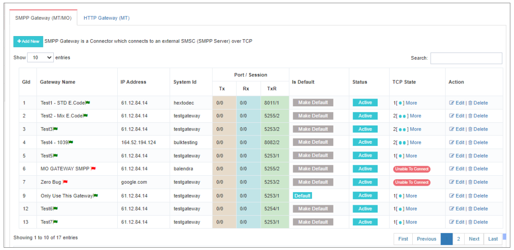
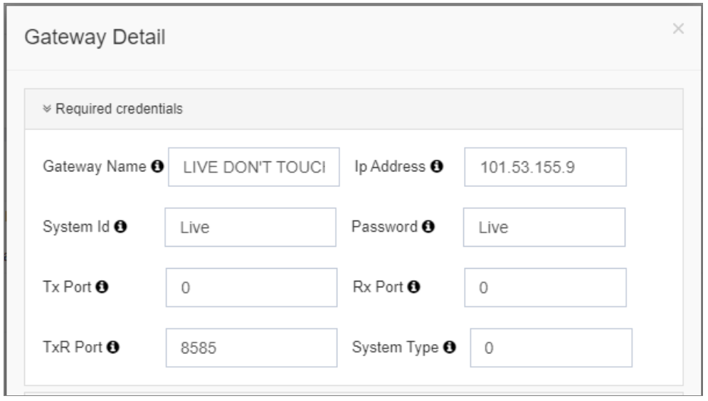
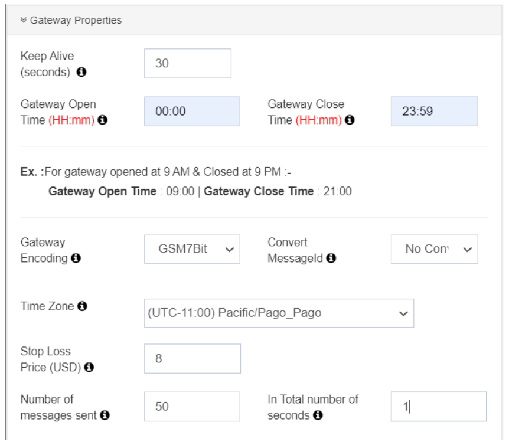
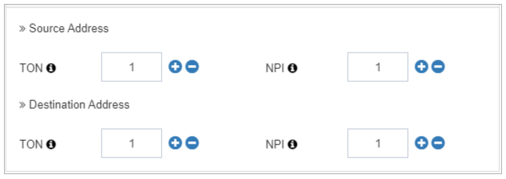
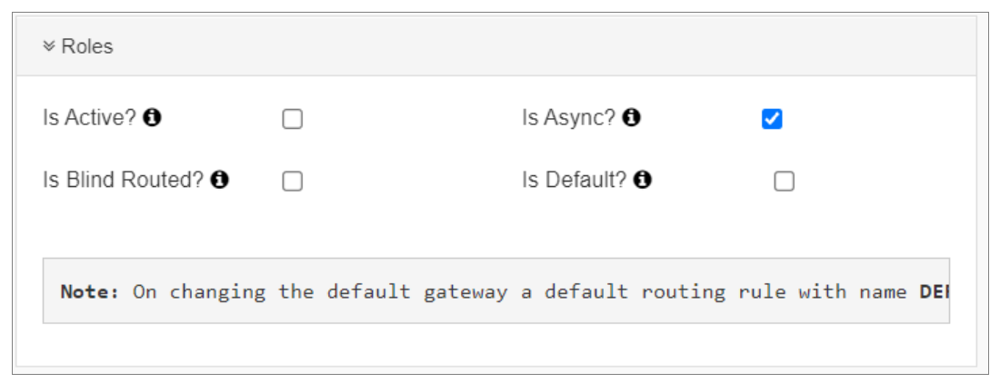

### Configuration

## SMPP Gateways (MO/MT)

The **iTextPRO Application** prioritizes a **user-friendly experience** through a flexible design interface and a simplified configuration workflow. The goal is to move away from CLI complexities and immerse application owners in a **Graphic User Interface (GUI)**-based environment. An integrated **Communicator Engine** handles all backend commands, streamlining your operational tasks.

---

---

The **"Manage Gateway"** feature empowers users to handle connectivity with external **Short Message Service Centers (SMSCs)** via **SMPP** and **HTTP** protocols.

For **SMPP**, a **single bind** enables Mobile-Originated (MO), Mobile-Terminated (MT), and Delivery Reports (DLR) operations. iTextPRO supports **multiple SMPP Gateways**, allowing for **redundancy** and **cost-effective routing**.

---

### 🔧 Configuring a New Gateway

To set up an SMPP connector:

1. Click **"Add New"**.
2. Enter the credentials provided by your **gateway vendor** or **telecom operator**.

---

---

#### Required Credentials:

- **Gateway Name:**  
  A user-friendly name to identify your gateway.

- **IP Address:**  
  The IP from your SMSC/vendor.

- **System ID:**  
  Username provided by your vendor/SMSC.

- **Password:**  
  Used for authentication to the SMSC.

- **Tx Port / Rx Port / TxR Port:**  
  Ports for Transmitter, Receiver, and Transceiver binds respectively.

- **System Type (Optional):**  
  Enter only if required by the vendor.

📌 **Note:** Double-check all values as per SMSC/vendor documentation to ensure a successful connection.

---

### ⚙️ Gateway Properties

Configure SMPP Gateway properties in iTextPRO for optimal performance:

1. **Keep Alive (Seconds):**  
   Interval for *Enquire Link* to keep session alive.

2. **Gateway Open Time / Close Time:**  
   Define operational hours, often used to comply with **Do Not Disturb** policies.

3. **Gateway Encoding:**  
   Character set selection compatible with the telco/SMSC.

4. **Convert Message-ID:**  
   Allows conversion between **Decimal ↔ Hex** Message-ID formats for accurate DLRs.

5. **Time Zone:**  
   All reports will reflect this selected time zone.

6. **Stop Loss Price:**  
   Sets the **max allowed gateway cost** when using blind routing.

7. **Throughput per Second (TPS):**  
   Define based on vendor capacity.  
   **Formula:** `Messages per second × Sessions`

---

### 🧩 TON/NPI Setup

- **TON (Type of Number):**  
  Select as per SMSC documentation (e.g., International, Alphanumeric, etc.)

- **NPI (Numbering Plan Indicator):**  
  Indicates numbering standard in use (E.164, ISDN, etc.)

- **Session Setup:**  
  Configure Tx, Rx, and TxR sessions per vendor allocation.

---

### 🧷 Roles & Routing

- **Is Active:**  
  Marks the gateway as live and ready to route traffic.

- **Is Default:**  
  Only one gateway can be marked as default. Messages without matching routes go here.

- **Is Async:**  
  Enables **asynchronous mode** for faster message submissions.

- **Blind Routing:**  
  Allows message submission to countries **without defined cost prices**.

📌 **Note:**  
After configuration, clicking **"Save"** sends an **on-the-fly bind request** — no manual restart required.

---
