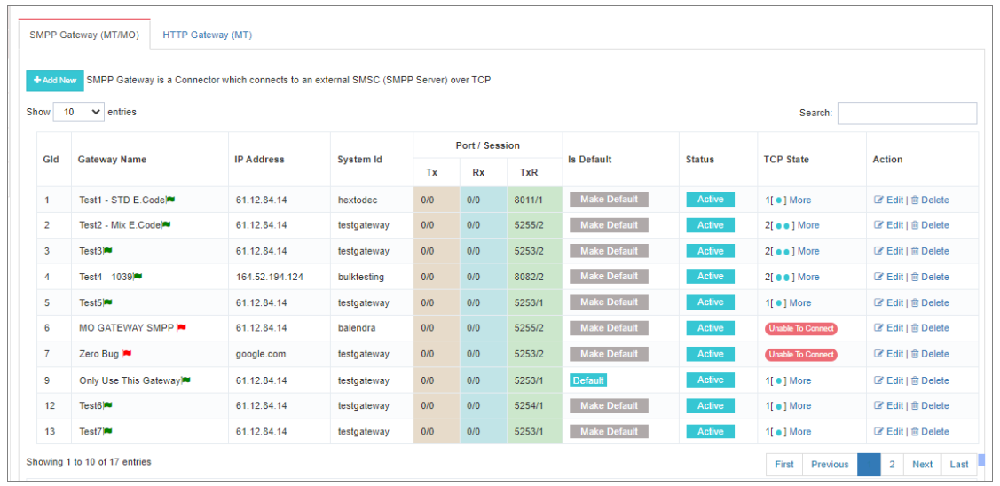
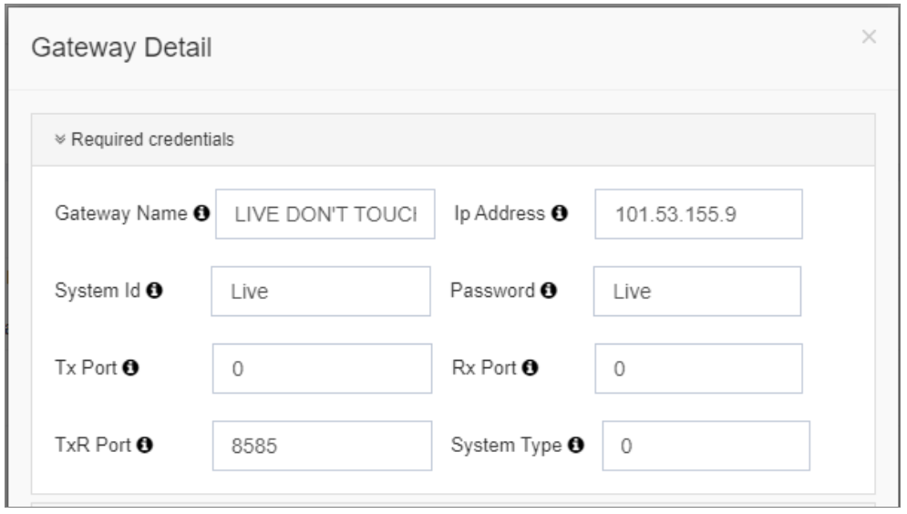
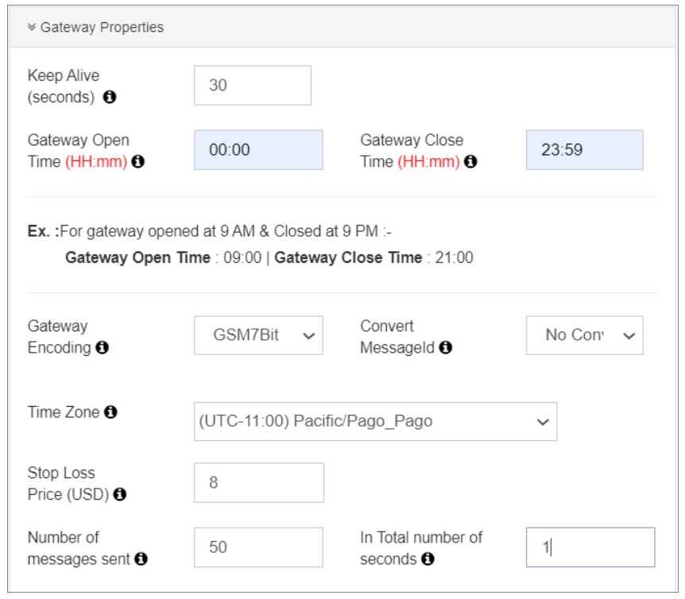
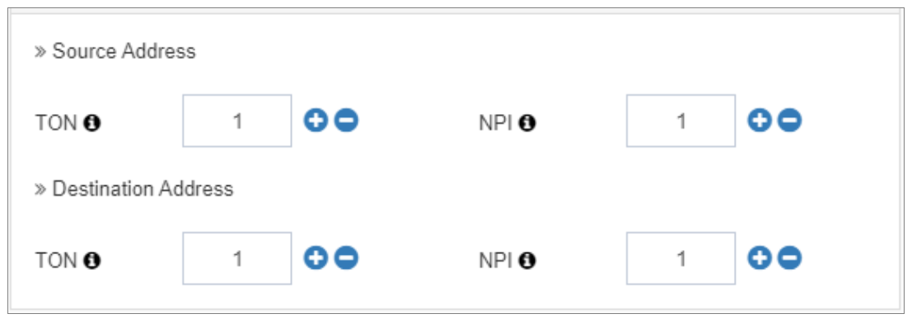
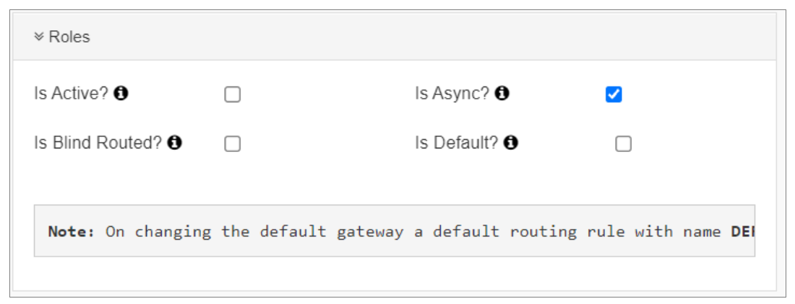

---
tags:
  - SMPP
  - Gateway
  - Configuration
---

# 配置

## SMPP 网关(MO/MT)

这个 **iTextPRO 应用程序** 优先级a **方便用户的经验** 通过灵活的设计接口和简化的配置工作流程. 目标是摆脱CLI的复杂性,使应用程序所有者沉浸在 **图形用户界面( GUI)**- 基于环境。 综合 **通讯引擎** 处理所有后端命令,精简您的操作任务。

---

---

这个 **"管理网关"** 特性授权用户处理与外部的连接 **短信息服务中心** 通过 **SMPP 软件** 财务报告和审定财务报表 **HTTP 密码** 协议。

对于 **SMPP 软件**页:1 **单绑** 允许移动式灌溉(MO)、移动终端(MT)和交付报告(DLR)操作。 iTextPRO 支持 **多个 SMPP 网关**,允许 **冗余** 财务报告和审定财务报表 **成本效益高的路线**。 。 。 。

---

### 配置新网关

要设置 SMPP 连接器 :

1. 点击 **“添加新”**。 。 。 。
2. 输入您提供的证书 **网关供应商** 或者说 **电信运营商**。 。 。 。

---

---

#### 所需全权证书

| 外地 | 说明 |
|-------|-------------|
| **网关名称** | 一个方便用户的名称来识别您的网关 |
| **IP 地址** | 您的短消息/ 供应商的IP |
| **系统标识** | 您的供应商/ SMSC 提供的用户名 |
| **密码** | 用于对 SMSC 的认证 |
| **Tx端口/ Rx端口/ TxR端口** | 传送器、接收器和收发器连接端口 |
| **系统类型** | *(备选)* 仅在供应商提出要求时输入 |

!!! warning
 双向检查根据短消息/供应商文档的所有值,以确保连接成功。

---

### QQ 网关属性

配置 SMPP iTextPRO中用于最佳性能的网关属性 :

1. **保持生命( 秒) :** 
 间隔 *询问链接* 让会议保持活力

2. **网关打开时间/ 关闭时间 :** 
 界定经常用于遵守的工作时间 **不要烦恼** 政策。

3. **网关编码 :** 
 字符集选择与telco/SMSC兼容.

4. **转换信件ID :** 
 允许在 **十进制 QX 十六进制** 用于精确 DLR 的訊息ID格式 。

5. **时区:** 
 所有报告都将反映这一选定的时区。

6. **停止损失价格 :** 
 设置 **允许的最大网关成本** 当使用盲道。

7. **每秒通量( TPS) :** 
 根据供应商的能力界定。 
 **公式 :** 

---

### TON/NPI 设置

- **TON(数字类型):** 
 根据短报文档选择(例如国际、字母等)

- **NPI(数字计划指标):** 
 表示使用的编号标准(E.164、ISDN等)

- **会话设置 :** 
 每个供应商分配配置 Tx, Rx,和 TxR 会话 。

---

### 角色运行( R)

- **活动 :** 
 将网关标为直播通道 并准备通路

- **是默认 :** 
 只有一条网关可以被标记为默认. 不匹配路径的信件到这里 。

- **是 Async 吗 :** 
 启用 **同步模式** 以更快的速度提交信件。

- **盲从:** 
 允许向国家提交信件 **未确定成本价格**。 。 。 。

!!! tip
 配置后,单击 **"救赎"** 发送一个 **飞行绑定请求** ——不需要手动重启.
