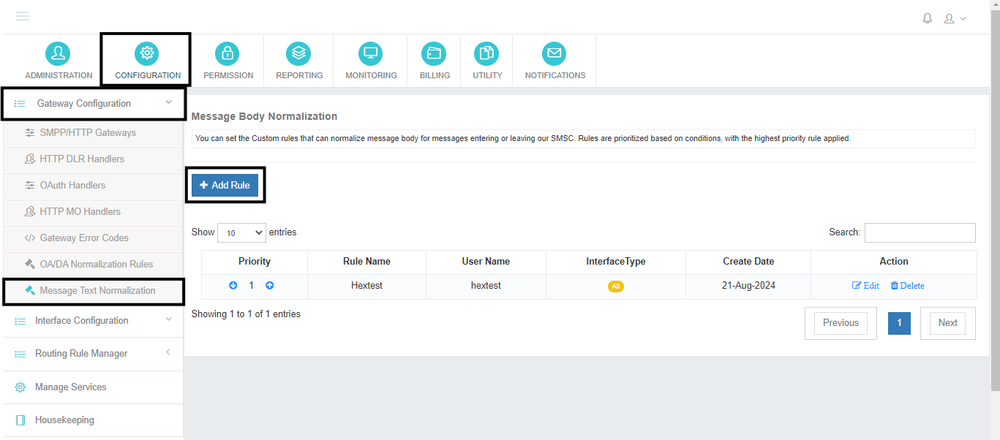
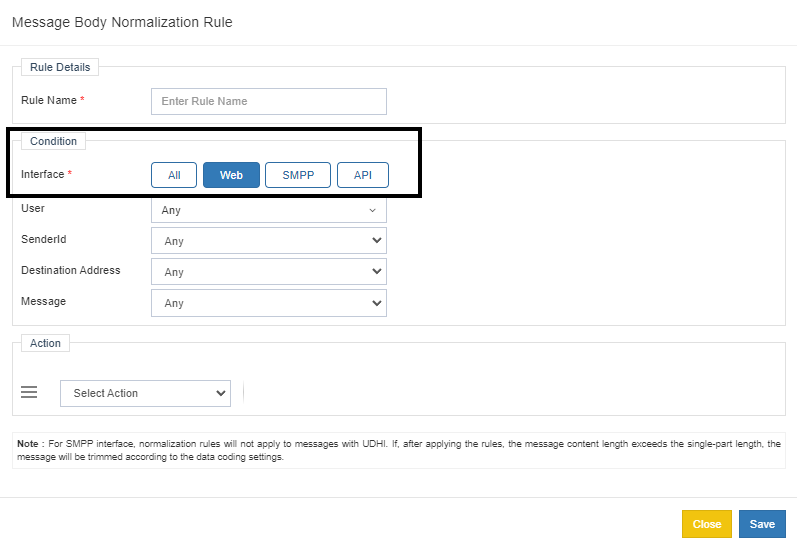
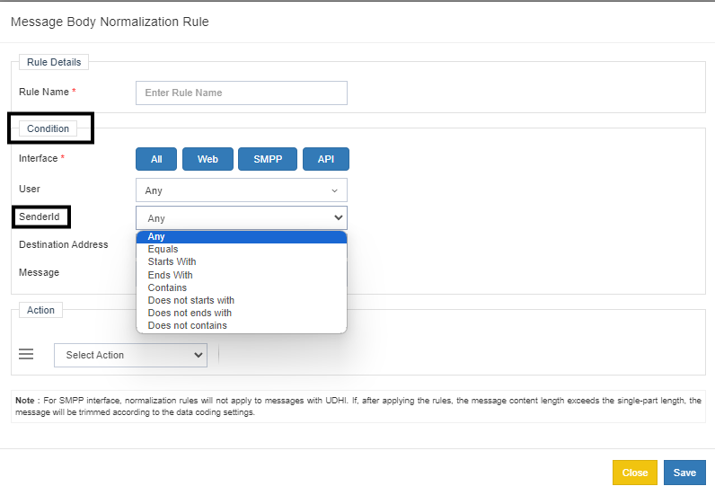
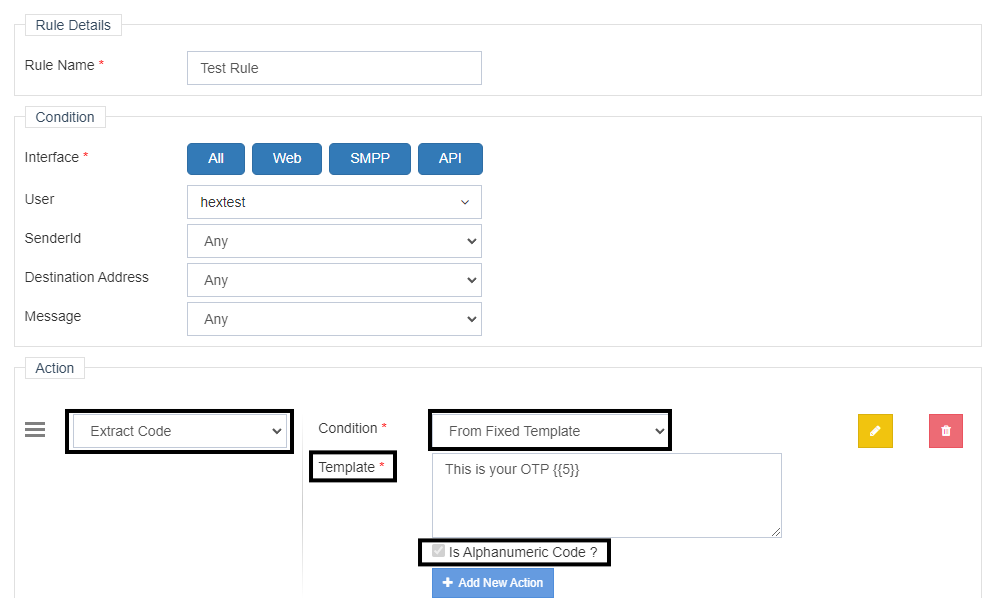
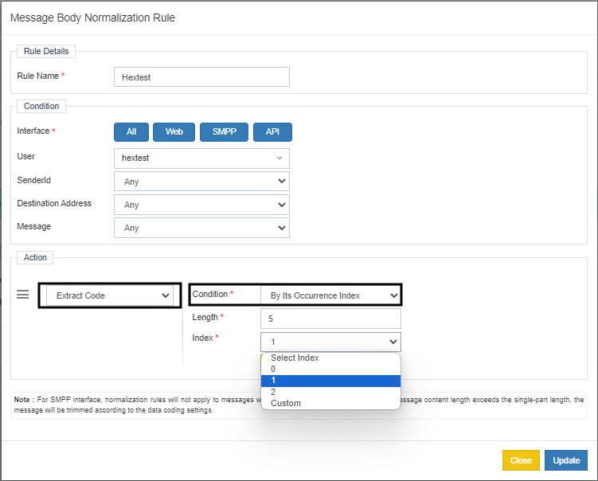
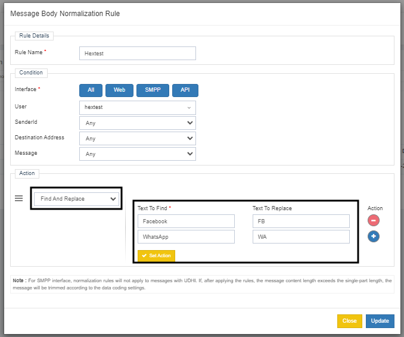
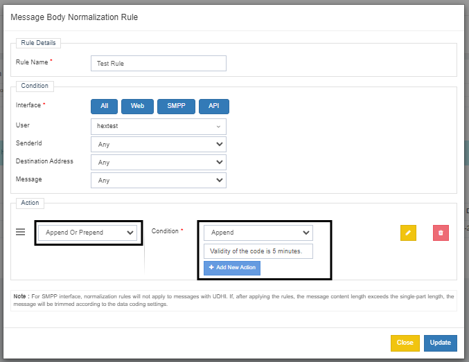
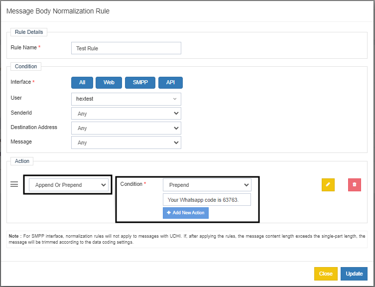
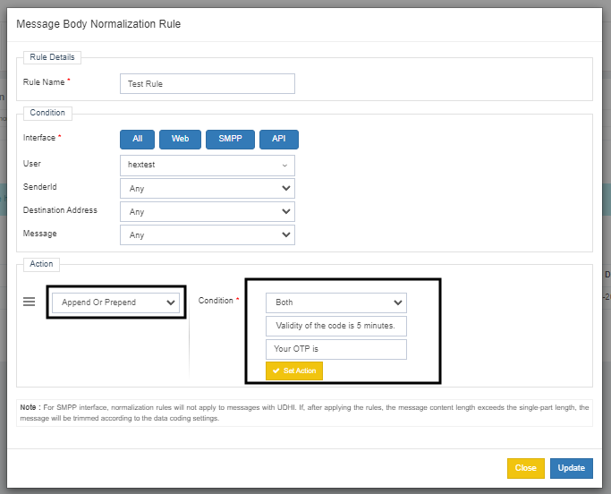
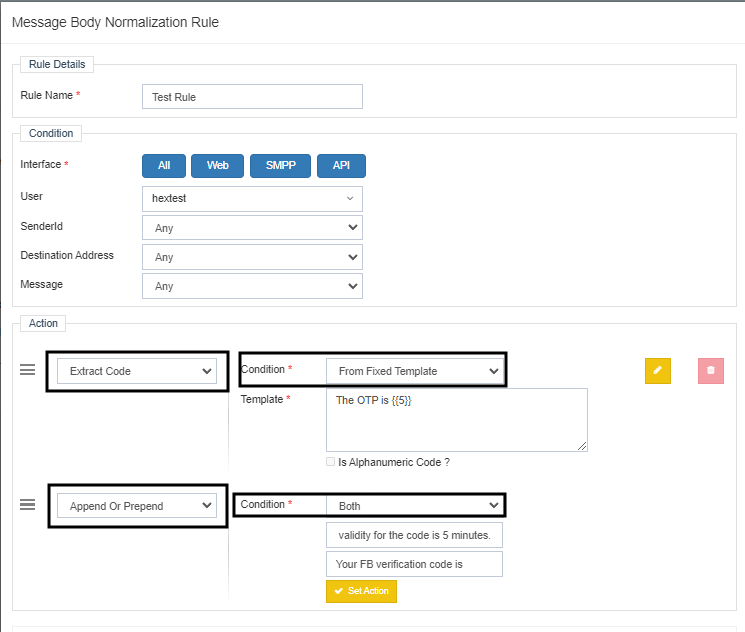

# Message Body Normalization

The **Message Body Normalization** Rule is a built-in feature within **Power SMPP**, designed to give administrators flexibility to modify and refine message content before submission to the gateway.  
This ensures that all outgoing messages are formatted correctly, enhancing both readability and effectiveness.

This document explains how **Message Body Normalization** works and how administrators can configure it to automatically adjust message content based on predefined rules — ensuring consistency and compliance with gateway requirements.

---

## Key Features

The Message Body Normalization Rule extends the existing **OA/DA Normalization Rule**. It provides multiple ways to manipulate message content, including:

- **Extraction of Codes/OTPs:** Automatically detect and extract OTPs or specific codes from the message text.  
- **Add Prefixes or Suffixes:** Insert specific text before or after the message to maintain a standard format.  
- **Text Replacement:** Replace certain words or phrases according to predefined rules for better consistency.

These options help administrators ensure that all messages conform to gateway standards, improving the overall messaging experience.

---

## ️ Accessing Message Body Normalization

To configure Message Body Normalization:

1. Navigate to the **Configuration Module**.  
2. Select **Gateway Configuration**.  
3. Choose **Message Body Normalization**.  
4. Click **Add New** to create a new normalization rule.

---

## Rule Configuration

Once you click **Add New**, a configuration page appears with multiple fields.

### **Rule Name**
Define a descriptive and meaningful name for the rule.

---

### **Condition Settings**

#### 1. Select Interface
Specify the interface where the rule applies. You can select one or more of the following:

- WEB  
- API  
- SMPP  
- All Interfaces  

This enables targeted rule application depending on the operational interface.

---

#### 2. User
Choose whether the rule applies to:
- A specific **User**, or  
- **ANY** (applies to all users).

---

#### 3. Sender ID
Configure Sender ID conditions based on specific matching patterns:

- **Equal** – Matches exactly the specified Sender ID  
- **Start With** – Triggers if Sender ID begins with a specific keyword  
- **End With** – Applies if Sender ID ends with a specific keyword  
- **Contains** – Applies if the keyword is found anywhere in the Sender ID  

---

#### 4. Destination Address
Functions similarly to **Sender ID**, allowing the same conditions — *Equal*, *Start With*, *End With*, *Contains* — to apply rules based on destination address format.

---

#### 5. Message
Same conditional options as above can be applied to message content, enabling precise formatting control.

---

## ️ Actions: Detailed Explanation

In **Power SMPP**, the **Action** section offers three configurable methods to manipulate message content before submission to the gateway:

1. **Extract Code**  
2. **Find and Replace**  
3. **Append and Prepend**

Each serves a specific use case. Let’s explore each in detail.

---

### 1️⃣ Extract Code

The **Extract Code** action allows admins to pull OTPs or codes from messages.

#### a) From Fixed Template
If the message has a fixed pattern, you can use `{{}}` to define the character count for extraction.

**Example:**

- Message: `This is your OTP 56789`  
- Configuration: `This is your OTP {{5}}`  
- Output: `56789`  

---

#### b) By Its Occurrence Index
Use this when messages contain multiple codes, and you want to extract one by its index.

**Example:**
- Message: `Hello User, Your OTP is 67334 and for more info send a text to 63772.`  
- Configuration:  
  - Length: `5`  
  - Index: `0`  
- Output: `67334`

---

### 2️⃣ Find and Replace

Use this to replace specific words or phrases in the message.

**Example:**
- Message: `Dear User, your Facebook code is 74537.`  
- Configuration:  
  - Find: `Facebook`  
  - Replace: `FB`  
- Output: `Dear User, your FB code is 74537.`

---

### 3️⃣ Append and Prepend

This allows adding custom text before (prepend) or after (append) the message, or both.

#### a) Append  
Adds text to the **end** of the message.  
**Example:**  
- Message: `Your WhatsApp code is 63763.`  
- Append: `Validity of the code is 5 minutes.`  
- Output: `Your WhatsApp code is 63763. Validity of the code is 5 minutes.`  

---

#### b) Prepend  
Adds text to the **beginning** of the message.  
**Example:**  
- Message: `Validity of the code is 5 minutes.`  
- Prepend: `Your WhatsApp code is 63763.`  
- Output: `Your WhatsApp code is 63763. Validity of the code is 5 minutes.`  

---

#### c) Both  
Adds both a prefix and suffix.  
**Example:**  
- Message: `63763`  
- Prepend: `Your code is `  
- Append: ` Validity of the code is 5 minutes.`  
- Output: `Your code is 63763 Validity of the code is 5 minutes.`  

---

## Combining Multiple Actions

Admins can apply multiple actions within a single rule.

**Example:**
- Message: `The OTP is 87837`  
- Actions:  
  - Extract Code (From Fixed Template)  
  - Append and Prepend (Both)  

This extracts the OTP and applies additional text formatting as configured.

---

## Priority and Compatibility

- **Message Body Normalization** executes **before** the **OA/DA Normalization**.  
- This ensures message content is optimized and formatted first, preventing rule conflicts.  
- Both normalization rules work in layers for accurate gateway submission.

---

## Summary

**Message Body Normalization** in Power SMPP empowers administrators to:
- Extract OTPs or codes,  
- Add prefixes/suffixes,  
- Replace words or phrases,  
- Combine multiple rules, and  
- Apply rules per user, sender, or interface.  

This feature ensures all messages maintain a consistent format and comply with gateway requirements — enhancing reliability and professionalism in message delivery.
