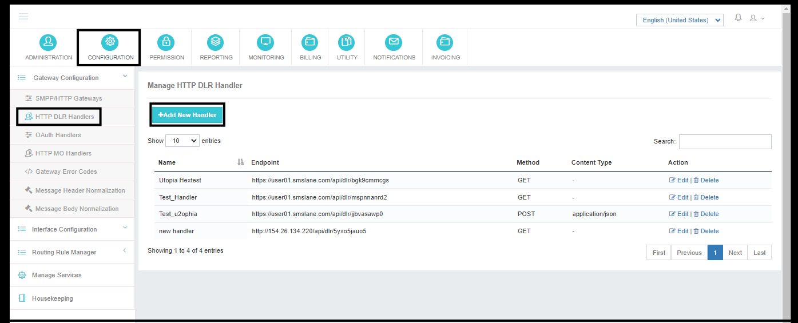
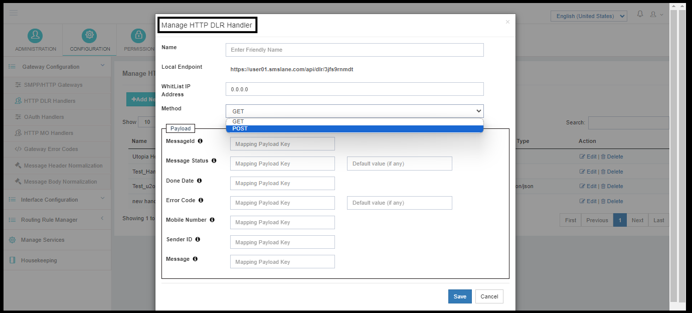
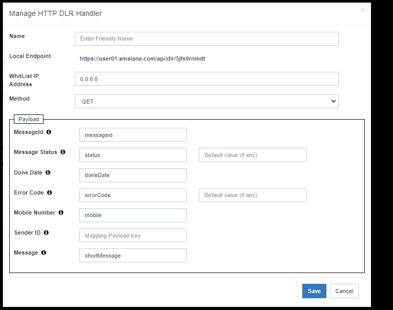

---
tags:
  - HTTP
  - DLR
  - Handler
  - Configuration
---

# HTTP DLR 處理器配置

HTTP 閘道器在應用程式上配置完畢後,使用者就可以傳送訊息,並在應用程式上更新響應.

!!! note
 這個 **閘道器響應** 僅僅是 **第一次答覆** 說明電文是否已成功提交供應商。

接收 **DLR( 交貨收據)** 從供應商,管理員需要配置 **HTTP DLR 處理器** 這樣,每當供應商傳送DLR時,DLR將使用DLR處理器更新應用程式.

在本檔案中,我們將分享為了正確接收DLR的應用程式而需要行政部門完成的所有步驟和配置.



---

## 導航

<span data-ph="0"></span> ➔ <span data-ph="1"></span> ➔ <span data-ph="2"></span> ➔ <span data-ph="3"></span>。 。 。 。



---

## 樣本 DLR 有效載荷

要配置 HTTP DLR 處理器,我們需要 **DLR 響應格式** 或來自供應商的 DLR 樣本,以便管理員能夠完成應用程式上的配置。

例如,我們將使用以下 DLR 樣本用於 HTTP DLR 處理器配置 :

```json
{
    "messageId": "161a9168-623c-4411-9e30-cf69353f9bef",
    "status": "EXPIRED",
    "errorCode": "1039",
    "mobile": "91123537072",
    "shortMessage": "Test Message",
    "doneDate": "2024-05-22 11:07:46"
}
```

---

## 配置步驟

遵循以下步驟配置上述提供的 DLR 樣本的 DLR 處理器:

1. **新增方便使用者的名稱** 給處理者。
2. **將銷售商的IP白名單** *(非強制性)*。 。 。 。
3. **選擇所支援的方法** 由供應商進行—— <span data-ph="0"></span> 或者說 <span data-ph="1"></span>。 。 。 。
4. **配置有效載荷** ——在有效載荷下,客戶端需要配置儲存特定值的引數名稱.

### 實地繪圖參考文獻

| 應用程式欄位 | JSON 金鑰地圖 | 示例數值 |
|-------------------|------------------|---------------|
| **信件編號** | <span data-ph="0"></span> | <span data-ph="0"></span> |
| **信件狀態** | <span data-ph="0"></span> | <span data-ph="0"></span> |
| **完成日期** | <span data-ph="0"></span> | <span data-ph="0"></span> |
| **錯誤程式碼** | <span data-ph="0"></span> | <span data-ph="0"></span> |
| **移動號碼** | <span data-ph="0"></span> | <span data-ph="0"></span> |
| **發件人標識** | *(可選的,如果供應商傳送地圖)* | —— 說 |
| **訊息** | <span data-ph="0"></span> | <span data-ph="0"></span> |

!!! tip
 在上述例子中,引數 <span data-ph="0"></span> 儲存 DLR 狀態的值,並 <span data-ph="1"></span> 儲存錯誤程式碼的值。 這些引數需要配置,如在 **信件狀態** 財務報告和審定財務報表 **錯誤程式碼** 頁:1 對供應商共用的所有其他引數適用同樣的邏輯。



---

## 本地終點

當處理器被儲存時, Power SMPP 生成一個 **本地終點** URL(例如, <span data-ph="0"></span>) (中文(簡體) ). 這是銷售商用 DLR 有效載荷調回的 URL 。

!!! warning "重要"
 一旦所有的細節 配置在應用程式上, **請儲存它,請聯絡您的閘道器供應商, 並讓他們將 DLR 處理器的端點白化**。 。 。 。

---

## 預設值

給 **信件狀態** 財務報告和審定財務報表 **錯誤程式碼** 欄位,可選 <span data-ph="0"></span> 可配置。 如果供應商不返回某一德國航天中心中的該欄位,則適用預設值。 這保證了DLR記錄仍然完整,並且信件在報告中被關閉.

---

## 核查

在配置 DLR 處理器後 :

1. 透過相應的HTTP Gateway傳送測試訊息.
2. 詢問供應商(或使用測試工具,例如 <span data-ph="0"></span> 編號 : <span data-ph="1"></span>)將DLR有效載荷樣本傳送到本地端點URL.
3. 開啟相關的 **德國航天中心報告** 內 <span data-ph="0"></span> 以確認德國航天中心已收到並正確分析。

如果 DLR 不出現,則重新檢查引數名稱對映——最常見的原因是供應商傳送的JSON金鑰和處理器中配置的金鑰不匹配.
