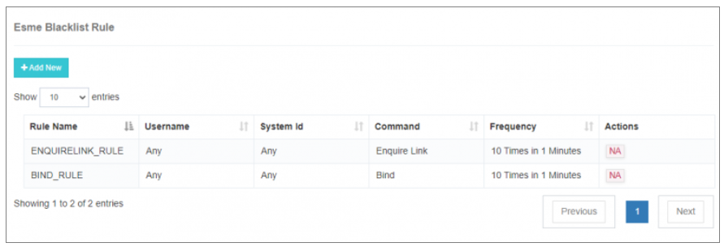
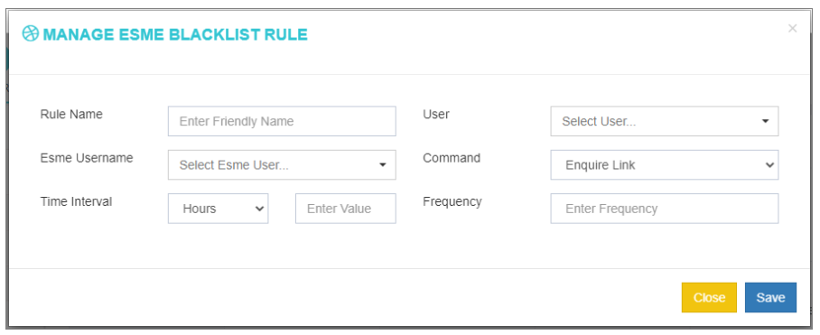
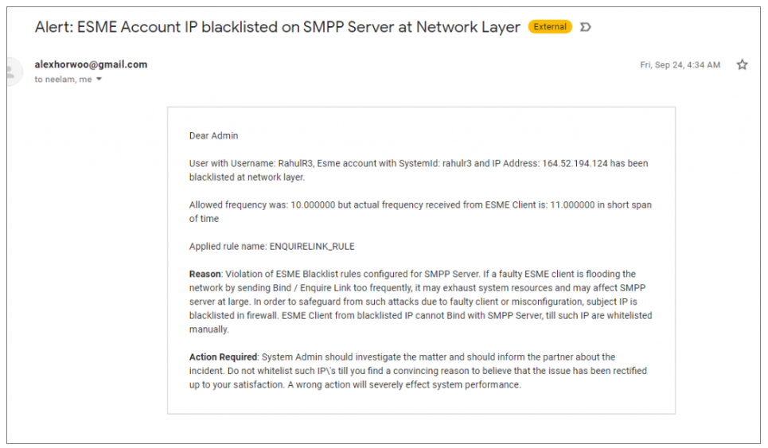

## ESME Blacklist Rule

The **ESME Blacklist Rule** in iTextPRO serves as a proactive safeguard to protect your SMPP server from rogue or misconfigured ESME clients. These clients may cause performance degradation due to repeated or abnormal command requests. By setting up this rule, administrators can **automatically blacklist** suspicious clients and prevent further damage.

---

### Purpose

In scenarios where a rogue ESME user poses a threat—either from faulty implementation or unintended high-frequency requests—this rule enables iTextPRO to permanently drop requests from that user, maintaining **server stability and integrity**.

---

### Configuration Options

  

To configure a new ESME Blacklist Rule:

1. **Rule Name**:  
   - Enter a descriptive, friendly name for the blacklist rule (e.g., `"Frequent Bind Flood"`).

2. **User**:  
   - Select the ESME user account that the rule should monitor.

3. **ESME System ID**:  
   - Choose the specific **System ID** of the ESME user.

4. **Command Type**:  
   - Choose the type of command to monitor:
     - **Enquire Link**
     - **Bind**

5. **Time Interval**:  
   - Set the interval in:
     - Hours
     - Minutes
     - Seconds

6. **Frequency**:  
   - Define how many times the selected command type can occur within the specified time interval.

7. After filling out the details, click **"Save"** to activate the rule.

---

### Example Use Case

Suppose you want to block an ESME user that sends **Bind or Enquire Link requests** more than **10 times within 1 minute**.  
- Set `Time Interval = 00:01:00`  
- Set `Frequency = 10`  
- If the condition is met, iTextPRO will:
  - **Blacklist the ESME account**
  - **Send an alert to the registered admin email address**

This prevents abusive or misconfigured clients from overloading the SMPP server.

---

### Result & Alerts

Once the rule is violated:
- The ESME is automatically **blacklisted**.
- An **email alert** is sent to the admin.

---

### Summary

The **ESME Blacklist Rule** is a vital feature to:
- Detect abnormal or abusive client behavior.
- Protect your infrastructure from performance degradation.
- Automate mitigation by enforcing real-time blacklisting.

Use this feature to maintain robust **SMPP server performance** and enforce operational hygiene across all ESME connections.
