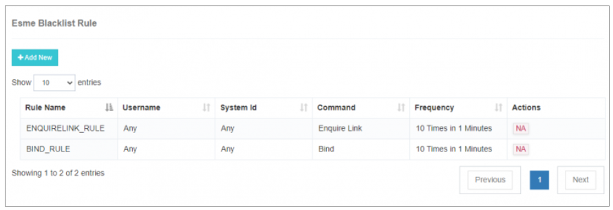
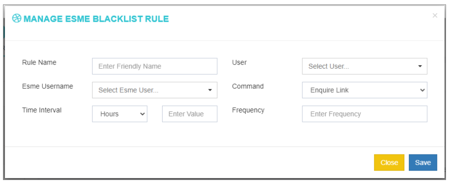
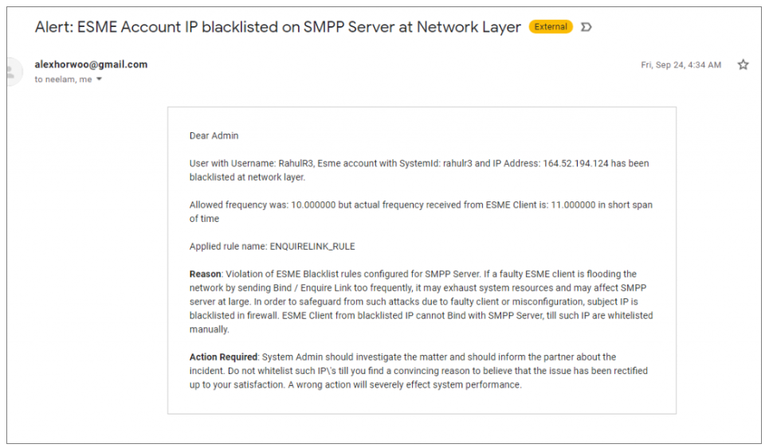

## Regra da lista negra do ESME

A **Regra da lista negra do ESME** no iTextPRO serve como uma salvaguarda proativa para proteger seu servidor SMPP de clientes ESME desonestos ou mal configurados. Estes clientes podem causar degradação do desempenho devido a pedidos de comando repetidos ou anormais. Ao configurar esta regra, os administradores podem **lista negra automática** clientes suspeitos e evitar mais danos.

---

### Objecto

Em cenários em que um usuário desonesto do ESME representa uma ameaça – seja de implementação defeituosa ou solicitações de alta frequência não intencionadas – esta regra permite que o iTextPRO solte permanentemente solicitações desse usuário, mantendo **estabilidade e integridade do servidor**.

---

### Opções de Configuração

 

Para configurar uma nova Regra da Lista Negra do ESME:

1. **Nome da Regra**: 
   - Digite um nome descritivo e amigável para a regra da lista negra (por exemplo, ).

2. **Usuário**: 
   - Selecione a conta de usuário ESME que a regra deve monitorar.

3. **ID do sistema ESME**: 
   - Escolha o específico **ID do sistema** do utilizador do ESME.

4. **Tipo de Comando**: 
   - Escolha o tipo de comando a monitorizar:
     - **Perguntar a Ligação**
     - **Encadernação**

5. **Intervalo de tempo**: 
   - Definir o intervalo em:
     - Horas
     - Atas
     - Segundos

6. **Frequência**: 
   - Defina quantas vezes o tipo de comando selecionado pode ocorrer dentro do intervalo de tempo especificado.

7. Depois de preencher os detalhes, clique **"Salvar"** para activar a regra.

---

### Exemplo de caso de uso

Suponha que você queira bloquear um usuário ESME que envia **Pedidos de ligação ou consulta** mais de **10 vezes em 1 minuto**. 
- Definir  
- Definir  
- Se a condição for cumprida, o iTextPRO:
  - **Lista negra da conta ESME**
  - **Envie um alerta para o endereço de e-mail de administrador registrado**

Isso evita que clientes abusivos ou mal configurados sobrecarreguem o servidor SMPP.

---

### & Alertas de resultado

Uma vez violada a regra:
- O ESME é automaticamente **lista negra**.
- An **alerta de e- mail** é enviado para o administrador.

---

### Resumo

A **Regra da lista negra do ESME** é uma característica vital para:
- Detecte comportamento anormal ou abusivo do cliente.
- Proteja sua infraestrutura da degradação do desempenho.
- Automatize a mitigação através da aplicação da lista negra em tempo real.

Use este recurso para manter robusto **Desempenho do servidor SMPP** e reforçar a higiene operacional em todas as ligações do ESME.
