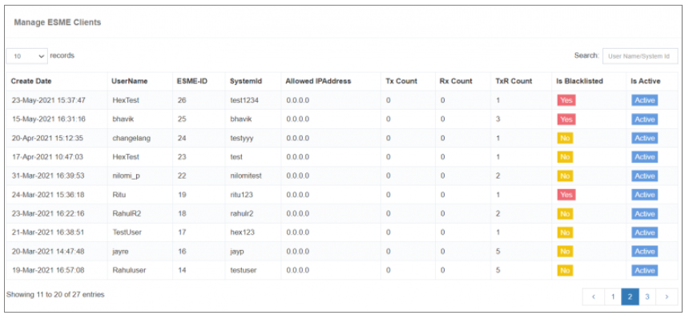

## ESME Client List

El **ESME Client List** sección en iTextPRO proporciona una vista centralizada de todos los usuarios que han optado por **SMPP services** (Entidades externas de mensajería corta). Esta interfaz permite a los administradores monitorear, buscar y gestionar fácilmente clientes conectados de ESME.

---

---

### Características clave:

- **Resumen del cliente**: 
 Muestra una lista de todos los usuarios con cuentas ESME (SMPP).

- **Función de búsqueda**: 
 Un intuitivo **cuadro de búsqueda** permite filtrar cuentas ESME basadas en:
  - **Nombre de usuario**
  - **ID del sistema**

Esta característica garantiza un acceso rápido a los detalles específicos de la cuenta ESME sin navegar a través de largas listas.

---

### Caso de uso:

Si desea encontrar el estado de conexión o detalles de un usuario ESME con el ID del sistema , simplemente introduzca eso en la barra de búsqueda, y el sistema autofiltrará los resultados.

---

El **ESME Client List** es una utilidad útil para mantener la visibilidad y el acceso rápido a todos los clientes conectados con SMPP en su entorno iTextPRO.
