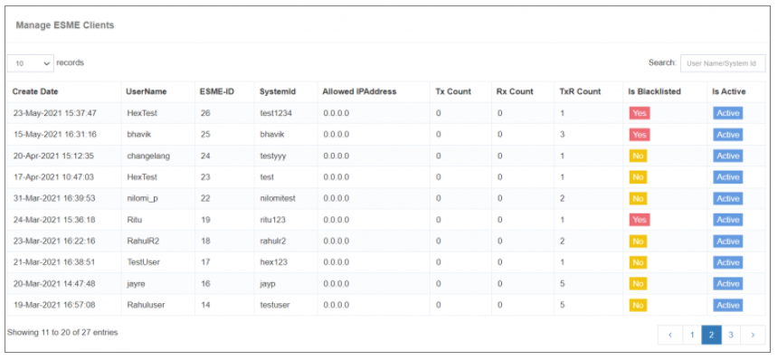

## ESME Client List

The **ESME Client List** section in iTextPRO provides a centralized view of all users who have opted for **SMPP services** (External Short Messaging Entities). This interface allows administrators to easily monitor, search, and manage connected ESME clients.

---

---

### Key Features:

- **Client Overview**:  
  Displays a list of all users with active ESME (SMPP) accounts.

- **Search Functionality**:  
  An intuitive **search box** allows filtering ESME accounts based on:
  - **Username**
  - **System ID**

This feature ensures fast access to specific ESME account details without navigating through lengthy lists.

---

### Use Case:

If you want to find the connection status or details of an ESME user with the System ID `"client_abc"`, simply enter that into the search bar, and the system will auto-filter the results.

---

The **ESME Client List** is a useful utility to maintain visibility and quick access to all SMPP-connected clients in your iTextPRO environment.
