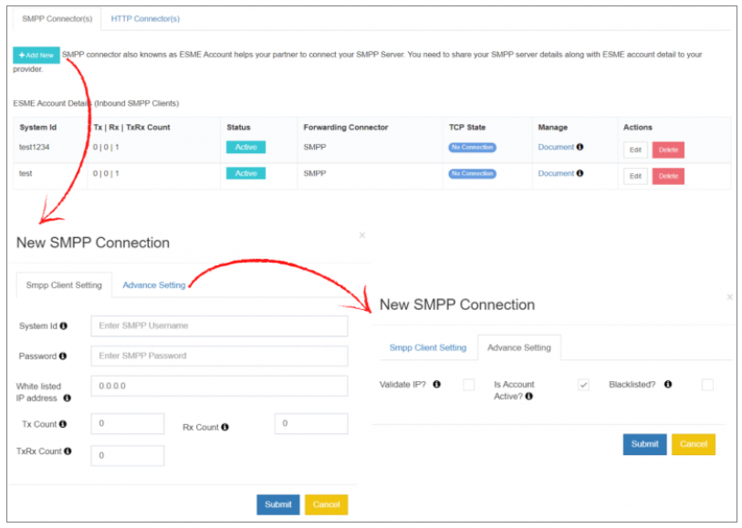
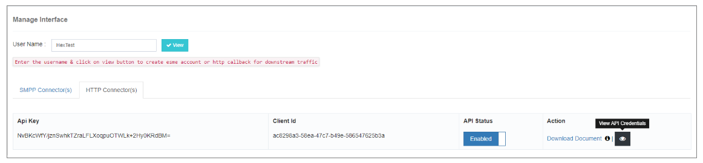
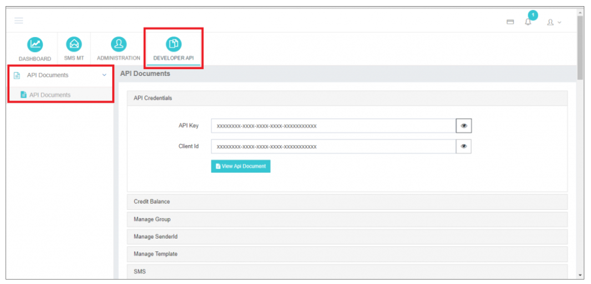

---
tags:
  - SMPP
  - ESME
  - HTTP API
  - Configuration
---

## Manage Interface

El **Manage Interface** sección en iTextPRO permite a los administradores configurar y gestionar la conectividad de los socios a través de **SMPP Connectors (contables ESME)** y **HTTP Connectors**. Estos conectores aumentan las capacidades de comunicación permitiendo una integración perfecta con sistemas externos.

---

### 1. SMPP Connector (Contaduría General)

El **SMPP Connector**, también conocido como **Cuenta ESME (Entidad de mensajería corta externa)**, facilita las conexiones con los socios **SMPP Server** dentro de iTextPRO.

#### Cómo agregar un nuevo conector SMPP:
1. Busque la cuenta de usuario específica.
2. Haga clic **"Añadir nuevo"** para iniciar la configuración.
3. Rellene los detalles necesarios:

**ESME Account Setup Fields:**

| Campo | Descripción |
|-------|-------------|
| **ID del sistema** | Nombre de usuario utilizado para conectarse a la cuenta ESME |
| **Contraseña** | Contraseña de autenticación para la cuenta ESME |
| **Whitelist IP** | Sólo se permiten conexiones de esta IP |
| **Tx Count** | Número de sesiones de transmisor (Tx) |
| **Cuenta Rx** | Número de sesiones del receptor (Rx) |
| **Cuenta TRx** | Número de sesiones de Transceptor (TRx) |

#### Ajustes avanzados:
- **Validar IP**: Permite validación de direcciones IP de origen. Sólo los IPs de lista blanca pueden conectarse.
- **Is Account Active**: Cuando está habilitado, el usuario ESME puede conectarse al servidor SMPP.
- **Lista negra**: Esto se habilita automáticamente si el usuario de ESME viola el **ESME Blacklist Rule**.

---

### 2. Conexión HTTP

El **HTTP Connector** permite a los socios integrarse con iTextPRO **API basadas en HTTP**.

#### Pasos para habilitar HTTP API Access:
1. Activar **API** en la cuenta de usuario deseada.
2. Una vez activado, **Developer API** sección se hace visible en la interfaz de usuario.
3. Desde allí, los usuarios pueden:
   - Vista **API**
   - **Descargar documentación de API** (formato PDF)
   - Comience a utilizar puntos finales de HTTP API para presentaciones de mensajes, informes y más.

---

### Resumen

El **Manage Interface** en iTextPRO ofrece una configuración unificada e intuitiva para ambos **SMPP y conectores HTTP**, habilitación:
- Acceso seguro y controlado para socios y revendedores.
- Documentación y herramientas de API para una fácil integración.
- Control de nivel de período de sesiones y gestión de acceso basada en IP.

Al aprovechar estos conectores, los usuarios de iTextPRO pueden ampliar su alcance de mensajería manteniendo un control estricto y flexibilidad.
