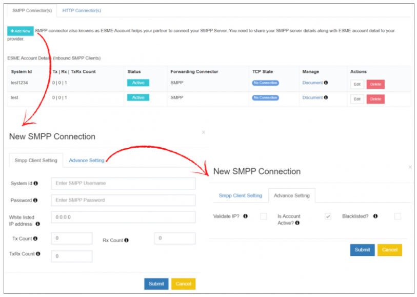
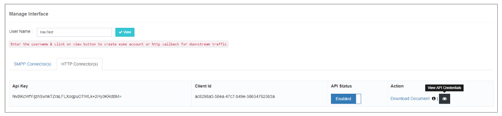
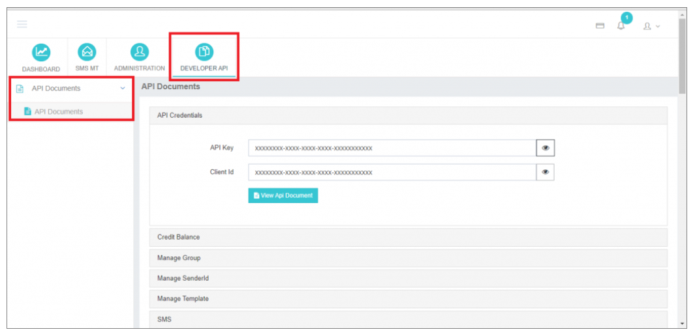

## Manage Interface

The **Manage Interface** section in iTextPRO allows administrators to configure and manage partner connectivity through **SMPP Connectors (ESME Accounts)** and **HTTP Connectors**. These connectors enhance communication capabilities by enabling seamless integration with external systems.

---

### 1. SMPP Connector (ESME Account)

The **SMPP Connector**, also referred to as an **ESME (External Short Messaging Entity) Account**, facilitates partner connections to the **SMPP Server** within iTextPRO.

#### ➤ How to Add a New SMPP Connector:
1. Search for the specific user account.
2. Click **"Add New"** to initiate the configuration.
3. Fill in the required details:

**ESME Account Setup Fields:**
- **System ID**: The username used to connect to the ESME account.
- **Password**: The authentication password for the ESME account.
- **Whitelist IP Address**: Only connections from this IP are allowed.
- **Tx Count**: Number of Transmitter (Tx) sessions.
- **Rx Count**: Number of Receiver (Rx) sessions.
- **TRx Count**: Number of Transceiver (TRx) sessions.

#### ➤ Advanced Settings:
- **Validate IP**: Enables validation of source IP addresses. Only whitelisted IPs can connect.
- **Is Account Active**: When enabled, the ESME user can connect to the SMPP server.
- **Blacklisted**: This is automatically enabled if the ESME user violates the **ESME Blacklist Rule**.

---

### 2. HTTP Connector

The **HTTP Connector** allows partners to integrate with iTextPRO using **HTTP-based APIs**.

#### ➤ Steps to Enable HTTP API Access:
1. Activate **API Status** in the desired user account.
2. Once activated, the **Developer API** section becomes visible in the user interface.
3. From there, users can:
   - View **API Credentials**
   - **Download API documentation** (PDF format)
   - Start using HTTP API endpoints for message submissions, reports, and more.

---

### Summary

The **Manage Interface** in iTextPRO offers a unified and intuitive setup for both **SMPP and HTTP Connectors**, enabling:
- Secure and controlled access for partners and resellers.
- API documentation and tools for easy integration.
- Session-level control and IP-based access management.

By leveraging these connectors, iTextPRO users can expand their messaging reach while maintaining strict control and flexibility.
