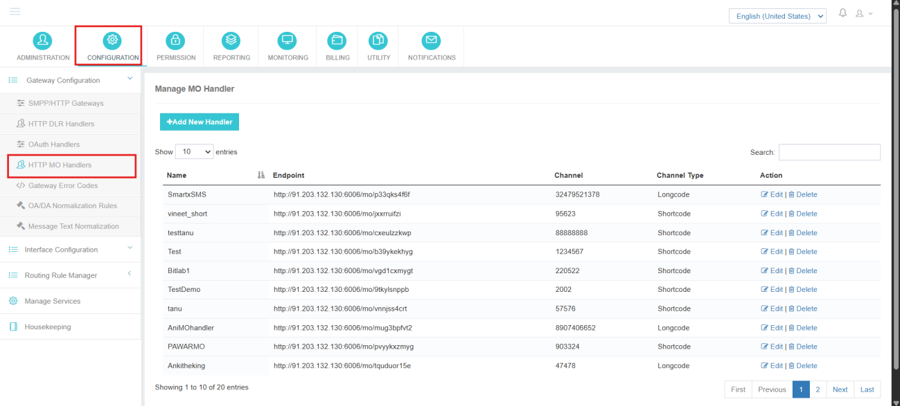
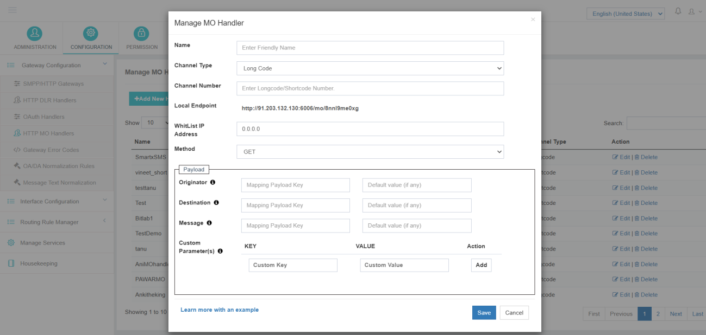

---
tags:
  - HTTP
  - MO
  - Handler
  - Configuration
---

# HTTP MO 處理器

## 概覽

這個 **HTTP MO 處理器** 在 iTextPro 中用於接收和處理收到的 **MO( 移動原生)** 電信運營商或閘道器供應商發來的資訊。 處理器充當API端點,接受MO請求,將收到的資料轉發到平臺,以進一步進行路由和處理.

HTTP MO 處理器配置定義 :

- 交流方法
- 頻道細節
- 有效載荷對映
- 安全限制
- 端點生成

!!! warning "先決條件"
 此配置為 **強制** 在建立MO Routing規則之前.

---

## 導航路徑

<span data-ph="0"></span> ➔ <span data-ph="1"></span> ➔ <span data-ph="2"></span>。 。 。 。



---

## 處理器配置引數

在建立 HTTP MO Handler 時必須配置以下引數 。

### 1] 處理器名稱

這個 **處理器名稱** 用於在平臺內唯一識別MO Handler配置。

此名稱在內部用於:

- 執行配置
- 處理器選擇
- MO 交通製圖
- 行政和解決問題

!!! example
    ```
    MO_HANDLER_INDIA_01
    ```

---

### 2] 頻道型別

這個 **頻道型別** 定義與運入的MO流量相關的電訊號碼型別。

**支援的頻道型別 :**

| 型別 | 說明 |
|------|-------------|
| **長碼** | 用於雙向訊息通訊的標準手機號碼. |
| **短碼** | 一般用於企業競選,投票系統,訂閱,或促銷服務的短數字程式碼. |

所選擇的頻道型別應匹配操作員或供應商配置.



---

### 3] 頻道號碼

這個 **頻道號碼** 代表收到MO流量的實際目的地號碼。

!!! example
    ```
    567890
    ```

此數字必須配置 **完全按照規定** 由電信運營商或閘道器供應商提供。

---

### 4] 當地終點

這個 **本地終點** 由 iTextPro 建立處理器配置後自動生成。

此端點作為接收 HTTP MO 請求的接收 URL 。

生成的端點 URL 通常與 :

- 短訊息閘道器供應商
- 電信運營商
- 彙總數
- 第三方平臺

供應商利用這個端點將收到的MO訊息推入iTextPro平臺.

**示例流程:**

```
Operator/Vendor → Local Endpoint → iTextPro Processing
```

---

### 5] 白名單IP

這個 **白名單 IP** 區域用於透過限制訪問僅限授權的IP地址來保障MO端點的安全.

只有從配置的IP地址收到的請求才會被平臺接受.

**目的:**

- 防止未經許可進入
- 加強API安全
- 限制未知流量
- 保護MO端點不被濫用

!!! example
    ```
    192.168.10.20
    ```

!!! tip
 可以根據操作要求配置多個IP.

---

### 6] 方法

這個 **方法** 定義供應商在傳送MO請求時使用的HTTP通訊方法.

**支援的方法:** <span data-ph="0"></span>, (中文(簡體) ). <span data-ph="1"></span>。 。 。 。

#### 獲取方法

在 GET 方法中:

- 引數在URL內傳輸.
- 資料作為查詢引數傳送.
- 適合輕量級融合.

!!! example
    ```
    https://domain.com/mo?originator=9876543210&destination=567890&message=TEST
    ```

#### POST 方法

在 POST 方法中:

- 引數在HTTP請求機構內傳遞.
- 支援結構化和更大的有效載荷。
- 常用於現代API整合.

**福利:**

- 加強安保
- 更清潔的請求結構
- 支援 JSON / XML 有效載荷
- 適用於複雜的整合

---

## 有效載荷配置

這個 **有效載荷** 區域定義了將如何在 iTextPro 內對映收到的請求引數。

正確的有效載荷對映是 **強制** 用於成功的MO處理. 配置有效載荷引數,具體如下:

| 平臺引數 | 供應商引數 |
|--------------------|------------------|
| **發件人** | <span data-ph="0"></span> |
| **目標** | <span data-ph="0"></span> |
| **訊息** | <span data-ph="0"></span> |

### 有效載荷引數描述

#### 發件人

這個 **發件人** 引數代表收到MO訊息的發件人移動號碼.

!!! example
    ```
    9876543210
    ```

#### 目標

這個 **目標** 引數代表 **短碼** 或者說 **長碼** MO 訊息傳送的編號。

!!! example
    ```
    567890
    ```

#### 訊息

這個 **訊息** 引數代表終端使用者提交的實際文字內容。

!!! example
    ```
    ASKRK BALANCE
    ```

---

## 儲存處理器配置

完成所有配置後 :

1. 校驗所有配置的細節 。
2. 點選 **儲存**。 。 。 。

HTTP MO Handler現已成功配置並準備接收MO流量.

!!! tip "下一個步驟"
 處理器儲存後,立即建立 **MO 執行規則** 以定義進取的MO流量將如何被過濾並交付給終端使用者。
