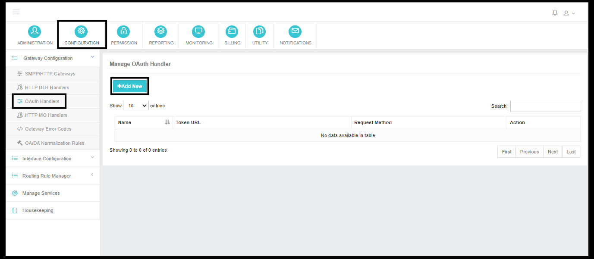
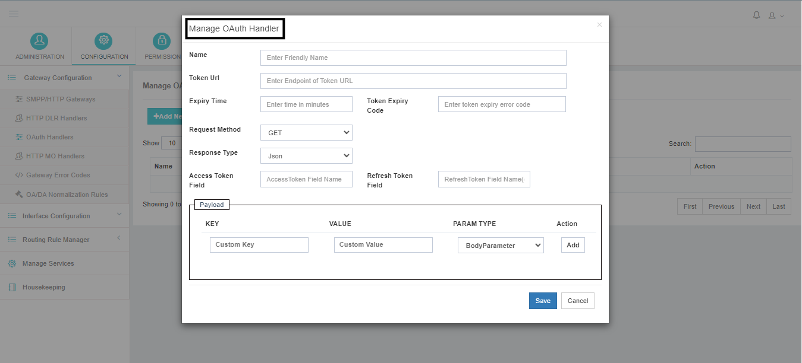

---
tags:
  - HTTP
  - OAuth
  - Handler
  - Configuration
---

# OAuth 處理器配置

單位 **HTTP 閘道器**,我們支援 **3種授權**數字 :

| {\fn方正粗倩簡體\fs12\an8\1cHFFFF00\b0} | 型別 | 說明 |
|---|------|-------------|
| 1個 | **無授權** | 無需批准。 |
| 2個 | **基本認證** | API的安全認證需要使用者名稱和密碼. |
| 3個 | **OAuth 2.0 資料** | 最新版本的授權,用於在一段時間後重新生成新的證書,以保持API的高安全性。 **OAuth 處理器** API (英語). |

在這份檔案中,我們將解釋為執行《公約》所需的所有步驟和資料。 **OAuth 處理器** HTTP 閘道器的配置 。

---

## 導航

 ➔  ➔  ➔ 。 。 。 。

---

## OAuth 處理器欄位

| 外地 | 需求 | 說明 |
|-------|----------|-------------|
| **名稱** | 對 | OAuth 處理器的使用者友好名稱 。 它有助於在應用程式中方便地識別和管理不同的OAuth處理器. |
| **除錯 URL** | 對 | 應用程式將請求 OAuth 令牌的 URL 端點 。 是銷售商提供的URL來獲取訪問令牌. |
| **過期時間** | 對 | 出入證有效期為幾分鐘。 這一時期後,信使會到期,需要產生新的信使. |
| **託肯過期程式碼** | 對 | 表示該令牌已過期的錯誤程式碼 。 當收到這個錯誤程式碼時,系統會知道它需要重新整理符號. |
| **請求方法** | 對 | HTTP 方法用於從 Token URL 中請求令牌——  或者說 。 。 。 。 |
| **反應型別** | 對 | 從Token URL收到回覆的格式—— , (中文(簡體) ). ,或 。 。 。 。 |
| **訪問託肯欄位** | 可選 | 響應中包含訪問符的欄位名稱 。 系統會從這個欄位取出訪問符來認證未來的請求. |
| **重新整理託肯欄位** | 可選 | 包含重新整理符號的響應中的欄位名稱 。 重新整理令牌用於在當前令牌到期時獲得新的訪問令牌. 這個領域是可選的,取決於供應商的執行情況。 |

---

## 有效載荷

本節允許管理員定義 **額外的金鑰值配對** 需要隨同象徵性請求一起傳送。

| 外地 | 說明 |
|-------|-------------|
| **關鍵** | 請求中要包含的引數名稱 。 |
| **評價** | 請求中要包含的引數值 。 |
| **帕拉姆型別** | 指定引數型別。 常見引數型別包括: , (中文(簡體) ). 等 (中文(簡體) ). |

!!! example
    - **關鍵**數字 : 
    - **評價**數字 : 
    - **帕拉姆型別**數字 :  *(表示此引數將包含在令牌請求正文中).*

此配置有助於設定 **OAuth 認證** 用於透過自動獲取和重新整理令牌的程序訪問 API。

---

## 如何運作

1. 當需要透過 HTTP 閘道器傳送信件時 **OAuth 2.0 資料**, Power SMPP 首先檢查一個有效的(非過期)訪問符是否已經快取.
2. 如果存在有效標誌,它會附在外向API呼叫上(通常透過  頭曰.
3. 如果不存在有效符號——或者符號已過期並配置 **託肯過期程式碼** 由閘道器返回 。 **除錯 URL** 帶有配置的 , (中文(簡體) ). ,以及  雙人
4. 使用 **反應型別**,則 **訪問託肯欄位** 中提取出,並在 **過期時間**。 。 。 。
5. 出境訊息請求現在使用新獲得的令牌,直到它再次到期.

---

## 將 OAuth 處理器連結到 HTTP 閘道器

在儲存 OAuth 處理器後 :

1. 開啟您想要與 OAuth 安全的 HTTP 閘道器 。
2. 下 **第1節:必要的全權證書**設定 **認證** 改為 **OAuth 2.0 資料**。 。 。 。
3. 從 **OAuth 處理器** 放下,選擇你剛建立的處理器。
4. 救出門戶.

HTTP Gateway 現在將使用所配置的OAuth Handler來自動獲取並重新整理令牌——不需要手動令牌旋轉.

!!! tip
 留著 **過期時間** 略低於供應商公佈的價值(例如,設定)  如果賣家的證物是最後的  分鐘). 這避免了到期後第一次請求在重新整理被觸發前失敗的比賽條件.
