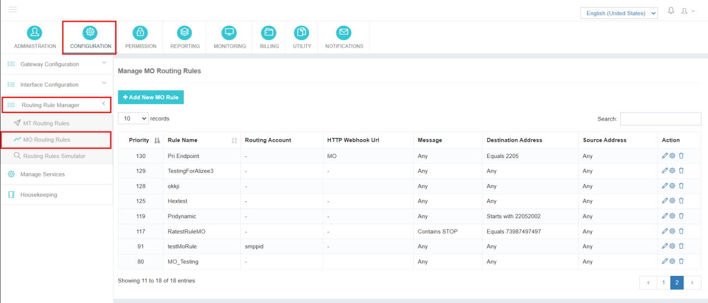
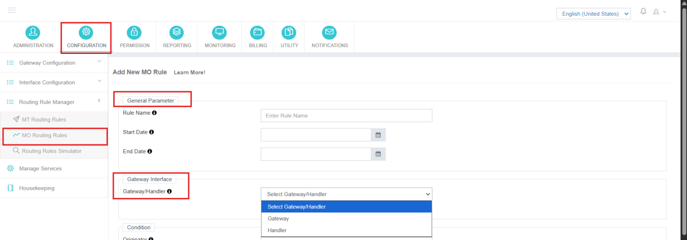
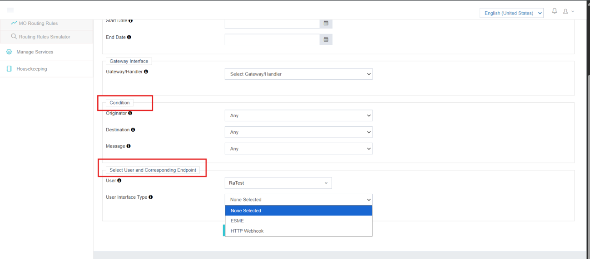

---
tags:
  - MO
  - Routing
  - Rules
  - Configuration
---

# MO 執行規則

## 概覽

**MO 執行規則** iTextPro中用於定義如何在平臺內識別、過濾和路由收到的MO訊息。

路線規則決定:

- 哪些輸入的MO流量應該處理
- 哪個關鍵字應觸發路由
- 哪個使用者應該接收MO流量
- 用於交付的介面型別

MO 執行規則與配置 **HTTP MO 處理器**。 。 。 。

---

## 導航路徑

<span data-ph="0"></span> ➔ <span data-ph="1"></span> ➔ <span data-ph="2"></span> ➔ <span data-ph="3"></span>。 。 。 。



---

## MO 規則引數

在建立路由規則時必須配置以下引數.

## 通用引數

### 1] 規則名稱

這個 **規則名稱** 唯一在平臺內識別MO Routing Rule.

此名稱用於:

- 規則管理
- 交通監測
- 行政部門
- 解決問題

!!! example
    ```
    MO_ROUTE_KEYWORD_01
    ```

---

### 2] 壽命

這個 **終身** 引數定義了路由規則的有效性期限。

**用法 :**

- 可用於臨時活動
- 支援基於時間的MO路由
- 對有限時間服務有用

!!! tip
 如果不需要過期,此欄位可留為空白.

---

## 閘道器介面配置

### 處理器

這個 **處理器** 欄位用於選擇先前在平臺中配置的 HTTP MO Handler。

此處理器將處理所有匹配路由條件的MO請求. 處理器將被使用,以防供應商傳送MO與 **HTTP 連線**。 。 。 。

### 閘道器

如果供應商支援 **SMPP 軟體** 傳送 MO 點選的協議,然後在 MO 執行規則的建立過程中,管理員需要選擇 **閘道器** 並選擇正確的閘道器,以便從正確的閘道器獲取點選。

**目的:**

- 將 MO 流量與正確的端點連線
- 聯絡人與進入頻道的路線
- 啟用信件處理工作流程



---

## 執行條件

路線條件界定 **過濾邏輯** 運入的MO流量。 該平臺在處理或引導MO請求之前對這些條件進行評估.

### 1] 發端人條件

這個 **發件人** 條件根據傳送者移動號定義過濾。

**示例配置 :** <span data-ph="0"></span>

選擇 **任意** 允許來自所有傳送者的MO訊息。 如果需要,也可以配置特定的傳送過濾器.

---

### 2] 目的地條件

這個 **目標** 條件定義接收的短碼或長碼號.

| 外地 | 數值 |
|-------|-------|
| **條件型別** | <span data-ph="0"></span> |
| **示例** | <span data-ph="0"></span> |

只有收到的MO訊息在所配置的目的地號碼上收到,路由規則才會被觸發.

---

### 3] 信件條件

這個 **訊息** 條件定義關鍵字匹配標準。

| 外地 | 數值 |
|-------|-------|
| **條件型別** | <span data-ph="0"></span> |
| **示例關鍵詞** | <span data-ph="0"></span> |

只有收到的訊息以所配置的關鍵詞開頭,路由規則才會觸發.

!!! example
 對於收到的訊息 <span data-ph="0"></span>,從訊息開頭 <span data-ph="1"></span>,路由規則將處理MO請求.



---

## 使用者和端點對映

### 1] 使用者

選擇 **使用者賬戶** MO的流量應該被繪製並交付給它.

此對映可確保正確的使用者收到收到的MO訊息.

### 2] 使用者介面型別

這個 **使用者介面型別** 定義 MO 訊息在路由後應如何傳輸。

**支援的介面型別 :**

| 型別 | 說明 |
|------|-------------|
| **未選中** | 不應用特定介面路由 。 |
| **無害環境管理** | 透過SMPP連通來引導MO交通. 一般在使用者透過SMPP協議連線時使用. |
| **網頁** | 將MO流量路由到一個外部的HTTP API端點. 一般用於CRM整合,第三方應用程式,網路處理系統,以及API驅動的工作流程. |

---

## 儲存規則

配置所有路由引數後 :

1. 校驗路線條件.
2. 驗證關鍵字配置 。
3. 點選 **儲存**。 。 。 。

MO Routing Rule現在已成功配置並活躍於MO流量處理.

!!! tip "核查"
 儲存規則後,傳送符合所配置條件的測試MO訊息(允許傳送,校正目的地號,訊息從所配置的關鍵詞開始),並透過檢查使用者的MO收件箱或webhook端點日誌確認規則起火.
