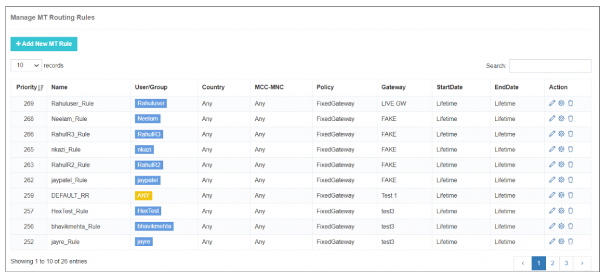
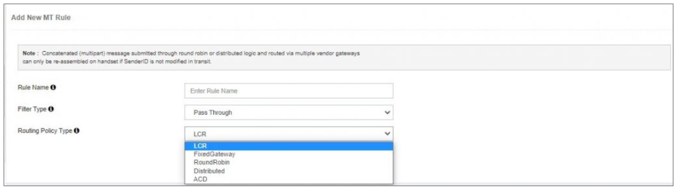
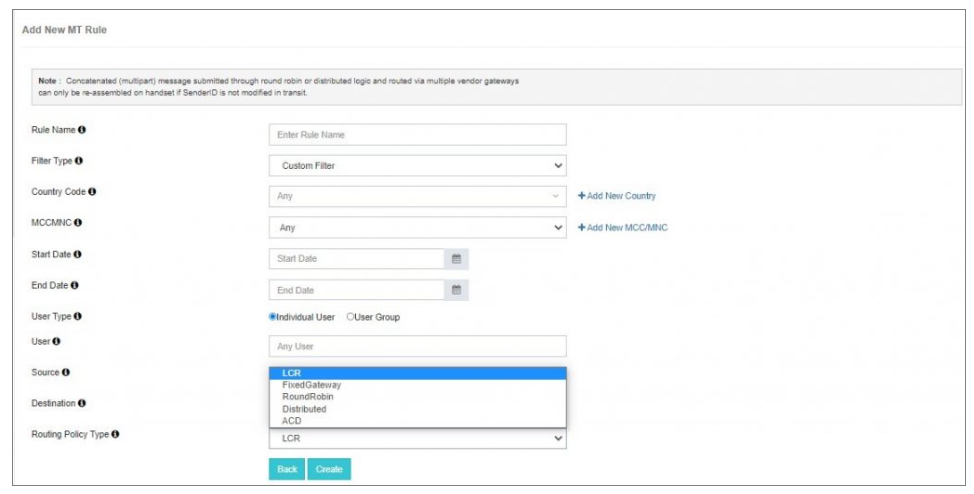

---
tags:
  - Routing
  - Configuration
  - MT
---

## Routing Rule Manager

Routing juega un papel crucial en mantener un borde competitivo y maximizar los ingresos. El **Routing Rule Manager** en iTextPRO permite el envío eficiente del tráfico de SMS de usuario a su destino final a través de la lógica de enrutamiento dinámica e inteligente.

Las aplicaciones SMPP soportan múltiples rutas de enrutamiento. iTextPRO simplifica esta complejidad permitiendo crear reglas dinámicas de enrutamiento MT (Mobile Terminated) que mejoran el rendimiento de entrega, reduzcan los costos y distribuyan el tráfico inteligentemente.

Los principales beneficios incluyen:
- Selección de puerta basada en el tiempo de entrega
- Optimización de costes mediante enrutamiento de menor costo
- Toggling dinámico entre protocolos HTTP y SMPP
- Distribución y equilibrio de carga en tiempo real

Una vez dentro de la **MT Regla de Routing** sección, se mostrará una lista de reglas de enrutamiento ya configuradas. Puedes **edición** cualquier regla haciendo clic en el icono de edición.

!!! tip
 No es necesario reiniciar ni recargar manualmente. Todas las actualizaciones de reglas de enrutamiento se aplican en el vuelo.

---

### Manage MT Routing Rule

Para crear una nueva regla, haga clic en **"Añadir nueva regla de MT"** Botón. Se le pedirá que configure lo siguiente:

#### 1. **Nombre de la regla**
- Introduzca un nombre amistoso y descriptivo para una identificación fácil.

#### 2. **Tipo de filtro**
- Hay dos tipos de filtro disponibles:

##### **Pase a través del filtro**
- Diseñado para políticas de enrutamiento global.
- Recomendado para crear una regla paso a través de alta prioridad para servir como una ruta de retroceso.

##### **Filtro personalizado**
- Mensajes de ruta basados en parámetros más específicos:

- **Código del país**: Seleccione el país para el tráfico de SMS.
- **MCC/MNC**: Elija una red móvil específica del país seleccionado.
- **Usuario**: Aplicar la regla a un usuario individual.
- **Grupo de usuarios**: Aplicar la regla a un grupo específico de usuarios.
- **Fecha de inicio " Fecha final "**: Establecer el período de validez de la regla.
- **Fuente**: Definir la dirección de la fuente – ruta específica.
- **Dirección**: Definir dirección de destino – ruta específica.

---

### Routing Policies

Puede definir políticas de enrutamiento basadas en requisitos empresariales o SLA. Las políticas de enrutamiento disponibles incluyen:

#### **LCR (Least Cost Routing)**
- Rutas de tráfico a través de la puerta de venta que ofrece el costo configurado más bajo para un destino dado.
- Ayuda a optimizar los precios y aumentar los márgenes de ganancia.

#### **Portal fijo**
- Todo el tráfico se recorre por una sola puerta predefinida.

#### **Round Robin**
- Distribuye el tráfico uniformemente a través de portales seleccionados.
- Garantiza el uso óptimo de todas las pasarelas configuradas.

#### **Distribuidos**
- Método de equilibrio de carga avanzado.
- Rutas de tráfico a múltiples portales basados en ratios porcentuales (por ejemplo, 60%, 30%, 10%).

#### **ACD/DLR (Entrega reconocida)**
- También conocido como enrutamiento basado en la entrega.
- Rutas de tráfico a la puerta de venta con la mayor proporción de entrega (DLR), garantizando un rendimiento de calidad en tiempo real.

---

### Manejo de prioridades

!!! info "Manejo de prioridades"
 Si múltiples reglas de enrutamiento coinciden con un mensaje, **iTextPRO seleccionará la regla con el valor prioritario más alto** (numerically highest).

Esta poderosa lógica de enrutamiento garantiza que su tráfico SMS se entrega de manera eficiente, económica y en cumplimiento de la lógica empresarial, sin necesidad de interrupciones del servicio o reinicia el sistema.
