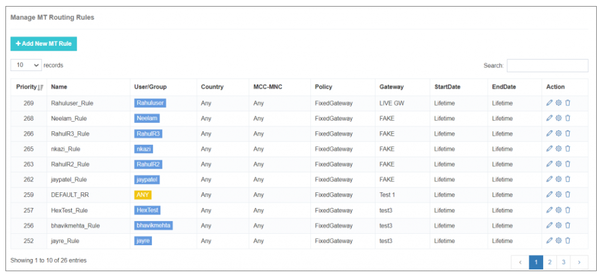
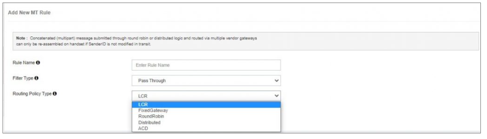
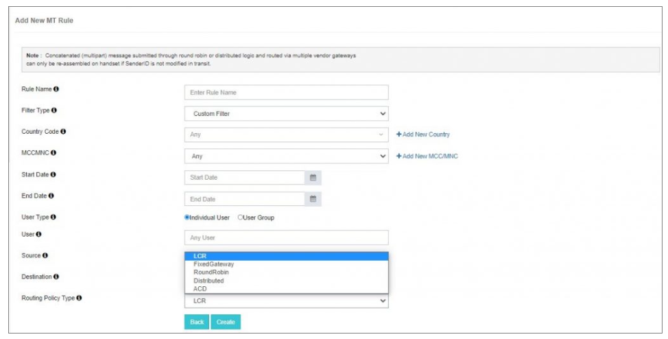

## Routing Rule Manager

Routing plays a crucial role in maintaining a competitive edge and maximizing revenue. The **Routing Rule Manager** in iTextPRO enables efficient forwarding of user SMS traffic to its ultimate destination through dynamic and intelligent routing logic.

SMPP applications support multiple routing paths. iTextPRO simplifies this complexity by allowing you to create dynamic MT (Mobile Terminated) routing rules that enhance delivery performance, reduce costs, and distribute traffic intelligently.

The key benefits include:
- Gateway selection based on delivery time
- Cost optimization via least-cost routing
- Dynamic toggling between HTTP and SMPP protocols
- Real-time traffic distribution and load balancing

Once inside the **MT Routing Rule** section, a list of already-configured routing rules will be displayed. You can **edit** any rule by clicking the edit icon.

> ⚠️ **Note:** No manual restart or reload is needed. All routing rule updates are applied on-the-fly.

---

### Manage MT Routing Rule

To create a new rule, click on the **"Add New MT Rule"** button. You’ll be prompted to configure the following:

#### 1. **Rule Name**
- Enter a friendly, descriptive name for easy identification.

#### 2. **Filter Type**
- Two filter types are available:

##### ➤ **Pass Through Filter**
- Designed for global routing policies.
- Recommended to create a high-priority pass-through rule to serve as a fallback route.

##### ➤ **Custom Filter**
- Route messages based on more specific parameters:

- **Country Code**: Select the country for routing SMS traffic.
- **MCC/MNC**: Choose a specific mobile network of the selected country.
- **User**: Apply the rule to an individual user.
- **User Group**: Apply the rule to a specific group of users.
- **Start Date & End Date**: Set the rule’s validity period.
- **Source Address**: Define source-address–specific routing.
- **Destination Address**: Define destination-address–specific routing.

---

### Routing Policies

You can define routing policies based on business requirements or SLAs. Available routing policies include:

#### 🔹 **LCR (Least Cost Routing)**
- Routes traffic through the vendor gateway offering the lowest configured cost for a given destination.
- Helps optimize pricing and increase profit margins.

#### 🔹 **Fixed Gateway**
- All traffic is routed through a single, predefined gateway.

#### 🔹 **Round Robin**
- Distributes traffic evenly across selected gateways.
- Ensures optimal usage of all configured gateways.

#### 🔹 **Distributed**
- Advanced load balancing method.
- Routes traffic to multiple gateways based on percentage ratios (e.g., 60%, 30%, 10%).

#### 🔹 **ACD/DLR (Acknowledged Delivery)**
- Also known as delivery-based routing.
- Routes traffic to the vendor gateway with the highest Delivery Ratio (DLR), ensuring real-time quality performance.

---

### Priority Handling

> If multiple routing rules match a message, **iTextPRO will select the rule with the highest priority value** (numerically highest).

This powerful routing logic ensures your SMS traffic is delivered efficiently, economically, and in compliance with business logic — without any need for service interruptions or system restarts.
