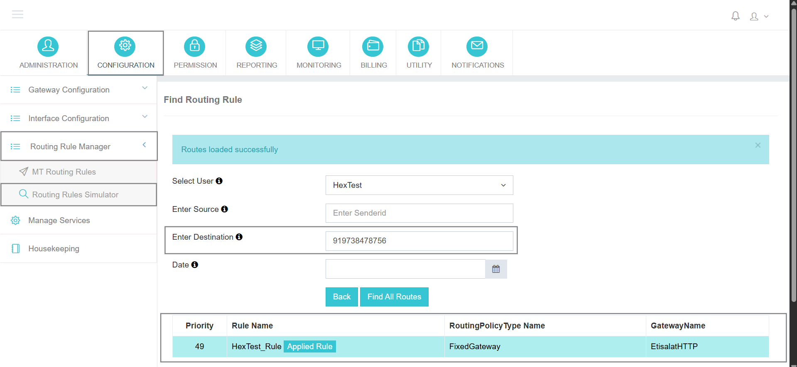

## 執行規則模擬器

這個 **執行規則模擬器** 在 iTextPRO 中,是一個強大的診斷工具,可以幫助您模擬和視覺化最佳匹配 **MT( 機動報廢)** 路線規則。 這種模擬可以讓使用者在不傳送實際短訊息流量的情況下測試路由邏輯,確保配置達到其傳送和業務目標.

---

### 模擬細節

為開始模擬,提供下列引數:

- **使用者**: 選擇要模擬路由規則的使用者賬戶。
- **輸入源**輸入 **發件人標識** 或者說 **發件人地址**。 。 。 。
- **輸入目標**: 提供 **手機號碼** (呼叫地址)測試路由.
- **完成日期**: 選擇應當模擬路線規則的日期. 這有助於確定具體日期的路由邏輯(如果適用的話)。

---

### 查詢所有路線

所需欄位填充後,點選 **"尋找所有路線"**。 。 。 。

- iTextPRO 將顯示 **最佳匹配 MT 路由規則列表**。 。 。 。
- 適用的規則是: **突出顯示** 以顯示根據當前配置和輸入將適用哪種路由規則。
- 這個 **日期過濾器** 確保只考慮在特定日期活動的路由規則。

---

### 福利

- 🔍 **預覽執行邏輯**: 為給定的使用者,發件人和收件人組合, 很容易檢查觸發的路由規則 。
- ⚙️ **驗證配置**:確保動態路由邏輯在無活流量的情況下正確配置.
- 🧠 **最佳化交付**:瞭解交通途徑,並調整規則來提高交付率並降低成本.

---

這個 **執行規則模擬器** 提供了對iTextPRO中簡訊流量的路由行為的重要見解,使管理員和轉售者能夠自信地管理和最佳化其資訊傳遞策略.
