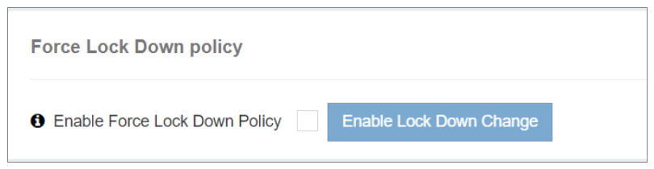

### Force Lockdown Policy

The **Force Lockdown Policy** in iTextPRO is an intelligent security tool designed to proactively respond to suspected attack attempts on the admin account by securing all user accounts.

---

---

#### Key Features:

- **Enable Feature:**  
  Activating this option initiates the Force Lockdown Policy, representing a proactive response to potential admin account security threats.

- **Immediate Log Out:**  
  Once enabled, iTextPRO immediately logs out all currently active user sessions to mitigate any ongoing risks.

- **Account Lockdown:**  
  Beyond logging users out, iTextPRO enforces a lockdown on all user accounts, preventing unauthorized access and suspicious activity during the incident.

- **Purpose:**  
  This policy is a critical security mechanism to safeguard user accounts and maintain the integrity of the iTextPRO application during suspected attacks on the admin account.
