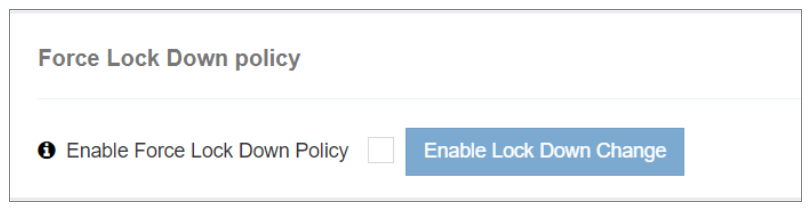

### Forçar a política de bloqueio

A **Forçar a política de bloqueio** no iTextPRO é uma ferramenta de segurança inteligente projetada para responder proativamente às tentativas de ataque suspeitos na conta de administrador, protegendo todas as contas de usuário.

---

---

#### Características chave:

- **Habilitar recurso:** 
 Ativar esta opção inicia a Política de Bloqueio de Força, representando uma resposta proativa às potenciais ameaças de segurança da conta de administrador.

- **Sair Imediatamente:** 
 Uma vez habilitado, o iTextPRO registra imediatamente todas as sessões de usuário atualmente ativas para mitigar quaisquer riscos contínuos.

- **Bloqueio da Conta:** 
 Além de excluir usuários, o iTextPRO impõe um bloqueio em todas as contas de usuários, impedindo acesso não autorizado e atividade suspeita durante o incidente.

- **Objectivo:** 
 Esta política é um mecanismo crítico de segurança para proteger contas de usuários e manter a integridade da aplicação iTextPRO durante ataques suspeitos na conta de administrador.
